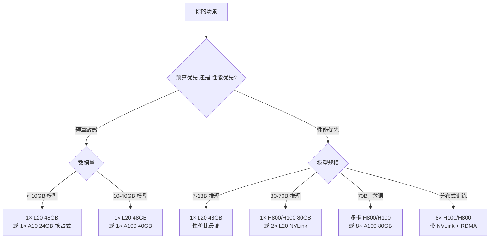

# 附录 A — 阿里云/腾讯云 GPU 实例速查

> 最后更新：2026-05  
> GPU 实例规格和价格变化频繁，遇到不一致时以官方文档为准：[阿里云 GPU](https://www.aliyun.com/product/ecs/gpu)（ECS：Elastic Compute Service，阿里云的虚拟机产品）、[腾讯云 GPU](https://cloud.tencent.com/product/gpu)（CVM：Cloud Virtual Machine，腾讯云的虚拟机产品）。

### 术语速读（本附录高频缩写）

- **GPU 型号**：NVIDIA 数据中心卡常见型号——**A10**（Ampere 架构入门卡，24GB 显存）、**A100**（Ampere 旗舰，40GB/80GB 两版）、**H100**（Hopper 旗舰，80GB HBM3，A100 的 2-3 倍算力）、**H800**（H100 的合规版，受出口管制后向中国市场供应，NVLink 带宽阉割）、**H20**（更进一步的合规版，算力再砍）、**L20**（Ada Lovelace 架构推理卡，48GB GDDR6，2024 年起在国内云上线）、**L40S**（L20 的高端版，48GB 但更强）
- **HBM3** vs **GDDR6**：HBM3（High Bandwidth Memory 第三代，ch03 提过）是堆叠式高带宽显存，A100/H100 用；GDDR6 是显卡常见的图形显存，带宽较低但成本也低，L20 用

## 实例选型决策树



## 实例选型建议（2026-05）

| 场景 | 最低配置 | 推荐配置 | 对应章节 |
|------|---------|---------|---------|
| Tokenizer/可视化 | CPU 实例 | - | ch02-03 |
| 小模型推理 (7B) | 1× A10 (24GB) | **1× L20 (48GB)**，性价比优于 A100 40GB | ch04-06 |
| 中等模型推理 (30-70B) | 1× A100 (80GB) | **1× H800 / H100 (80GB)** | ch04-06 |
| 量化实验 | 1× A10 (24GB) | 1× L20 (48GB) | ch07-08 |
| 微调 7B (QLoRA) | 1× A10 (24GB) | 1× L20 (48GB) 或 1× A100 (80GB) | ch09-10 |
| 微调 70B (LoRA) | 1× A100 (80GB) | 1× H800 (80GB) 或多卡 | ch09-10 |
| 分布式训练 | 2× A100 | 4-8× H800/H100 (带 NVLink) | ch11 |
| 生产部署 | 1× L20 | 按需扩缩容 | ch12-13 |

> **2026 年初的变化**：A100 已不再是推理首选。**L20（48GB GDDR6）的性价比在 7-30B 推理场景下显著超过 A100 40GB**（更便宜，显存还多）；70B 以上模型直接选 H800/H100（80GB HBM3，带宽是 A100 的 1.5-2 倍）。A100 80GB 仍然有性价比，但纯新机型上线优先级降低。

> **关于出口管制**：2022 年起美国对华出口高端 GPU 设限，NVIDIA 为中国市场推出 A800/H800/H20 等「合规版」，相比原型号主要砍 NVLink/算力。国内云上能买到的 H100 多为 2022 年管制前的存量或灰色渠道，主流仍是 H800。

## 阿里云 GPU 实例

### 推荐实例族（2026-05 现状）

| 实例族 | GPU | 显存 | 适用场景 | 备注 |
|--------|-----|------|---------|------|
| ecs.gn7i | A10 | 24GB | 入门 / 抢占式实验 | 入门首选，价格便宜 |
| **ecs.gn8i-l20** | **L20** | **48GB** | **小-中模型推理首选** | **2025 年上线，性价比最高** |
| ecs.gn7 | A100 | 40GB | 老机型，仅在 L20 缺货时考虑 | 推理性价比已被 L20 超越 |
| ecs.gn7e | A100 | 80GB | 大模型微调 | 仍是 70B 微调的稳定选项 |
| **ecs.gn8v-h800** | **H800** | **80GB** | **大模型推理 / 微调** | **国内主流大模型云推理选择** |
| ecs.ebmgn7e | 8× A100 | 8×80GB | 多卡训练 / 微调 | NVLink 全互联（NVLink：GPU 间高速互联，ch03 介绍过） |
| **ecs.ebmgn8-h800** | **8× H800** | **8×80GB** | **分布式训练首选** | **NVLink + RDMA**（RDMA：跨机零拷贝高速网络，ch11 介绍过） |

> 实际可购买的实例族会随地域和库存变化，下单前在控制台「实例购买页 → GPU 计算型」筛一遍。L40S 和 H100（受出口管制后，国内主要是 H800/H20 的合规版本）在部分地域也可申请。

### 创建实例要点

1. **地域选择**：推荐**华北 2（北京）**或**华东 1（杭州）**，GPU 库存较充足；H800/L20 在华南 1（深圳）也有上线
2. **镜像**：选 **GPU 优化型** 预装镜像（自带 CUDA + cuDNN + NCCL）。CUDA（Compute Unified Device Architecture）是 NVIDIA 的 GPU 通用计算平台；cuDNN（CUDA Deep Neural Network library）是深度学习算子加速库；NCCL（NVIDIA Collective Communications Library）是多卡/多机通信库。CUDA 版本一般是 12.4 或 12.6
3. **存储**：系统盘 100GB + 数据盘 200GB（模型权重占空间）
4. **付费模式**：常见三种——**按量付费**（按小时/秒计费，用完即停）、**包年包月**（预付固定时长，单价低 30% 左右）、**抢占式实例**（也叫竞价/Spot，价格低 60-90% 但可能被随时回收）。学习用途推荐抢占式，但见下方风险提示

### 省钱技巧

- **抢占式实例比按量付费便宜 60-90%**
- 用完及时释放，不要保留停机实例
- 模型权重存 OSS（Object Storage Service，阿里云对象存储，类似 AWS S3），用时再拉取
- 长期使用（> 1 个月）考虑包年包月，比按量付费便宜约 30%

> **抢占式实例的代价**：抢占式实例会被系统随时回收，**通常提前 5 分钟通知**。这意味着：
> - **微调任务必须配 checkpoint 自动保存**（checkpoint：训练过程中的模型状态快照，含权重+优化器状态，可断点续训；每 N 步保存一次到 OSS），不然实例被回收前的训练全部白做
> - **推理服务用抢占式实例时**，必须配健康检查 + 自动重启 + 多实例冗余，避免单点回收导致服务中断
> - **关键路径不要用抢占式**：on-call 排查、demo 演示这种「不能挂」的场景，老老实实按量付费

## 腾讯云 GPU 实例

### 推荐实例族（2026-05 现状）

| 实例族 | GPU | 显存 | 适用场景 | 备注 |
|--------|-----|------|---------|------|
| GN10Xp | A10 | 24GB | 入门 / 抢占式实验 | - |
| **GN10X-L20** | **L20** | **48GB** | **小-中模型推理首选** | **性价比最高** |
| GT4 | A100 | 40GB | 老机型 | 类似阿里云 gn7，推理建议改用 L20 |
| GN10X-A100 | A100 | 80GB | 大模型微调 | - |
| **GN10X-H100** | **H100** | **80GB** | **国内大模型推理 / 训练** | **2024-2025 年陆续上线** |
| **GN10Xp-8H** | **8× H800/H100** | **8×80GB** | **分布式训练** | **NVLink** |

### 创建实例要点

1. 地域选择：推荐**广州**或**北京**，H100 / L20 在上海金融云也可申请
2. 镜像：选择 GPU 驱动预装的公共镜像（一般预装 CUDA 12.x）
3. 竞价实例（腾讯云对抢占式实例的叫法，等同于阿里云抢占式 / AWS Spot）可节省成本，同样适用抢占式风险提示

## 通用环境初始化脚本

```bash
# 1. 检查 GPU
nvidia-smi
# 输出里的 CUDA Version: 12.x 决定后面装哪个版本的 PyTorch

# 2. 检查 CUDA Toolkit 版本（编译用）
nvcc --version
# 注意：nvidia-smi 显示的是驱动支持的最高 CUDA 版本，nvcc 显示的是实际安装的 Toolkit 版本
# 装 PyTorch 时按 nvcc 的版本选 wheel，向下兼容（CUDA 12.4 驱动可以跑 cu121 的 wheel）

# 3. 创建 conda 环境
conda create -n llm-infra python=3.10 -y
conda activate llm-infra

# 4. 装 PyTorch
# 先去 https://pytorch.org/get-started/locally/ 选对应命令
# 常见组合：
#   CUDA 12.4+ → cu124 或 cu121（前者更优，后者向下兼容）
pip install torch --index-url https://download.pytorch.org/whl/cu124
#   CUDA 12.1-12.3 → cu121
# pip install torch --index-url https://download.pytorch.org/whl/cu121
#   CUDA 11.8 → cu118
# pip install torch --index-url https://download.pytorch.org/whl/cu118

# 5. 验证安装
python -c "import torch; print(torch.__version__, torch.cuda.is_available(), torch.cuda.get_device_name(0))"

# 6. 克隆项目并装依赖
git clone https://github.com/<your-org>/llm-infra-book.git
cd llm-infra-book
pip install -r requirements.txt
```

> 更详细的环境配置（包括 Mac 本地 / Linux GPU 服务器双环境、常见踩坑）见 [第 0 章：Python 环境与快速入门](../chapters/ch00-python-quickstart/README.md)。

## 模型下载加速

国内下载 Hugging Face（简称 HF，全球最大的开源模型托管社区，国内访问慢）模型较慢，推荐使用镜像：

```bash
# 方式 1: 设置 HF 镜像（推荐）
export HF_ENDPOINT=https://hf-mirror.com

# 方式 2: 使用 modelscope（魔搭社区，阿里达摩院推出的国内模型托管平台）下载
pip install modelscope
python -c "from modelscope import snapshot_download; snapshot_download('Qwen/Qwen2-7B')"
```


---

> 本附录来自《LLM Infra 从入门到实践》开源版 · 作者「递归客」  
> 在线阅读完整书系：[inferloop.dev](https://inferloop.dev)  
> 源码仓库：[github.com/diguike/book-llm-infra](https://github.com/diguike/book-llm-infra)
