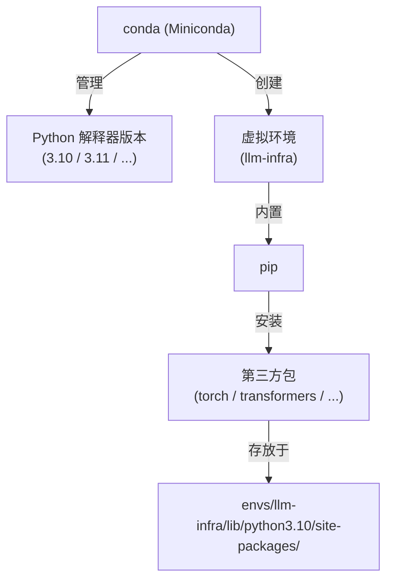

# 第 0 章：Python 环境与快速入门

> 本章面向有 JavaScript/TypeScript 经验但不熟悉 Python 的读者。如果你已经能熟练用 `pip` 装包、用 `conda` 切环境，扫一眼 0.1 节的双环境策略，然后跳到 0.6 节语法速查就够了。

LLM 生态几乎所有底层工具——PyTorch（Meta 开源的深度学习框架，AI/ML 事实标准，0.4 节会详细讲）、Transformers（HuggingFace 出的加载/运行预训练模型的标准库）、vLLM（UC Berkeley 出的工业级 LLM 推理引擎）、DeepSpeed（微软出的分布式训练加速库）——都是 Python 写的。绕不开。本章用最短篇幅把环境搭好，重点解释**为什么**这么搭，避免你在工具选型上反复折腾。

> **几个名字先备案**：上一段提到的库后面章节会反复出现，这里先一句话定位，遇到时不至于一头雾水。**Transformers** 是 HuggingFace（业界的"模型 GitHub"，托管几十万开源模型）开源的 Python 库，几行代码就能加载 BERT、Llama 这类模型。**vLLM** 是高吞吐 LLM 推理引擎，第 5 章会专门拆。**DeepSpeed** 是大模型分布式训练库，第 11 章用到。**TensorRT-LLM** 是 NVIDIA 自家的推理引擎，第 6 章对比时会出现。

## 0.1 本书的双环境策略：本地 Mac + GPU 服务器

本书的目标读者画像里，绝大多数人手上是这两台机器：

- **一台 Mac**（多半是 Apple Silicon，M1/M2/M3/M4 系列）作为日常开发机
- **一台 Linux GPU 服务器**（自己的工作站、公司机房，或临时按小时租的阿里云/腾讯云/AutoDL 实例）

两台机器分工很清楚，不要在一台上硬扛所有事：

> **CUDA 是什么**：表格里会反复出现这个词，先一句话讲清楚。CUDA（Compute Unified Device Architecture）是 NVIDIA 在 2006 年推出的 GPU 编程平台，可以理解成 NVIDIA GPU 的"操作系统 API"——PyTorch、vLLM 等 AI 框架通过它调度 GPU 算力，就像 Node.js 通过 libuv 调度 I/O。它是 NVIDIA 专有的，只能跑在 NVIDIA 显卡上。Apple Silicon 的 GPU 用的是另一套叫 **MPS**（Metal Performance Shaders）的体系，两边互不兼容，所以 vLLM 这类只依赖 CUDA 的工具 Mac 上跑不了。

| 任务 | 推荐环境 | 原因 |
|------|---------|------|
| 阅读本书、做笔记 | 本地 Mac | 不需要解释 |
| 第 1-4 章的基础实验（Tokenizer 分词器、Attention 注意力机制拆解、小模型 demo） | 本地 Mac | 7B（70 亿参数，B 是 Billion）以下用 CPU/MPS 能跑，无需开服务器 |
| 跑 vLLM、TensorRT-LLM（第 5、6 章） | GPU 服务器 | vLLM 只支持 NVIDIA CUDA，Mac 跑不了 |
| 量化、推理加速实验（第 7、8 章） | GPU 服务器 | 多数算子需要 CUDA 支持 |
| 微调、RLHF（Reinforcement Learning from Human Feedback，用人类反馈做强化学习对齐）、分布式训练（第 9-11 章） | GPU 服务器 | 显存和算力要求都不是 Mac 能扛的 |
| 生产部署演练（第 12 章） | GPU 服务器 + 容器 | 模拟真实部署环境 |
| 写代码、读源码、做架构图 | 本地 Mac | IDE 体验最好 |

**推荐工作模式**：在 Mac 上用 IDE 写代码，通过 SSH（Secure Shell，远程登录服务器的加密协议，等价于 JS 工程师常用的命令行那个 `ssh`）把代码同步到 GPU 服务器上跑。具体怎么搭见 0.5 节。

> **术语速读**：上表的标题列出现了几个高频词，集中先备案一下。**Tokenizer**（分词器）是把文字切成模型能吃的最小单位（token）的工具，第 2 章会拆。**Attention**（注意力机制）是 Transformer 架构的核心算子，决定模型怎么"理解上下文"。**7B / 13B / 70B** 里的 B 指 Billion（十亿），表示模型参数量级。**Transformer** 是 Google 2017 年论文《Attention Is All You Need》提出的网络架构，是所有现代 LLM 的骨架。

**全书约定**：后续章节凡是涉及环境相关命令，都会用下面这种格式标注：

> **Mac 本地：**
> ```bash
> # 给 Mac 的命令
> ```
>
> **Linux GPU 服务器：**
> ```bash
> # 给 Linux 的命令
> ```

如果某条命令两边一样，就只写一份不重复。

## 0.2 为什么 Python 工具链看起来这么乱

第一次接触 Python 的 JS 工程师常被这样一个事实劝退：解决"装一个包"这件事，Python 社区给了你十几个工具。

```
版本管理:    pyenv、conda、asdf、官方安装器
虚拟环境:    venv、virtualenv、conda env、pipenv
包管理:      pip、uv、poetry、pdm、pipenv、conda
项目元数据:  requirements.txt、Pipfile、pyproject.toml、setup.py
```

> **名词卡**：上面的工具集中介绍一下，看不懂没关系，本书只会用 conda 和 pip 两个。**pip**（Python Install Package）是 Python 官方的包管理器，相当于 `npm`。**venv** 是 Python 3.3+ 自带的虚拟环境模块，等价于隔离的 `node_modules`。**virtualenv** 是 venv 出现前的第三方实现，至今还在用。**conda** 是 Anaconda 公司推出的"环境管理 + 包管理"二合一工具，能管 Python 解释器版本本身。**pyenv** 是只管 Python 版本的工具，类似 `nvm`。**asdf** 是跨语言的版本管理器（一个 asdf 能管 Node、Python、Ruby 多种语言）。**poetry / pdm / pipenv** 是更现代的项目管理工具，类似 `pnpm + package.json`。**pyproject.toml** 是 PEP 518 引入的新一代项目元数据文件，意图替代老旧的 `setup.py`。

Node 这边对应的只有 `nvm + npm/pnpm + package.json` 三件套，分工清晰。Python 工具多是历史原因——语言比 npm 早出生十几年，每代工程师都试图修一遍前一代的痛点，但旧工具又没有完全淘汰。

把这些工具按职责分三层：

| 职责 | 是什么 | 类比 Node |
|------|--------|----------|
| **Python 解释器版本管理** | 决定项目用 Python 3.9 还是 3.11 | `nvm` |
| **虚拟环境隔离** | 让每个项目有独立的依赖目录，互不污染 | `node_modules` |
| **包安装与依赖管理** | 装第三方库、记录版本 | `npm install` |

Python 的"乱"主要在于：很多工具同时干多层活，又不互相兼容。

本书选定的组合，三层职责落到 conda 和 pip 两个工具上，关系如下：



conda 负责"装哪版 Python + 隔离环境"，pip 负责"在这个环境里装具体的包"，两者分工不重叠。

### 我们的选择：Miniconda + pip

本书统一用 **Miniconda 管 Python 版本和虚拟环境，用 pip 装包**。理由：

1. **CUDA 兼容性**。LLM 训练/推理离不开 CUDA、cuDNN（CUDA Deep Neural Network library，NVIDIA 在 CUDA 之上专门给神经网络做的加速库，卷积、池化这些算子的底层实现）、NCCL（NVIDIA Collective Communications Library，多 GPU 之间高效通信用，第 11 章分布式训练核心依赖）这些 GPU 库。pyenv/venv 装的是纯 Python，遇到 CUDA 版本错位时排查很痛苦。conda 能把 Python 解释器 + CUDA Runtime（运行 CUDA 程序所需的动态链接库，跟显卡驱动里的 CUDA Driver 是两层东西）一起装到环境里，切换干净。
2. **生态默认**。PyTorch、HuggingFace（业界最大的开源模型托管平台，相当于"模型版 GitHub"）、NVIDIA 的官方安装文档基本都给 conda 命令，社区博客也是。跟着主流走，遇到问题搜得到答案。
3. **跨平台一致**。Mac 和 Linux 上用同一套命令，本地学到的东西能直接迁移到服务器。
4. **学习成本低**。一个工具学会就够用，不用先理解 `pyenv + pipx + poetry + pyenv-virtualenv` 这套四件套的协作方式。

什么时候**不**用 conda？

- 在 Docker 镜像里：用系统 Python + venv 更轻，conda 会让镜像膨胀 1-2 GB。
- 纯 Web 后端（FastAPI 是 Python 主流异步 Web 框架，类似 Node 的 Fastify；Django 是老牌全栈 Web 框架），没 GPU 依赖：用 `uv` 或 `poetry` 更现代。
- 你已经有一套熟练的工具链：保持不变，本书命令都能映射过去。

> 关于 [`uv`](https://docs.astral.sh/uv/)：这是 Astral（开发 ruff 的团队，ruff 是 Rust 实现的 Python lint + 格式化工具，相当于 ESLint + Prettier 二合一）2024 年推出的 Rust 实现的包管理器，装包速度比 pip 快 10-100 倍，正在快速取代 pip + venv。如果只做应用层开发非常推荐。但目前 PyTorch GPU wheel（Python 二进制包格式，`.whl` 文件，相当于预编译的 `.tar.gz`）、vLLM 的安装教程还在以 pip/conda 为主，跨工具操作时容易出问题，所以本书先用 pip。等你环境稳定了，可以试试用 `uv pip install` 替换 `pip install`，多数情况下完全兼容。

## 0.3 Node.js 视角下的对照表

下面这张表只列**本书会用到的**工具，方便建立直觉：

| 你熟悉的 (Node.js) | Python 等价物 | 备注 |
|-------------------|--------------|------|
| `nvm use 18` | `conda activate llm-infra` | 切环境，包含 Python 版本和所有依赖 |
| `npm install xxx` | `pip install xxx` | 装包到当前激活的环境里 |
| `package.json` | `requirements.txt` 或 `pyproject.toml` | 记录依赖；本书用前者 |
| `package-lock.json` | `pip freeze > requirements.txt` 的输出 | 锁定版本 |
| `node_modules/` | `~/miniconda3/envs/<name>/lib/python3.10/site-packages/` | 实际包文件放这里 |
| `npx <cmd>` | 激活环境后直接 `<cmd>` | conda 把可执行文件加到 PATH |
| TypeScript | Type Hints + `mypy` 检查 | mypy 是 Python 官方推的静态类型检查器；类型注解运行时不强制 |
| ESLint + Prettier | `ruff` (一个工具搞定 lint + format) | ruff 已在上文出现，是新一代 Python 代码检查/格式化工具 |
| Jest / Vitest | `pytest` | 测试框架 |
| `process.env.X` | `os.environ["X"]` 或 `os.getenv("X")` | 读环境变量 |

## 0.4 安装步骤

下面的步骤两台机器都要走一遍。命令一样的只写一份，不一样的分 Mac / Linux 两栏并列。

### 第 1 步：先确认硬件情况

**Mac 本地：**

```bash
# 查芯片型号（确认是 Apple Silicon 还是 Intel）
system_profiler SPDisplaysDataType | grep "Chipset Model"
```

Apple Silicon（M1/M2/M3/M4）会输出 `Apple M*`，Intel Mac 会显示具体的 Intel/AMD 显卡型号。本书假设你是 Apple Silicon。Intel Mac 把它当成"普通 Linux x86 但没 NVIDIA GPU"处理即可。

**Linux GPU 服务器：**

```bash
# 查 NVIDIA GPU 和驱动
# 输出右上角的 "CUDA Version: 12.x" 是驱动支持的最高 CUDA 版本
nvidia-smi
```

如果 `nvidia-smi: command not found`，说明你买的机器没有 NVIDIA GPU（可能是 CPU 实例），或者镜像没装驱动。云服务器要换 GPU 镜像；自己的机器装驱动：

```bash
# Ubuntu/Debian 装驱动（云镜像通常已经装好了，本地工作站才需要这步）
sudo ubuntu-drivers autoinstall
sudo reboot
```

### 第 2 步：装 Miniconda

Miniconda 是 Anaconda 的精简版——不带预装的 200 多个数据科学包，只装 conda 工具本身和最小 Python。**本书选 Miniconda，不选 Anaconda**，因为大包预装会让磁盘膨胀 3 GB+，而我们要装的 PyTorch、vLLM 都自己装更可控。

**Mac 本地（Apple Silicon）：**

```bash
# 一定要用 arm64 版本！装错成 x86_64 会走 Rosetta 翻译，性能腰斩
curl -O https://repo.anaconda.com/miniconda/Miniconda3-latest-MacOSX-arm64.sh
bash Miniconda3-latest-MacOSX-arm64.sh
```

如果是 Intel Mac，把 `arm64` 换成 `x86_64`。

**Linux GPU 服务器：**

```bash
# 多数云 GPU 实例是 x86_64
wget https://repo.anaconda.com/miniconda/Miniconda3-latest-Linux-x86_64.sh
bash Miniconda3-latest-Linux-x86_64.sh
```

ARM Linux 实例（比如 AWS Graviton、阿里云倚天，都是基于 ARM 架构的服务器 CPU，区别于 x86 阵营的 Intel/AMD）把 URL 里的 `x86_64` 换成 `aarch64`（ARM 64 位指令集的标准名称）。

**两边公共的部分：**

```bash
# 安装过程中：
#   一路按回车看协议 → 输入 yes 接受 → 默认装在 ~/miniconda3
#   最后一步问"是否初始化 conda？" → 选 yes
#   它会往 ~/.bashrc 或 ~/.zshrc 写入初始化代码

# 让 conda 命令立刻可用（不想重开终端的话）
source ~/miniconda3/bin/activate

# 验证：应该输出 conda 24.x 之类
conda --version
```

### 第 3 步：创建项目专属环境

这一步两边命令完全一样：

```bash
# 创建一个名为 llm-infra 的环境，Python 版本固定为 3.10
# -y 表示遇到确认提示直接 yes，省一次回车
conda create -n llm-infra python=3.10 -y

# 激活这个环境
# 激活后终端提示符前面会多一个 (llm-infra) 标识
conda activate llm-infra

# 现在 python、pip 都指向这个环境里的版本
# 验证：路径里应该包含 envs/llm-infra
which python
which pip
```

为什么固定 3.10 这个版本？

- **PyTorch / vLLM / Transformers 的稳定兼容版本**。3.11、3.12 也支持，但部分第三方包（比如老一点的训练框架）的 wheel 可能还没更新到最新 Python。3.10 是社区文档里最稳的"最大公约数"。
- 不要用 3.9 及以下，类型注解语法（`list[int]` 而不是 `List[int]`）从 3.9 才能用，本书示例需要 3.10+。

环境管理常用命令：

```bash
conda activate <环境名>   # 切换到某个环境
conda deactivate          # 退到 base（conda 的默认环境）
conda env list            # 列出所有环境
conda env remove -n <名>  # 删除某个环境
```

### 第 4 步：装 PyTorch

#### 先搞清楚 PyTorch 是什么

PyTorch 是本书最重要的一个依赖——所有模型、训练、推理代码都基于它。装之前先用一段话把它讲清楚，避免后面看代码时一直在心里打问号。

**一句话定位**：[PyTorch](https://pytorch.org) 是 Meta（Facebook 母公司）在 2016 年开源的深度学习框架，2026 年的今天是 AI/ML（Artificial Intelligence / Machine Learning，人工智能 / 机器学习）领域事实标准。**PyTorch 之于 AI 工程 ≈ Node.js 之于 JS 服务端**——你看到的 LLM 模型、训练代码、推理引擎，底层默认都是它。HuggingFace Transformers、vLLM、DeepSpeed、Llama（Meta 开源的 LLM 系列，本书后续会反复拿来当实验对象）系列模型，全是 PyTorch 写的。

它解决的三件事：

1. **跨硬件的数值计算**。核心数据结构叫 **Tensor（张量，可以理解成多维数组：标量是 0 维、向量是 1 维、矩阵是 2 维、再往上就是 n 维 Tensor）**，可以理解成「numpy（NumPy，Python 数值计算基础库，提供 `ndarray` 多维数组类型）数组 + GPU 加速」。同一份代码不改逻辑就能在 CPU、NVIDIA GPU（CUDA 后端）、Apple Silicon（MPS 后端）、AMD GPU（ROCm 后端，AMD 自家对标 CUDA 的 GPU 计算平台）上跑，差别只在创建 Tensor 时指定 `device="cuda"` 还是 `device="mps"`
2. **自动求导（autograd，automatic differentiation 的简写，深度学习框架的核心特性）**。训练神经网络的本质是「定义一个损失函数（loss function，衡量预测值与真实值差距的标量），沿梯度反方向调整参数」。手算梯度对工业级模型完全不现实，PyTorch 在你做运算的同时自动记录计算图，调一次 `loss.backward()` 就把所有参数的梯度算出来
3. **神经网络组件库**。`torch.nn` 里有 `Linear`（全连接层）、`LayerNorm`（层归一化）、`MultiheadAttention`（多头注意力，Transformer 核心模块）这种现成的层，`torch.optim` 里有 Adam（自适应学习率优化器，最常用的默认选择）、SGD（Stochastic Gradient Descent，随机梯度下降）这些优化器。搭一个 Transformer 不用从矩阵乘法开始写

为什么不是 TensorFlow（Google 2015 年开源的深度学习框架，PyTorch 出现前的主流选择）？早年两家是双雄，PyTorch 因为"写起来像普通 Python、调试用 `print` 就行"（叫**动态图 / Define-by-Run**，运行时即时构建计算图；对比 TensorFlow 早期的"静态图 / Define-and-Run"，先编译整个图再喂数据），在研究圈先赢了，工业界跟着迁过来。到 2026 年 TensorFlow 主要还活跃在 Google 内部和部分老项目，新代码基本都是 PyTorch。

> **JS 工程师视角**：你不需要立刻理解"自动求导"具体怎么实现，就像你刚学 Node.js 时不需要先懂 V8（Google 的 JavaScript 引擎，Node.js 的执行核心）。本章你只要知道三件事：PyTorch 是装在 Python 环境里的一个库；它需要根据你的硬件装对应版本（这就是下面这一步的难点）；用 `torch.cuda.is_available()` / `torch.backends.mps.is_available()` 验证 GPU 后端是否可用。深度用法跟着第 2-3 章的实验慢慢长出来。

#### 安装

这一步两边**命令完全不同**：Mac 用 MPS 后端，Linux 用 CUDA 后端。

**Mac 本地（Apple Silicon）：**

```bash
# Apple Silicon 直接装默认版本即可
# PyTorch 自带 MPS 后端，会用 M 系列芯片的 GPU 加速
# 不要加 --index-url，那是给 NVIDIA 装 CUDA 版用的
pip install torch
```

**Mac 本地（Intel Mac，没 GPU）：**

```bash
# 只能用 CPU 后端
pip install torch
```

**Linux GPU 服务器：**

> 选哪个 CUDA 版本不确定？用官方选择器：[pytorch.org/get-started/locally](https://pytorch.org/get-started/locally/)，根据 OS、CUDA 版本、包管理器选好后直接复制下面给出的命令。

```bash
# 先看第 1 步 nvidia-smi 输出的 CUDA Version
# 装 PyTorch 时选等于或低于这个数字的版本
# 官方目前提供 cu118、cu121、cu124 三档预编译

# CUDA 12.1（最常用，4090/A100 主流驱动都支持）
pip install torch --index-url https://download.pytorch.org/whl/cu121

# CUDA 11.8（老一点的驱动）
pip install torch --index-url https://download.pytorch.org/whl/cu118

# CUDA 12.4（最新驱动）
pip install torch --index-url https://download.pytorch.org/whl/cu124
```

**为什么 Linux 必须加 `--index-url`？**

默认 PyPI（Python Package Index，Python 官方包仓库，相当于 `npmjs.com`）源上的 `torch` 包**不含 CUDA**。如果你的项目要用 GPU，必须从 PyTorch 自己的 wheel 仓库下载特定版本，文件名里会带 `+cu121` 这样的标识。这一步装错后面所有 GPU 代码都会报 `CUDA is not available`，到时候排查很费时间，**第一次就装对**很重要。

Mac 上则相反，PyPI 默认的就是带 MPS 的版本，加 `--index-url` 反而会装错。

> **国内网络加速**：服务器拉取 PyTorch wheel 慢的话，试上交镜像：`pip install torch --index-url https://mirror.sjtu.edu.cn/pytorch-wheels/cu121`。Mac 本地用清华源应急：`pip install torch -i https://pypi.tuna.tsinghua.edu.cn/simple`。

#### 顺手装上 numpy

```bash
pip install numpy
```

PyTorch 2.x 已经不再把 numpy 当成硬依赖（早期版本会自动一起装上）。但下一步的 `verify.py` 一跑起来，PyTorch 内部仍会尝试 import numpy，没装就会抛一条 `Failed to initialize NumPy` 的 warning。本书后续大量做 Tensor ↔ ndarray（numpy 的多维数组类型）互转、读 CSV（Comma-Separated Values，逗号分隔的纯文本表格格式）、可视化，numpy 是绕不开的，现在一行命令装上一劳永逸。

### 第 5 步：验证安装

下面这段脚本同时支持 CUDA 和 MPS，存成 `verify.py` 在两台机器上都跑一遍：

```python
import torch
import platform

print(f"OS:      {platform.system()} {platform.release()}")
print(f"Python:  {platform.python_version()}")
print(f"PyTorch: {torch.__version__}")

# 检测可用的 GPU 后端
# torch.cuda.is_available()         → NVIDIA GPU（Linux/Windows）
# torch.backends.mps.is_available() → Apple Silicon GPU
if torch.cuda.is_available():
    device = torch.device("cuda")
    print(f"Backend: CUDA {torch.version.cuda}")
    print(f"GPU:     {torch.cuda.get_device_name(0)}")
    # total_memory 单位是字节，除两次 1024 拿到 GB
    # VRAM = Video RAM，显存，GPU 上的高带宽专用内存，跟系统 RAM 是两套独立空间
    vram_gb = torch.cuda.get_device_properties(0).total_memory / 1024**3
    print(f"VRAM:    {vram_gb:.1f} GB")
elif torch.backends.mps.is_available():
    device = torch.device("mps")
    print(f"Backend: MPS (Apple Silicon GPU)")
else:
    device = torch.device("cpu")
    print(f"Backend: CPU only")

# 跑一个最小张量运算，确认计算后端正常
# 张量 (tensor) 是 PyTorch 里的基本数据结构，类似 numpy 数组
x = torch.randn(3, 3, device=device)
print(f"\n{device} 上的张量加法:\n{x + x}")
```

**Mac 本地的预期输出：**

```
OS:      Darwin 24.x
Python:  3.10.13
PyTorch: 2.4.x
Backend: MPS (Apple Silicon GPU)
```

**Linux GPU 服务器的预期输出：**

```
OS:      Linux 5.15.0
Python:  3.10.13
PyTorch: 2.3.1+cu121
Backend: CUDA 12.1
GPU:     NVIDIA GeForce RTX 4090
VRAM:    23.6 GB
```

如果 Linux 上 `CUDA available: False`，回到第 4 步检查是否装错了 wheel。

### 第 6 步：装本书后续会用到的核心库

这一步两边命令一样：

```bash
# 一次装齐：数值计算基础 + HuggingFace 全家桶 + 工具
# numpy:         数值计算基础库，跟 Tensor 互转、数据预处理都靠它
#                PyTorch 2.x 不再硬依赖 numpy，必须自己装
# transformers:  加载/运行 LLM 的标准库，文档：https://huggingface.co/docs/transformers
# accelerate:    HuggingFace 出的多 GPU / 混合精度封装库，几行代码切单机/分布式
# datasets:      HuggingFace 出的数据集加载库（微调章节会用，自带流式读取和缓存）
# sentencepiece: Google 出的 subword tokenizer 实现，Llama 等模型用它做分词
# protobuf:      Google 出的二进制序列化格式（Protocol Buffers），有些老模型权重用它存
pip install numpy transformers accelerate datasets sentencepiece protobuf

# Jupyter（可选，但强烈推荐）
# Jupyter 是数据科学界事实标准的交互式编程环境
#   起源于 IPython（Interactive Python，加强版的 Python REPL）
#   核心概念：notebook 是 .ipynb 格式的 JSON 文件，按"单元格"组织代码 + Markdown + 输出
# jupyter:    notebook 前端（网页 UI + .ipynb 文件格式）
# ipykernel:  执行 Python 代码的后端进程（"kernel"）
#             Jupyter 是前后端分离架构：前端展示，kernel 真正跑代码
pip install jupyter ipykernel

# 把当前 conda 环境注册成一个可选 kernel
# 不跑这一步：notebook 默认用系统 Python，import torch 会报 ModuleNotFoundError
# 跑了之后：在 VS Code / Cursor 打开 .ipynb 时，右上角能选到 "Python (llm-infra)"
python -m ipykernel install --user --name llm-infra --display-name "Python (llm-infra)"
```

> **给 JS 工程师**：一个 kernel ≈ 一个独立的 Python 运行时实例，类似 `nvm` 里的某个 Node 版本。`ipykernel install --name xxx` 类似 `nvm alias xxx` —— 把当前环境登记成 Jupyter 可见的一个选项。以后给每个新建 conda 环境都跑一次这条命令，就能在不同环境之间快速切换，不用反复装包。

**Linux GPU 服务器额外推荐：**

```bash
# nvitop：进程级 GPU 监控工具，类似交互版的 `top` 但专门看 GPU
# 显示每个进程占用多少显存、GPU 使用率、温度
# 项目主页：https://github.com/XuehaiPan/nvitop
pip install nvitop
```

跑训练或推理时，开一个终端执行 `nvitop` 看着，比反复 `watch nvidia-smi` 直观得多。

## 0.5 远程开发：在 Mac 上写代码，在 Linux 上跑

绝大多数读者会用这个工作流：日常坐在 Mac 前面写代码、读源码，但代码实际在 Linux GPU 服务器上跑。下面是几种主流方式，按推荐程度排序。

### 方式 A：VS Code Remote-SSH / Cursor SSH（首选）

VS Code（微软出的开源跨平台代码编辑器，前端工程师常用）装一个官方扩展 `Remote - SSH`（Cursor 是基于 VS Code 二次开发的 AI IDE，内置类似功能），就能直接打开远程服务器上的目录，体验和本地几乎没差别——文件树、终端、调试、Jupyter 全部走 SSH 通道，但 IDE 界面跑在本地。

```bash
# 1. 在 Mac 本地配置 SSH key（如果还没配）
# ssh-keygen 是生成密钥对的工具，ed25519 是当前最推荐的非对称加密算法（比老的 RSA 更短更快）
ssh-keygen -t ed25519 -C "your@email.com"
# 一路回车，默认存在 ~/.ssh/id_ed25519

# 2. 把公钥拷到 GPU 服务器
ssh-copy-id user@your-gpu-server.com
# 之后 ssh 就不用每次输密码了

# 3. 在 ~/.ssh/config 加一个别名（可选但强烈推荐）
cat >> ~/.ssh/config <<EOF
Host gpu
    HostName your-gpu-server.com
    User ubuntu
    IdentityFile ~/.ssh/id_ed25519
    ServerAliveInterval 60
EOF

# 4. 测试连接：以后输 ssh gpu 就够了
ssh gpu
```

在 VS Code/Cursor 里：`Cmd+Shift+P` → `Remote-SSH: Connect to Host` → 选 `gpu` → 新窗口里打开远程目录。所有 `pip install`、`python xxx.py`、Jupyter Notebook 都在远程执行。

### 方式 B：直接 SSH + tmux + vim/nano

最轻量，不需要 IDE。适合临时改个配置、跑个脚本。先解释三个名字：**tmux**（Terminal Multiplexer）是终端多路复用器，让一个 SSH 连接里跑多个独立会话且断连不丢；**vim** 是 UNIX 老牌模态编辑器，键位陡峭但极轻量；**nano** 是更简单的终端编辑器，新手友好。

```bash
ssh gpu
tmux new -s work     # 创建一个会话，断网也不会丢
# 在 tmux 里干活
# Ctrl+B 然后按 D 退出但保留会话
tmux attach -t work  # 下次回来恢复
```

为什么用 tmux？SSH 一断你跑的训练就 GG，tmux 让进程在服务器上一直跑，你随时连进去看进度。

### 方式 C：Jupyter Notebook 远程访问

适合做可视化实验：

```bash
# 在服务器上启动 Jupyter
ssh gpu
conda activate llm-infra
jupyter notebook --no-browser --port=8888

# 在 Mac 本地新开终端，做端口转发
ssh -L 8888:localhost:8888 gpu

# 在 Mac 浏览器打开 http://localhost:8888
# 用服务器输出的 token 登录
```

### 方式 D：rsync 同步代码（不推荐作为主力）

只在没法用 VS Code Remote 时用。**rsync** 是 UNIX 经典的增量文件同步工具，只传送变化的部分，比 `scp` 全量拷贝高效得多：

```bash
# 把本地目录同步到服务器
# --exclude 跳过不需要传的大目录
rsync -avz --exclude='.git' --exclude='__pycache__' --exclude='*.pyc' \
    ./ gpu:~/llm-infra-book/
```

频繁修改时手动 rsync 很烦，远不如 Remote-SSH 流畅。

### 文件传输小命令

`scp`（Secure Copy）是基于 SSH 协议的文件拷贝命令，命令行参数和 `cp` 几乎一致：

```bash
# 从本地传到服务器
scp local-file.py gpu:~/

# 从服务器拉回本地
scp gpu:~/results/output.png ./

# 大目录递归
scp -r ./dataset/ gpu:~/data/
```

## 0.6 给 JS/TS 工程师的 Python 语法速查

只列**真正会用到、并且和 JS 差异大**的部分。完整教程请参考 [Python 官方文档（中文）](https://docs.python.org/zh-cn/3.10/)。

### 基本类型与运算

```python
# 不需要 const/let/var，直接赋值
x = 42                    # int
y = 3.14                  # float
name = "递归客"            # str（注意：双引号和单引号等价，没有模板字符串那种区分）
ok = True                 # bool（首字母大写！不是 true）
nothing = None            # 等价于 JS 的 null（也不是 undefined）

# f-string（等价于 JS 的模板字符串）
print(f"Hello, {name}! Age: {x + 1}")

# 类型注解（运行时不强制，给 IDE 和 mypy 看）
age: int = 25
names: list[str] = ["Alice", "Bob"]
```

### 容器：list / dict / tuple

```python
# list ≈ JS Array
fruits = ["apple", "banana", "cherry"]
fruits.append("date")     # 类似 push
fruits[0]                 # 索引访问
fruits[-1]                # 负索引：从末尾数（JS 没有，要用 .at(-1)）
fruits[1:3]               # 切片：返回 ["banana", "cherry"]，左闭右开

# dict ≈ JS Object（但 key 可以是任意 hashable 类型，不仅是字符串）
user = {"name": "Alice", "age": 30}
user["name"]              # 取值（不能用点号语法）
user.get("email", "N/A")  # 带默认值的取值，避免 KeyError

# tuple：不可变的 list，常用于函数返回多个值
point = (1, 2)
x, y = point              # 解构，类似 JS 的 [x, y] = arr
```

### 控制流

```python
# 缩进决定代码块，没有花括号
# 强制 4 空格缩进（PEP 8，Python Enhancement Proposal 第 8 号，社区官方代码风格指南）
if x > 0:
    print("positive")
elif x < 0:
    print("negative")
else:
    print("zero")

# for 永远是 for-of 风格，没有 C 风格的 for(i=0;...)
for fruit in fruits:
    print(fruit)

# 要拿索引用 enumerate
for i, fruit in enumerate(fruits):
    print(f"{i}: {fruit}")

# 范围循环
for i in range(10):       # 0 到 9
    print(i)
```

### 函数

```python
# 定义：def 关键字，参数和返回值类型注解可选
def greet(name: str, age: int = 18) -> str:
    return f"Hello {name}, you are {age}"

greet("Alice")            # 用默认 age
greet("Bob", age=25)      # 命名参数（JS 没有，要靠对象传参模拟）

# Lambda ≈ JS 箭头函数，但只能写一个表达式
square = lambda x: x * x

# 可变参数
def total(*args, **kwargs):
    # args 是 tuple，kwargs（keyword arguments，关键字参数）是 dict
    # 等价于 JS 的 ...rest 和 ...options
    print(args, kwargs)
```

### 异步

```python
import asyncio

# asyncio 是 Python 标准库里的异步 I/O 框架，对应 Node 的 event loop + Promise
# async def 定义协程（coroutine，可被挂起和恢复的函数对象，await 的实际目标）
async def fetch_data():
    await asyncio.sleep(1)
    return "data"

# 顶层 await 不能直接用，要 asyncio.run 启动事件循环
# 等价于 Node 早期版本没有顶层 await 的情况
result = asyncio.run(fetch_data())
```

### 错误处理

```python
try:
    risky()
except ValueError as e:
    # 类似 JS 的 catch(e)，但要指定异常类型
    print(f"value error: {e}")
except (KeyError, IndexError) as e:
    # 多种异常类型用 tuple 列出
    print(f"lookup failed: {e}")
finally:
    cleanup()
```

### 模块导入

```python
# 整体导入
import torch
torch.zeros(3)

# 按需导入（更常用）
# AutoTokenizer / AutoModel 是 transformers 的"工厂类"，
# 根据模型名自动选对应实现，免去手动判断模型架构
from transformers import AutoTokenizer, AutoModel

# 改名（处理冲突或简写）
import numpy as np        # 社区默认别名
```

### 容易踩的坑

1. **缩进必须一致**。混用 tab 和空格会报 `IndentationError`。VS Code 默认配置就行，不用折腾。
2. **True / False / None 首字母大写**。写成 `true` 直接语法错误。
3. **`==` 比较值，`is` 比较引用**。判断 None 要用 `if x is None`，不要用 `==`。
4. **可变默认参数是坑**。`def f(items=[]):` 这种写法所有调用共享同一个 list，绝对不要写。要用 `def f(items=None):` + `if items is None: items = []`。
5. **没有 `null` 这个词**。所有"空"都是 `None`。

## 0.7 IDE 推荐

| 工具 | 适合谁 | 备注 |
|------|-------|------|
| **Cursor** | 想要 AI 辅助 | 基于 VS Code，内置 Claude/GPT，写 Python 提速明显，Remote-SSH 内置 |
| **VS Code + Python 扩展** | 大部分人 | 最接近 JS 工程师熟悉的体验，免费，社区生态强 |
| **PyCharm Community** | 重度 Python 项目 | JetBrains 出的 Python IDE 社区免费版，重构和调试体验是行业标杆，启动慢一点 |
| **Jupyter Notebook** | 实验和数据可视化 | 必备，跑模型时方便看中间结果 |

**VS Code / Cursor 推荐扩展**（安装后自动启用）：

- `ms-python.python` — Python 语言支持
- `ms-python.vscode-pylance` — 类型检查和补全（Pylance 是微软出的 Python 语言服务器，基于 Pyright）
- `charliermarsh.ruff` — Lint + 格式化（替代老的 black 格式化器 + flake8 lint 工具组合）
- `ms-toolsai.jupyter` — 在 IDE 里直接跑 .ipynb 文件
- `ms-vscode-remote.remote-ssh` — Remote-SSH（Cursor 已内置）

打开项目目录后，VS Code/Cursor 右下角会让你选 Python Interpreter，选刚才创建的 `llm-infra` 那个（路径里带 `envs/llm-infra/bin/python`）。选对之后，所有 import、运行、调试都会用这个环境。

## 0.8 一份 checklist

两台机器都过一遍，确认下面这些都能跑通，再进入第 1 章：

**Mac 本地：**

- [ ] `conda activate llm-infra` 能切换到环境
- [ ] `which python` 输出的路径在 `envs/llm-infra` 下
- [ ] `python -c "import torch; print(torch.__version__)"` 能输出版本号
- [ ] `python -c "import torch; print(torch.backends.mps.is_available())"` 输出 `True`
- [ ] `python -c "from transformers import AutoTokenizer"` 不报错
- [ ] Cursor / VS Code 打开 .py 文件能正确识别 `llm-infra` 解释器

**Linux GPU 服务器：**

- [ ] `ssh gpu` 不用输密码能登上
- [ ] `nvidia-smi` 显示 GPU 信息
- [ ] `conda activate llm-infra` 能切环境
- [ ] `python -c "import torch; print(torch.cuda.is_available())"` 输出 `True`
- [ ] 从 Mac 用 Remote-SSH 能打开服务器目录、跑 Jupyter Cell

两台机器都过了，环境就绪。下一章我们从一次 LLM API 调用的完整链路讲起，把"应用层 → Infra 层"的整张地图铺开。


---

> 本章来自《LLM Infra 从入门到实践》开源版 · 作者「递归客」  
> 在线阅读完整书系：[inferloop.dev](https://inferloop.dev)
