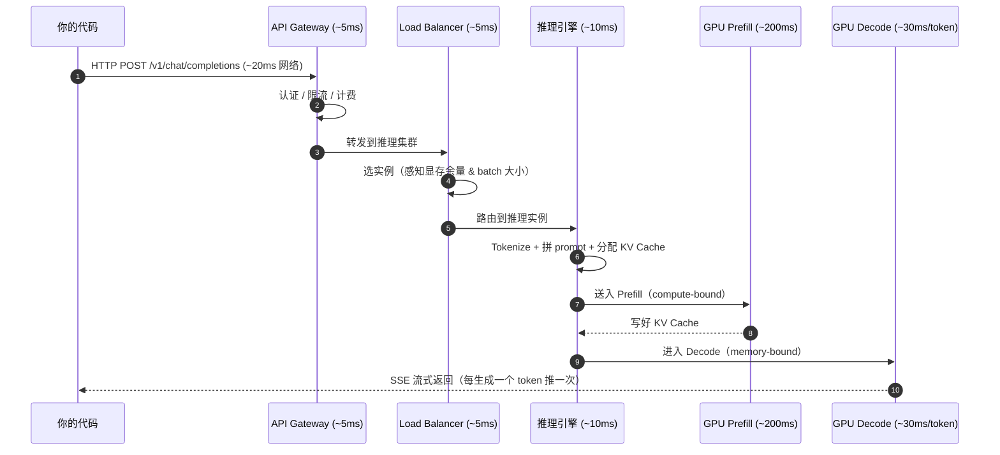
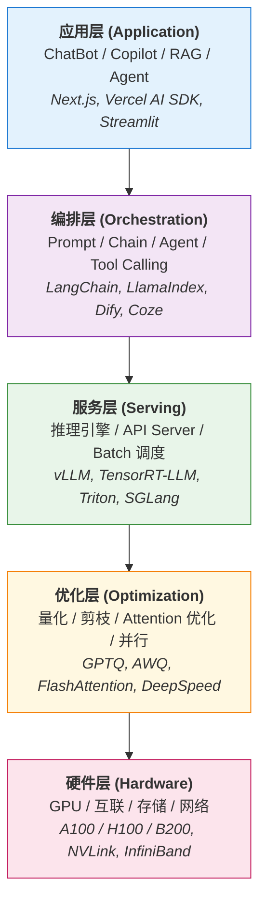
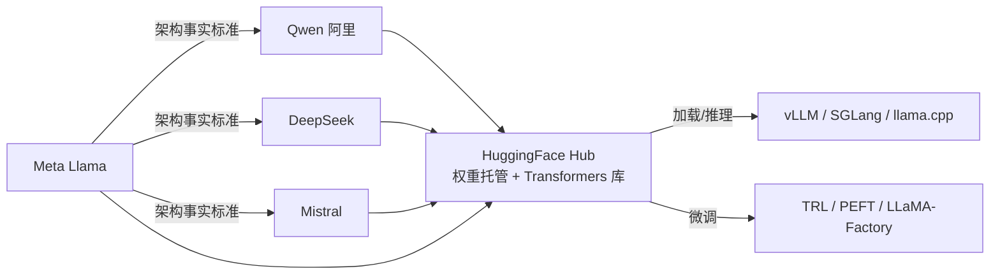
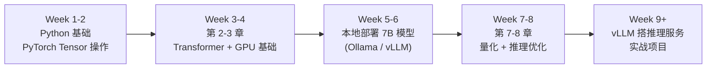

# 第 1 章 全景图：LLM 技术栈的分层

## 1.1 从 HTTP 请求到 Token 生成：一次 API 调用经历了什么

本书反复用到的几个核心缩写先在这里点一下，正文后面遇到不会再回头解释：

- **LLM**（Large Language Model，大语言模型）：参数量从几十亿到上万亿的语言模型，输入文本、输出文本，本书的主角。
- **Token**：模型处理文本的最小单元，介于"字符"和"单词"之间（1.1 节末尾会展开）。
- **Infra**（Infrastructure，基础设施）：本书语境里特指把 LLM 跑起来对外服务所需的引擎、调度、硬件、监控等"应用层之下"的所有东西。

先从最熟悉的东西开始。下面这段代码，前端工程师闭着眼睛都能写：

```typescript
const response = await fetch('https://api.openai.com/v1/chat/completions', {
  method: 'POST',
  headers: {
    'Authorization': `Bearer ${apiKey}`,
    'Content-Type': 'application/json',
  },
  body: JSON.stringify({
    model: 'gpt-4o',
    messages: [{ role: 'user', content: '什么是 KV Cache？' }],
    stream: true,
  }),
});
```

一个标准的 POST 请求。但从你按下回车到第一个 token 出现在屏幕上，中间经历了至少 7 个阶段（顺带一提，**KV Cache**（Key-Value Cache）是 LLM 推理时缓存历史 token 注意力计算结果的核心数据结构，详见下面第 4 步和第 4 章）。实际延迟大约 300ms-2s（取决于模型和负载），拆开看每一步花了多长时间：



三个垂直分区可以这样理解："你的代码 → API Gateway / Load Balancer（OpenAI 基础设施）→ 推理引擎 / GPU Prefill / GPU Decode（GPU 集群）"。下面按编号 1-7 展开。

**第 1 步：API Gateway（~5ms）**

请求先打到 API Gateway。干三件事：验证 API Key、检查 rate limit、记录用量用于计费。这和你写过的任何 SaaS 后端没区别——就是 middleware。OpenAI 用的方案未公开，但业界常见的是 Kong、Envoy 或自研网关。

**第 2 步：Load Balancer（~5ms）**

请求被路由到具体的推理集群。这里的 LB 逻辑比普通 Web 服务复杂：不能简单 round-robin，因为每张 GPU 卡上可能正在处理不同长度的请求，显存占用差异很大。调度器需要感知每张卡的显存余量和当前 batch 大小。

**第 3 步：推理引擎预处理（~10ms）**

请求到达具体的推理实例（运行 **vLLM**（UC Berkeley 开源的高吞吐 LLM 推理引擎，第 5 章主角）、**TensorRT-LLM**（NVIDIA 官方推理引擎，基于 TensorRT 编译优化）或 OpenAI 自研引擎）。引擎做几件事：

1. 把你的 messages 按照 **chat template**（聊天模板，定义不同角色文本如何拼成单一字符串的模板，类似前端的字符串模板字面量）拼成完整 prompt（**Prompt**：喂给模型的完整输入文本，即"提示词"。不同模型有不同的对话格式模板，比如 **Llama 3**（Meta 开源的大语言模型系列）用 `<|begin_of_text|><|start_header_id|>user<|end_header_id|>` 这样的特殊标记把 system / user / assistant 的角色边界标出来；引擎负责把 OpenAI 风格的 messages 数组转成对应模型能理解的字符串，第 4 章会展示完整实例）
2. 用 **Tokenizer**（分词器，把字符串切成 token 数组的工具，类似 `JSON.parse` 之于 JSON）把文本切成 token 序列（"什么是 KV Cache？" 大约 8-12 个 token）
3. 在显存中分配 KV Cache 空间
4. 把这个请求加入当前 batch（**continuous batching**（连续批处理）：不等一批请求全部跑完再接下一批，而是每次有 slot 空出就立刻插入新请求，让 GPU 几乎不空转，是 vLLM 把吞吐量做到工业级的关键调度策略，第 5 章详解）

> **token 是什么**：token 是模型处理文本的最小单元，大致对应英文的一个单词或中文的 1-2 个字，但实际上按 **subword（子词）** 切分——`unbelievable` 可能被切成 `un` + `believ` + `able` 三个 token，"什么是 KV Cache？" 这 10 个字符也大约被切成 8-12 个 token。OpenAI API 按 token 计费、上下文窗口（4k/8k/128k）单位也是 token，和这里说的是同一个东西。Tokenizer 的具体分词逻辑（**BPE**（Byte Pair Encoding，字节对编码，按高频组合贪心合并的分词算法）、**SentencePiece**（Google 开源的语言无关分词工具，被 Llama / Qwen 大量使用）等）第 2 章会讲。

**第 4 步：Prefill（~200ms，长 prompt 更久）**

这是第一个真正吃 GPU 算力的阶段（**Prefill**：预填充阶段，把整段 prompt 并行喂进模型一次性算出 KV Cache，第 4 章深入）。所有输入 token 并行通过 **Transformer**（2017 年 Google 提出的、基于 Attention 的神经网络架构，所有现代 LLM 的底座，第 2 章专章拆解）的每一层，计算出对应的 Key 和 Value 向量并缓存起来（KV Cache）。这里的 **Attention**（注意力机制）是 Transformer 的核心算子，计算"当前 token 该关注上下文里哪些 token"，输出 Query / Key / Value 三组向量。这一步是 **compute-bound**（计算密集型）——GPU 的计算单元跑满，显存带宽还有富余（类比：CPU 在做大矩阵相乘，内存读起来很轻松，瓶颈在算力）。

Prefill 的耗时和输入长度成正比（准确说是 O(n^2)，因为 Attention 计算量随 **sequence length**（序列长度，即输入加输出的 token 总数）平方增长）。100 个 token 的输入可能只要 50ms，但 10000 个 token 的输入可能要 2 秒。

**第 5 步：Decode（~30ms/token）**

从这一步开始逐个生成 token（**Decode**：自回归解码阶段，每次基于当前 KV Cache 算出下一个 token，写回 KV Cache，再算下一个，循环直到生成结束）。这种"每次只算一个 token、把它喂回去再算下一个"的方式叫 **autoregressive**（自回归），是所有主流 LLM 的生成范式。每次只处理 1 个新 token，但需要和之前所有 token 的 KV Cache 做 Attention 计算。这一步是 **memory-bound**（显存带宽密集型）——每生成一个 token 都要从显存读取整个 KV Cache，GPU 的计算单元大部分时间在等数据（类比：CPU 几乎空转，每一步都要先从 RAM 里把一大块数据搬过来才能继续）。

生成一个 token 大约 20-50ms（取决于模型大小和 batch size），生成 200 个 token 就是 4-10 秒。

**第 6 步：Streaming 返回**

每生成一个 token，推理引擎立刻通过 SSE（Server-Sent Events）把它推回去。你在前端用 `EventSource` 或手动解析 `ReadableStream` 拿到的就是这些 token。每个 SSE 事件长这样：

```
data: {"choices":[{"delta":{"content":"KV"},"index":0}]}

data: {"choices":[{"delta":{"content":" Cache"},"index":0}]}

data: {"choices":[{"delta":{"content":" 是"},"index":0}]}
```

这就是为什么 ChatGPT 的回复是"一个字一个字蹦出来的"——不是故意做的打字机效果，是真的在一个 token 一个 token 生成。

**延迟分布小结**

| 阶段 | 耗时 | 瓶颈 |
|------|------|------|
| 网络传输 | 20-100ms | 物理距离 |
| API Gateway | ~5ms | CPU |
| Load Balancer | ~5ms | 调度逻辑 |
| 推理引擎预处理 | ~10ms | CPU（Tokenize） |
| Prefill | 50-2000ms | GPU 算力 |
| Decode（每 token） | 20-50ms | GPU 显存带宽 |

对应用工程师来说，最直接的感受是两个指标：**TTFT**（Time To First Token，首 token 延迟）和 **TPS**（Tokens Per Second，生成速度）。TTFT 主要由 Prefill 决定，TPS 主要由 Decode 决定。

## 1.2 技术栈分层

整个 LLM 基础设施可以分成 5 层。从上到下，离用户越来越远，离硬件越来越近。下图里出现的关键名词先在这里集中扫一眼：

- **RAG**（Retrieval-Augmented Generation，检索增强生成）：先从外部知识库检索相关片段、再把这些片段拼进 prompt 让模型回答的范式，本书第 14 章专章讲。
- **Agent**：能调用工具、能多步推理、能自己决定下一步动作的 LLM 应用形态，不是单轮问答。
- **Tool Calling**（工具调用 / Function Calling）：模型按结构化 JSON 输出"我要调用 X 函数，参数是 Y"，由外部代码真正执行后把结果回喂给模型。
- **Serving**（服务）：把训练好的模型挂成 HTTP/gRPC API 对外提供推理的过程。
- **量化**（Quantization）：把模型权重从 FP16 等高精度压缩成 INT8 / INT4 等低精度，减少显存占用和计算量，第 7 章详解。
- **Attention 优化**：针对 Transformer 注意力算子的 GPU kernel 重写，例如 FlashAttention、PagedAttention（下文会出现）。
- **并行**：把模型或数据切到多张卡 / 多台机器上跑，包含 Tensor Parallel、Pipeline Parallel 等几种切法，第 11 章详解。
- **互联**（Interconnect）：GPU 之间和服务器之间的高速通信链路，例如下面会反复出现的 NVLink、InfiniBand。




前端/全栈工程师通常在最上面两层工作。这本书的目标是带你理解中间三层——服务层、优化层和硬件层，因为这三层决定了你的应用的响应速度、成本和可靠性。

一个类比：你写过 Node.js Web 应用，知道 Express 是框架、V8 是引擎、libuv 是事件循环、Linux 是操作系统、CPU 是硬件。你不需要能写 V8，但你得知道 event loop 怎么工作才能写出高性能的代码。LLM 技术栈也一样——你不需要训练模型，但你得理解推理引擎的工作原理，才能做好 Agent 工程。

## 1.3 各层的核心职责、关键指标和代表项目

### 应用层

**职责：** 直接面向终端用户，把 LLM 能力包装成产品。处理 UI 交互、用户会话管理、结果展示。

**关键指标：**
- 端到端延迟（用户感知的等待时间）
- 可用性（SLA 99.9%+）
- 用户体验（流式输出的流畅度、错误处理）

**代表项目：**

| 项目 | 说明 |
|------|------|
| [Vercel AI SDK](https://sdk.vercel.ai) | TypeScript-first 的 LLM 应用框架，streaming 支持极好 |
| [Streamlit](https://streamlit.io) | Python 快速原型，适合 demo |
| [Gradio](https://www.gradio.app) | 类似 Streamlit，HuggingFace 生态 |
| [Open WebUI](https://github.com/open-webui/open-webui) | 开源 ChatGPT 替代前端 |

### 编排层

**职责：** 管理 Prompt、组织调用链路、实现 Tool Calling 和 Agent 逻辑。这层是 Agent 工程师的主战场。

**关键指标：**
- Prompt 命中率和质量（RAG 的 **recall**（召回率，相关文档被检索出来的比例）/ **precision**（准确率，检索出的文档里真正相关的比例））
- Agent 任务完成率
- Token 消耗成本
- 端到端 Chain 延迟

**代表项目：**

| 项目 | 说明 |
|------|------|
| [LangChain](https://github.com/langchain-ai/langchain) | 最流行的 LLM 编排框架，生态大但抽象层多 |
| [LlamaIndex](https://github.com/run-llama/llama_index) | 专注 RAG 场景，数据索引能力强 |
| [Dify](https://github.com/langgenius/dify) | 开源 **LLMOps**（LLM 运维平台，类比 DevOps 之于传统服务）平台，可视化编排 |
| [CrewAI](https://github.com/crewAIInc/crewAI) | 多 Agent 协作框架 |
| [Semantic Kernel](https://github.com/microsoft/semantic-kernel) | 微软的 LLM 编排框架 |

### 服务层

**职责：** 把训练好的模型跑起来，对外提供推理 API。处理请求调度、batch 管理、显存分配、模型加载。

**关键指标：**
- TTFT（Time To First Token）：首 token 延迟
- TPS（Tokens Per Second）：吞吐量
- **QPS**（Queries Per Second，每秒请求数）：传统 Web 服务的吞吐量指标
- GPU 利用率
- 每千 token 成本

**代表项目：**

| 项目 | 说明 |
|------|------|
| [vLLM](https://github.com/vllm-project/vllm) | 当前最流行的开源推理引擎，**PagedAttention**（借鉴操作系统虚拟内存分页思路的 KV Cache 管理算法，第 5 章详解）显存管理 |
| [TensorRT-LLM](https://github.com/NVIDIA/TensorRT-LLM) | NVIDIA 官方方案，性能最优但灵活性低 |
| [SGLang](https://github.com/sgl-project/sglang) | UC Berkeley 出品，**RadixAttention**（基于前缀树 / Radix Tree 的 KV Cache 共享算法）加持，结构化生成性能好 |
| [Triton Inference Server](https://github.com/triton-inference-server/server) | NVIDIA 的模型服务框架，支持多种后端（注意这里的 Triton 是"模型服务器"产品名，和后文优化层提到的 OpenAI Triton GPU kernel 语言不是一回事） |
| [Ollama](https://ollama.com) | 本地部署方案，开发者友好 |
| [llama.cpp](https://github.com/ggml-org/llama.cpp) | C++ 实现，CPU 推理首选 |

### 优化层

**职责：** 让模型跑得更快、占用更少显存。不改变模型能力（或尽量少损失），但大幅提升推理效率。

**关键指标：**
- 压缩比（**INT4**（4 比特整数）量化 = 模型体积缩小到原来的 1/4，相比 **FP16**（16 比特半精度浮点）权重）
- 精度损失（量化后 **benchmark**（标准化评测集，例如 MMLU、GSM8K，用来横向对比模型能力）得分的下降幅度）
- 推理加速比
- 显存节省量

**代表项目：**

| 项目 | 说明 |
|------|------|
| [FlashAttention](https://github.com/Dao-AILab/flash-attention) | **IO-aware**（感知 GPU 显存层级 IO 的）Attention 实现，减少 **HBM**（高带宽显存，下节专门解释）访问，第 8 章详解 |
| [GPTQ](https://arxiv.org/abs/2210.17323) | **Post-training 量化**（PTQ，训练完成之后再做量化、不需要重新训练），输出 **INT8**（8 比特整数）/ INT4 权重 |
| [AWQ](https://arxiv.org/abs/2306.00978) | **Activation-aware**（基于激活值分布做权重缩放的）量化，精度损失更小 |
| [DeepSpeed](https://github.com/microsoft/DeepSpeed) | 微软的分布式训练/推理框架，**ZeRO**（Zero Redundancy Optimizer，零冗余优化器）显存切分的代表实现 |
| [Megatron-LM](https://github.com/NVIDIA/Megatron-LM) | NVIDIA 的大规模并行训练框架 |
| [bitsandbytes](https://github.com/bitsandbytes-foundation/bitsandbytes) | 4-bit 量化库，**QLoRA**（Quantized LoRA，把基座权重量化到 4-bit 之后再做 LoRA 微调，单卡可训 65B 模型）的基础。**LoRA**（Low-Rank Adaptation，低秩适配）是把参数更新约束在两个小矩阵相乘上的高效微调技术，第 9 章详解 |

### 硬件层

**职责：** 提供算力和存储。GPU 选型、集群网络拓扑、存储方案直接决定了上层能做什么。

**关键指标：**
- **TFLOPS**（Tera Floating-Point Operations Per Second，每秒万亿次浮点运算，算力单位）
- 显存容量和带宽（GB, GB/s）
- 卡间互联带宽（NVLink: 900GB/s on H100）
- 性价比（$/TFLOPS/hour）

> **三个名词先解释清楚**：
>
> - **HBM**（High Bandwidth Memory，高带宽显存）：GPU 上贴着芯片封装的高带宽显存，带宽比普通 **GDDR6**（消费级显卡使用的显存类型）高一个数量级，但单卡容量受工艺限制（目前主流 80-192 GB）。HBM2e、HBM3、HBM3e 是工艺迭代版本，带宽逐代提升。
> - **NVLink**：NVIDIA 自家 GPU 之间的高速直连总线，让多张卡可以像一张大卡一样共享显存——H100 单链路 900 GB/s，远高于 **PCIe**（Peripheral Component Interconnect Express，主板上 CPU/GPU/SSD 走的通用串行总线） 5.0 的 ~128 GB/s。多卡训练/推理几乎离不开它。
> - **InfiniBand**：服务器与服务器之间的高速网络协议（不是 GPU 内部），延迟比以太网低一个数量级，多机分布式训练用它来传梯度。

**代表硬件**（**A100 / H100 / H200 / B200 / L40S** 都是 NVIDIA 数据中心 GPU 型号，前四款是 SXM 训练卡，L40S 是 PCIe 推理卡；**FP4** = 4 比特浮点，**GDDR6X** 是消费级显卡常用的显存类型，比 HBM 带宽低但便宜）：

| 硬件 | FP16 TFLOPS | 显存 | 显存带宽 | 适用场景 |
|------|-------------|------|----------|----------|
| A100 80GB | 312 | 80GB HBM2e | 2.0 TB/s | 当前主力，性价比高 |
| H100 80GB | 990 | 80GB HBM3 | 3.35 TB/s | 新一代旗舰 |
| H200 | 990 | 141GB HBM3e | 4.8 TB/s | 大显存，长 **context**（上下文，模型一次能"看到"的 token 总长度） |
| B200 | 2250 | 192GB HBM3e | 8.0 TB/s | 最新一代，FP4 支持 |
| L40S | 366 | 48GB GDDR6X | 864 GB/s | 推理性价比之选 |

## 1.4 主流模型家族速览

从下一章开始，本书会反复用 Llama、Qwen、DeepSeek 这几个名字举例子。这些不只是几个模型，它们代表了**整个开源 LLM 生态**——架构样本、推理引擎的优化基准、benchmark 的对照组、微调和部署的实践模板。先把它们彼此的关系理清楚，后面看具体例子时不会迷路。

### Llama：开源 LLM 的事实标准

[Llama](https://github.com/meta-llama/llama-models)（[官网](https://llama.com)）是 Meta 在 2023 年起开源的大语言模型系列。一句话定位：**Llama 之于开源 LLM ≈ Linux 之于操作系统**——不是性能最强的（GPT-4 / Claude / Gemini 这些闭源旗舰通常领先半档），但它是**权重公开、可自己下载部署、可自己微调**的最知名一家。整个生态（HuggingFace Transformers、vLLM、`llama.cpp` 这名字都来自它）都默认优先兼容 Llama 架构。

> 顺带说一下下表的"参数量档位"读法：**7B / 70B / 405B** 里的 **B**（Billion）是十亿参数数量，**M**（Million）是百万。Llama 3.1 405B 就是 4050 亿参数。**SFT**（Supervised Fine-Tuning，监督微调，用有标注的"输入-期望输出"对继续训练基座模型）是后面章节常见的术语，第 9 章详解。

| 版本 | 发布 | 参数量档位 | 备注 |
|---|---|---|---|
| LLaMA 1 | 2023.02 | 7B / 13B / 33B / 65B | 原本只授权学术，泄露后被广泛使用 |
| Llama 2 | 2023.07 | 7B / 13B / 70B | 首个允许商用的开源版本，开源 LLM 爆发起点 |
| Llama 3 | 2024.04 | 8B / 70B | 数据量扩大，性能跳一档 |
| Llama 3.1 | 2024.07 | 8B / 70B / **405B** | 首次开源 400B+ 旗舰，对标 GPT-4 |
| Llama 3.2 | 2024.09 | 1B / 3B（小）+ 11B / 90B（视觉） | 加多模态分支 |
| Llama 3.3 | 2024.12 | 70B | 用更好的训练把 70B 推到接近 405B |
| Llama 4 | 2025 | MoE 架构 | 切到稀疏激活（见下） |

**架构特点**：Decoder-only Transformer + RMSNorm + SwiGLU + RoPE + GQA。这套组合后来成了所有现代开源 LLM 的默认套路，第 2 章会逐一拆开讲。把名词先点开：

- **Decoder-only**（仅解码器）：Transformer 的一种变体，只保留 GPT 这一支用的"解码器"那一半，逐 token 自回归生成。
- **RMSNorm**（Root Mean Square Normalization，均方根归一化）：替代经典 LayerNorm 的一种归一化层，省一次减均值的计算。
- **SwiGLU**（Swish-Gated Linear Unit）：一种带门控的激活函数，比 ReLU / GELU 在 LLM 上效果更好。
- **RoPE**（Rotary Position Embedding，旋转位置编码）：把位置信息以"复数旋转"的方式注入 Query/Key 向量的位置编码方案，能优雅地外推到更长的上下文。
- **GQA**（Grouped Query Attention，分组查询注意力）：让多个 Query head 共享一组 Key/Value head 的折中方案，显著减小 KV Cache，第 2、3 章会反复出现。极端版本叫 **MQA**（Multi-Query Attention，所有 head 共享一组 KV）。

**License 提醒**：Llama 用的是 [Llama Community License](https://www.llama.com/llama3/license/)，不是 MIT / Apache。商用条件：你的产品月活用户 < 7 亿都免费可商用（基本覆盖所有中小厂），但要在产品里标注 "Built with Llama"，且禁止用 Llama 输出训练其他 LLM。严格合规需要看清楚。

### Qwen：国产开源代表

[Qwen](https://github.com/QwenLM)（通义千问，[HuggingFace 组织页](https://huggingface.co/Qwen)）是阿里巴巴开源的模型系列。从 Qwen2 起架构基本与 Llama 对齐（Decoder-only + RMSNorm + SwiGLU + RoPE + GQA），所以推理引擎、微调框架可以直接复用 Llama 那套代码。

常见版本：Qwen2.5（0.5B / 1.5B / 3B / 7B / 14B / 32B / 72B）、Qwen2.5-Coder（专为代码训练）、Qwen2-**VL**（Vision-Language，视觉-语言多模态）、QwQ（推理增强）。**License 是 Apache 2.0 / Qwen License**，多数版本限制比 Llama 少，国内项目越来越多直接选 Qwen 作为基座。

### DeepSeek：MoE 路线的代表

[DeepSeek](https://github.com/deepseek-ai)（[官网](https://www.deepseek.com)）是一家国内 AI 公司，技术路线偏激进，模型卡片上的数字经常吓人——比如 **DeepSeek-V3 总参数 671B、激活参数 37B**。这是 **MoE（Mixture of Experts，混合专家）** 架构：模型里有 256 个专家子模型（每个专家是一个独立的 **FFN**（Feed-Forward Network，前馈网络，Transformer 每层除了 Attention 之外的那个两层 MLP 部分）），每个 token 只激活其中 8 个，所以**存得多但每个 token 实际计算量只对应 37B**。DeepSeek 还在注意力机制上引入了 **MLA**（Multi-head Latent Attention，多头潜变量注意力），用低秩压缩进一步缩小 KV Cache，是这家公司的招牌设计之一。

**总参数 vs 激活参数**是 MoE 时代的关键区分：

- 总参数（total params）：决定**显存占用**（所有专家都得装进显存等待被选中）
- 激活参数（active params）：决定**每个 token 的计算量和推理速度**

这就是为什么 DeepSeek-V3 是 671B 但能跑起来——单卡只算 37B 的活，但要 8 张 H100 才装得下。

### Mistral：欧洲玩家

[Mistral AI](https://mistral.ai/)（[GitHub](https://github.com/mistralai)）是法国创业公司，开源了 Mistral 7B、Mixtral 8x7B（MoE 早期代表）、Codestral（代码模型）等。架构同样跟 Llama 系列对齐。在欧美开发者圈使用率高，国内项目用 Mistral 的少一些，但读 vLLM / SGLang issue 时会经常看到。

### HuggingFace：模型和生态的「集散地」

[HuggingFace](https://huggingface.co/)（[GitHub](https://github.com/huggingface)）不是一个模型，是一家公司 + 一个平台。它在 LLM 生态里扮演**三个核心角色**：

1. **模型 Hub**（[huggingface.co](https://huggingface.co)）：超过 100 万个模型权重托管在这里，包括所有 Llama / Qwen / DeepSeek / Mistral 的官方发布。`pip install xxx` 装代码，但下载模型权重几乎都是从 HuggingFace 拉。
2. **Transformers 库**（[github.com/huggingface/transformers](https://github.com/huggingface/transformers)）：用 **PyTorch**（Meta 主导的开源深度学习框架，是 LLM 训练 / 推理代码的事实标准，类比前端的 React）加载和运行模型的事实标准库，`AutoModelForCausalLM.from_pretrained("meta-llama/Llama-3.1-8B")` 这种调用就是它。本书第 4 章会大量用到。
3. **配套生态**：[Datasets](https://github.com/huggingface/datasets)（数据集）、[Tokenizers](https://github.com/huggingface/tokenizers)（分词器）、[PEFT](https://github.com/huggingface/peft)（**Parameter-Efficient Fine-Tuning**，参数高效微调，只更新少量参数即可适配新任务，LoRA 是它的旗舰算法，第 9 章用）、[TRL](https://github.com/huggingface/trl)（Transformer Reinforcement Learning，**RLHF**（Reinforcement Learning from Human Feedback，人类反馈强化学习，用人类偏好数据训练奖励模型再调模型）/ **DPO**（Direct Preference Optimization，直接偏好优化，跳过显式奖励模型的对齐算法）训练，第 10 章用）、[Accelerate](https://github.com/huggingface/accelerate)（分布式训练，第 11 章用）。

简化记忆：**模型权重去 HuggingFace 下载，代码用 Transformers 加载**。国内访问慢可以用 [ModelScope](https://www.modelscope.cn/)（阿里）或 [HF-Mirror](https://hf-mirror.com/) 镜像。

### 一张关系图



理解了这张图，本书后面看到具体模型名时就有了上下文：**它来自哪家、用什么架构、权重在哪下、推理用什么工具**。

## 1.5 作为应用工程师，你已经具备的和需要补齐的

好消息是，你已经有不少直接可迁移的技能。

**你已有的（直接可用）：**

| 技能 | 在 LLM Infra 中的对应 |
|------|----------------------|
| HTTP/REST API 设计 | 推理服务的 API 协议（OpenAI 兼容格式） |
| **SSE**（Server-Sent Events，服务器推送事件，HTTP 长连接单向流） / WebSocket / Streaming | 流式推理输出，就是你熟悉的 SSE |
| JSON 解析和数据处理 | **Structured Output**（结构化输出，让模型严格按指定 JSON Schema 返回）、Tool Calling 的响应解析 |
| async/await 异步编程 | 推理请求的并发处理（Python 的 asyncio 和 Node 的 async 思路一样） |
| Docker / 容器化 | 推理服务部署，vLLM 就是跑在容器里 |
| 监控 / 可观测性 | GPU 监控用 Prometheus + Grafana，你肯定用过 |
| 负载均衡概念 | LLM serving 的请求调度，原理一样但策略不同 |

**你需要补齐的：**

| 技能 | 重要程度 | 本书覆盖 | 说明 |
|------|----------|----------|------|
| Python 基础 | 必须 | 贯穿全书 | LLM 生态 95% 是 Python，不会 Python 寸步难行 |
| PyTorch 基础 | 重要 | 第 2-3 章 | 不需要从头训练模型，但要能读懂模型代码 |
| GPU / **CUDA**（Compute Unified Device Architecture，NVIDIA GPU 编程平台和并行计算 API）概念 | 重要 | 第 3 章 | 不需要写 CUDA，但要理解显存、算力、带宽的关系 |
| Transformer 架构 | 重要 | 第 2 章 | 知道数据怎么流过模型，才能理解各种优化 |
| 量化基础 | 实用 | 第 7 章 | INT8/INT4 量化直接影响部署成本 |
| 分布式计算概念 | 进阶 | 第 11 章 | **Tensor Parallel**（张量并行，把一层权重矩阵切到多张卡上、协同计算一次前向）、**Pipeline Parallel**（流水线并行，把模型按层切到多张卡上、像流水线一样接力前向）。还会顺带遇到 **Data Parallel**（数据并行，每张卡持有完整模型、分配不同数据批次）。 |
| Linux 系统编程 | 有帮助 | 零散涉及 | 排查 GPU 驱动、CUDA 版本问题时需要 |

**一个实际的学习路径建议：**



说白了，做 LLM 工程得换一套思路：前端工程师习惯"CPU 够用、内存便宜、网络是瓶颈"，但到了 LLM 这边，现实是"GPU 极贵、显存极紧、计算是瓶颈"。资源约束完全不同，这会改变你做技术决策的方式。

一个具体例子：在前端，你可能不会纠结一个 JSON 对象占了 1MB 内存。但在 LLM 推理中，一个 batch 里多一个 2048 长度的请求，KV Cache 就多占约 1 GB 显存（Llama 2 7B，FP16，32 层 × 32 头 × head_dim=128 × 2(K+V) × 2 bytes × 2048 tokens ≈ 1 GB）。这种量级的差异会贯穿整本书。

---

**延伸阅读：**

- [Chip Huyen - Building LLM applications for production](https://huyenchip.com/2023/04/11/llm-engineering.html)
- [vLLM Blog - 官方技术博客](https://blog.vllm.ai/)
- [vLLM GitHub（含 Quick Start）](https://github.com/vllm-project/vllm)
- [SGLang GitHub](https://github.com/sgl-project/sglang)
- [HuggingFace Transformers 文档](https://huggingface.co/docs/transformers)
- [NVIDIA H100 Datasheet](https://www.nvidia.com/en-us/data-center/h100/)


---

> 本章来自《LLM Infra 从入门到实践》开源版 · 作者「递归客」  
> 在线阅读完整书系：[inferloop.dev](https://inferloop.dev)  
> 源码仓库：[github.com/diguike/book-llm-infra](https://github.com/diguike/book-llm-infra)
