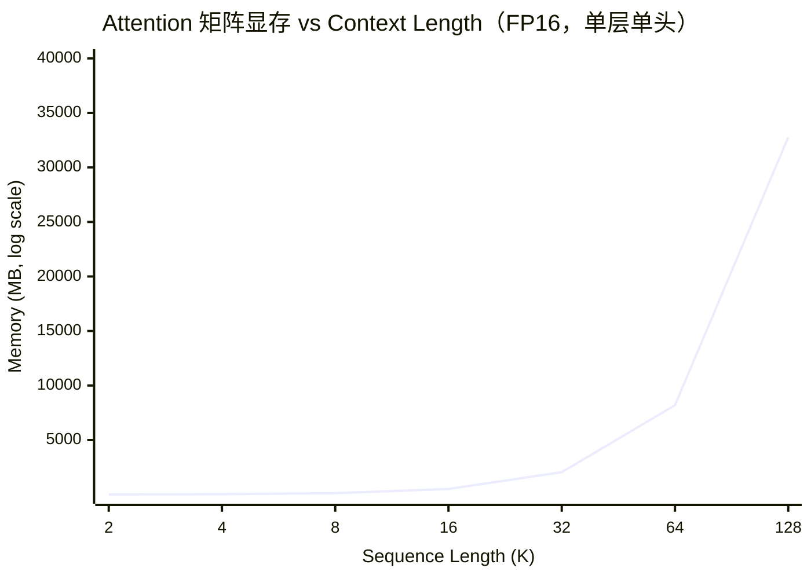

# 第 2 章 Transformer 架构：工程师视角

## 2.1 不讲数学，讲数据流

Transformer（2017 年 Google 论文 *Attention Is All You Need* 提出的神经网络架构，靠 Self-Attention 让序列里任意位置直接互相交换信息，是几乎所有现代 LLM 的骨架）本质上就是一个函数：输入一串 token（被 tokenizer 切出来的最小语言单元，可能是一个字、一个子词或一个标点）ID，输出下一个 token 的概率分布。中间经过的每一步，输入输出都是确定 shape 的 tensor。

> **tensor 和 shape 是什么？**  
> 在 PyTorch（以及所有深度学习框架）里，数据的基本单位是 tensor——可以理解为 N 维数组。shape 描述每个维度的大小：`[6, 4096]` 表示 6 行 4096 列，类似 TypeScript 里的 `number[][]`，但支持任意维度、保存在 GPU 显存里、并且所有运算（加减乘除、矩阵乘法）都用 GPU 并行加速。

> **「7B」是什么意思？参数怎么数的？**  
> **B = Billion = 十亿**，所以 Llama 2 7B 就是「这个模型有 70 亿个参数」。常见档位：0.5B / 1B / 3B（小模型）、7B / 8B / 13B（主流）、70B / 72B（中等）、405B / 671B（旗舰）。更小的也有 M（Million，百万），1000 M = 1 B。
>
> **「参数」是什么**：神经网络的本质是大量矩阵相乘 + 加法，每个矩阵里的每个数字就是一个参数。训练时不断调整这些数字让预测变准，推理时这些数字全部冻结。注意不要和 hyperparameter（超参数，人手调的配置，如 `learning_rate`、`batch_size`，对应训练前要拍板的"配置项"）混淆——「参数」指的是模型自己学出来的权重。一个 `.safetensors`（Hugging Face 主推的模型权重存储格式，相比老的 `.bin`/`.pt` 更安全也加载更快）文件里那几十亿个浮点数，就是这里说的参数。
>
> **7B 怎么算出来的**：用 Llama 2 7B 的参数（hidden=4096、layers=32、intermediate=11008、vocab=32000）逐项算——Embedding（嵌入层，把离散的 token ID 查表换成一个稠密向量，类似把字符串 key 映射到固定长度的 Float 数组）矩阵 32000×4096 ≈ 0.13B；每层 Attention（注意力机制，让每个 token 根据相关性从其他 token 那里取信息，可以类比一次带权重的 lookup table 查询）的 4 个投影 4×4096² ≈ 67M；每层 FFN（Feed-Forward Network，前馈网络，下文 2.1 末尾会展开）的 3 个投影 3×4096×11008 ≈ 135M；32 层加上 Embedding 和输出头总共 ≈ 6.7B。业界四舍五入写成 7B 好记。
>
> **为什么这个数字重要**：
> - **决定显存**：粗略公式 1B 参数 ≈ 2 GB 显存（FP16，半精度浮点，每个参数占 2 字节，是推理默认的精度）。7B 装权重要 ~14 GB，70B 要 ~140 GB（一张 A100 80G（NVIDIA 数据中心级 GPU，80 GB 显存版）装不下，必须多卡或量化）。这是第 3 章、第 7 章、第 11 章存在的根本原因。
> - **决定速度**：参数越多每个 token 的 forward（前向传播，一次完整跑完模型从输入到输出的过程）越慢，TTFT（Time To First Token，首 token 延迟，从请求发出到第一个 token 返回的时间）和 TPOT（Time Per Output Token，每个输出 token 的平均生成时间）都受影响。
> - **决定智能**：经验上参数越多越聪明，但有边际递减。7B 适合 RAG（Retrieval-Augmented Generation，检索增强生成，先检索再让 LLM 基于检索结果回答）/ 简单对话，72B 起才有强推理能力。
>
> **MoE 的特殊性**：DeepSeek-V3 写 671B 但又写"激活参数 37B"——这是 MoE（Mixture of Experts，混合专家）架构，模型里有 256 个专家子模型每个 token 只走其中 8 个，所以**总参数（决定显存）和激活参数（决定计算量和速度）要分开看**。第 1 章 1.4 节有更多 MoE 模型家族的背景。

用 Llama 2 7B 的真实参数来走一遍（关于 Llama 是什么、为什么用它当解剖样本，见第 1 章 1.4 节）：

```
模型参数（Llama 2 7B）:
- vocab_size = 32000       # 词表大小
- hidden_dim = 4096        # 隐藏层维度
- n_layers = 32            # Transformer 层数
- n_heads = 32             # Attention 头数
- head_dim = 128           # 每个头的维度 (4096 / 32)
- intermediate_dim = 11008 # FFN 中间层维度
```

假设输入是 "什么是 KV Cache"（KV Cache 是推理时缓存历史 token 的 K、V 向量、避免重复计算的关键优化，2.4 节专门讲），经 Tokenizer（分词器，负责把文本字符串切成 token 并映射成 ID，可以理解为模型自己的"词法分析器"）切成 6 个 token：

```
输入文本: "什么是 KV Cache"
    │
    ▼
┌──────────────────────────────────────────────────────────┐
│ Step 1: Tokenize                                         │
│ "什么是 KV Cache" → [20345, 12876, 476, 8067, 28747, 5765] │
│ 输出 shape: [6]  (6 个 token ID)                          │
└──────────────────────────────────────────────────────────┘
    │
    ▼
┌──────────────────────────────────────────────────────────┐
│ Step 2: Token Embedding + Positional Encoding            │
│ Token Embedding：token ID → 稠密向量的查表步骤            │
│ Positional Encoding (PE)：位置编码，把"第几个 token"      │
│   也变成向量信号注入进去，不然 Attention 看不出顺序        │
│ 每个 token ID 查表得到一个 4096 维向量                     │
│ 再叠加位置编码（Llama 2 用 RoPE，旋转位置编码）            │
│ 输出 shape: [6, 4096]                                    │
└──────────────────────────────────────────────────────────┘
    │
    ▼
┌──────────────────────────────────────────────────────────┐
│ Step 3: 32 × Transformer Block (重复 32 次)               │
│ Transformer Block = Attention + FFN + 两次 Norm + 两次   │
│ Residual 的固定积木，整个模型靠它堆叠出来                  │
│                                                          │
│   ┌────────────────────────────────────────────┐         │
│   │ 3a. RMSNorm（归一化层，2.1 末尾会展开）       │         │
│   │     [6, 4096] → [6, 4096]                  │         │
│   ├────────────────────────────────────────────┤         │
│   │ 3b. Multi-Head Self-Attention (MHA)        │         │
│   │     即多头自注意力，把 Attention 拆成多个独立  │         │
│   │     的"头"并行计算，再拼回来                 │         │
│   │     Q (Query) / K (Key) / V (Value)：       │         │
│   │     attention 的三个投影矩阵，类比一次       │         │
│   │     带权 lookup：Q 是查询、K 是键、V 是值     │         │
│   │     Q: [6, 4096] → [6, 32, 128]           │         │
│   │     K: [6, 4096] → [6, 32, 128]           │         │
│   │     V: [6, 4096] → [6, 32, 128]           │         │
│   │     Attention 计算后: [6, 32, 128]          │         │
│   │     投影回: [6, 4096]                       │         │
│   │     注：Llama 2 7B 用 MHA（32 个 KV 头）；   │         │
│   │     Llama 3 / Llama 2 70B 改用 GQA          │         │
│   │     （Grouped Query Attention，分组查询注意 │         │
│   │     力；8 个 KV 头，K/V 变成 [6, 8, 128]）  │         │
│   ├────────────────────────────────────────────┤         │
│   │ 3c. Residual Connection（残差连接）         │         │
│   │     x = x + attention_output               │         │
│   │     把输入"短路"加到输出上，让梯度能穿过深层   │         │
│   ├────────────────────────────────────────────┤         │
│   │ 3d. RMSNorm                                │         │
│   │     [6, 4096] → [6, 4096]                  │         │
│   ├────────────────────────────────────────────┤         │
│   │ 3e. FFN (SwiGLU)                           │         │
│   │     SwiGLU 是 Llama 系列 FFN 用的激活函数，  │         │
│   │     可看作 ReLU 的升级版                    │         │
│   │     [6, 4096] → [6, 11008] → [6, 4096]    │         │
│   ├────────────────────────────────────────────┤         │
│   │ 3f. Residual Connection                    │         │
│   │     x = x + ffn_output                     │         │
│   └────────────────────────────────────────────┘         │
│                                                          │
│ 输出 shape: [6, 4096]                                    │
└──────────────────────────────────────────────────────────┘
    │
    ▼
┌──────────────────────────────────────────────────────────┐
│ Step 4: Final RMSNorm + Linear Head                      │
│ Linear Head（也叫 LM Head，Language Model Head，         │
│ 语言模型头）：一层全连接，把 hidden 向量映射到词表大小      │
│ [6, 4096] → RMSNorm → [6, 4096] → Linear → [6, 32000]  │
│ 取最后一个位置的 logits: [32000]                           │
│ （logits 是词表上每个 token 的"原始分数"，可正可负，         │
│   未经 softmax 之前不是概率分布）                           │
└──────────────────────────────────────────────────────────┘
    │
    ▼
┌──────────────────────────────────────────────────────────┐
│ Step 5: Sampling（采样，按概率从 logits 里挑下一个 token） │
│ 对 [32000] 维 logits 做 softmax（把任意实数向量压成概率   │
│ 分布的函数）+ temperature scaling（温度缩放，调节生成的    │
│ "随机度"，越高越散）                                       │
│ 然后 top-p/top-k 采样（截断式采样：top-k 只从概率最高的 k │
│ 个里挑、top-p 从累积概率达到 p 的最小集合里挑），           │
│ 输出 1 个 token ID                                       │
│ 比如: 15043 → decode → "是"                              │
└──────────────────────────────────────────────────────────┘
```

关键信息：整个模型就是矩阵乘法（GEMM，General Matrix Multiply，通用矩阵乘法，深度学习里最核心的算子，所有 GPU/CUDA 优化都围绕它）+ 少量逐元素操作（norm 归一化、activation 激活函数）。Llama 2 7B 的 70 亿参数，绝大部分在 Attention 的 QKV（Query/Key/Value 三个投影矩阵的统称）投影矩阵和 FFN 的权重矩阵里。

数据流图里出现的几个生词，先在这里给一个最小定义，下面几节会逐个展开：

- **FFN**（Feed-Forward Network，前馈网络）：每个 Transformer Block 里的第二个子模块，由两层线性变换加一个激活函数（activation function，给神经网络引入非线性的小函数，例如 ReLU、GELU、SwiGLU）组成。Attention 负责 token 之间的关系，FFN 负责对每个 token 的特征做非线性变换，作用类似"特征过滤器"。
- **Norm**（归一化层）：对每层输出向量做数值缩放，防止激活值在深层网络里爆炸或消失。LayerNorm（Layer Normalization，层归一化，沿单个样本的最后一维做"减均值除标准差"）是经典方案，**RMSNorm**（Root Mean Square Normalization，均方根归一化）是 Llama 系列用的简化版（只做 RMS 缩放，不减均值），速度更快。
- **RoPE**（Rotary Position Embedding，旋转位置编码）：把位置信息编码成向量旋转角度，通过乘法施加到 Q、K 上（不作用于 V）。相比经典的"加法式"位置编码（例如原始 Transformer 论文的 sinusoidal PE，以及 ALiBi 这类相对位置偏置方案），RoPE 更容易外推到训练时没见过的长上下文，是 Llama、Qwen（阿里通义千问开源大模型系列）、DeepSeek（深度求索开源大模型系列）等现代模型的标配。
- **SwiGLU**（Swish-Gated Linear Unit，门控线性单元的 Swish 变体）：Llama 系列 FFN 用的激活函数，可以理解为 ReLU（Rectified Linear Unit，整流线性单元，最常见的激活函数，`max(0, x)`，类似一个"负数清零"开关）的升级版，能让 FFN 学到更复杂的特征模式。GELU（Gaussian Error Linear Unit，高斯误差线性单元，BERT/GPT-2 用的激活函数）是同类家族的另一个常见成员。
- **softmax**：把任意实数向量（包括负数）转成概率分布——每个值变成 0 到 1 之间，全部相加等于 1。Step 5 的采样需要先对 logits 做 softmax 才能得到概率。

**参数分布（Llama 2 7B，每层）：**

| 组件 | 参数量 | 占比 |
|------|--------|------|
| Q/K/V 投影 (Wq, Wk, Wv) | 4096 x 4096 x 3 = 50.3M | 23.5% |
| Output 投影 (Wo) | 4096 x 4096 = 16.8M | 7.8% |
| FFN (gate, up, down) | 4096 x 11008 x 3 = 135.3M | 63.2% |
| RMSNorm | 4096 x 2 = 8K | ~0% |

每层约 202M 参数，32 层 = 6.5B，加上 Embedding 层（32000 x 4096 = 131M）和 LM Head（Language Model Head，把 hidden 向量映射回词表的最后一层 Linear，131M），总计约 6.7B。

## 2.2 Tokenization

Tokenizer 是模型和人类语言之间的翻译器。它把文本切成 token（子词单元），每个 token 对应词表里的一个 ID。

### BPE 算法的直觉

BPE（Byte Pair Encoding，字节对编码，主流 LLM tokenizer 的核心算法）的核心思想极其简单：

1. 从单个字符开始（或 byte，一个字节，即 8 bit 的最小单位；中文一个字在 UTF-8 下是 3 个 byte）
2. 统计相邻 pair 出现的频率
3. 把出现最频繁的 pair 合并成新 token
4. 重复，直到词表达到目标大小

```
初始:  l o w e r    (5个字符)
第1轮: lo w e r     (lo 合并，因为 l+o 最频繁)
第2轮: low e r      (lo+w 合并)
第3轮: lower        (low+er 合并)
```

最终效果：高频词（"the"、"is"）会成为一个 token，低频词会被拆成几个子词。"unhappiness" 可能被拆成 "un" + "happiness"，甚至 "un" + "happ" + "iness"。

### 三种主流 Tokenizer

三家分别是：**tiktoken**（OpenAI 自家用的 BPE 实现，Rust 内核），**SentencePiece**（Google 开源的通用分词库，Llama、T5、Gemma 都在用），**HF Tokenizers**（Hugging Face——简称 HF，全球最大的开源模型仓库——出品的 Rust 分词库，配合 Transformers 库用）。

| 特性 | [tiktoken](https://github.com/openai/tiktoken) (OpenAI) | [SentencePiece](https://github.com/google/sentencepiece) (Google) | [HF Tokenizers](https://github.com/huggingface/tokenizers) |
|------|-------------------|----------------------|---------------|
| 算法 | BPE (byte-level，即在字节级别而非字符级别合并，对所有 UTF-8 文本通吃) | BPE / Unigram（一种概率式分词算法，跟 BPE 思路不同） | BPE / WordPiece（Google BERT 用的变种 BPE） / Unigram |
| 实现语言 | Rust + Python | C++ + Python | Rust + Python |
| 速度 | 极快 | 快 | 极快 |
| 用户 | GPT-4（OpenAI 旗舰大语言模型）, GPT-4o（GPT-4 的多模态版） | Llama（Meta 开源 LLM 系列）, T5（Google 文本到文本模型）, Gemma（Google 开源小模型） | BERT（Google 2018 年提出的双向 Transformer 编码器，开启预训练时代）, 各种 HF 模型 |
| 中文处理 | byte-level fallback（中文找不到 token 就退回到字节级编码） | 原生支持 | 取决于具体模型 |

### 中文分词的特殊性

中文对 Tokenizer 是个挑战。英文有天然的空格分隔词，中文没有。不同 Tokenizer 对中文的处理差异很大：

```
输入: "大语言模型的推理优化"

tiktoken (GPT-4):     ["大语言", "模型", "的", "推理", "优化"]          → 5 tokens
SentencePiece (Llama): ["大", "语言", "模型", "的", "推", "理", "优化"] → 7 tokens
```

Token 数量直接影响成本和速度——同样的中文内容，Llama 可能比 GPT-4 多消耗 30-50% 的 token。这也是为什么 Qwen、Yi（零一万物 Yi 系列开源大模型）等中文大模型会特意扩充中文词表。

Qwen2 的词表有 151,646 个 token，其中大量是中文常用词和短语，同样的中文输入只需要更少的 token。

代码示例见 `examples/ch02-transformer/01_tokenizer_compare.py`。

## 2.3 Attention 的计算成本

### O(n^2) 从何而来

Self-Attention（自注意力，Attention 的一种特例：Q、K、V 三个矩阵都从同一个输入序列算出来，让序列内部的 token 互相关注）的核心操作：每个 token 要和所有其他 token 计算相关性。用矩阵运算表示：

`@` 是 Python 的矩阵乘法运算符，相当于 `np.matmul(X, Wq)`。前端同学可以理解为高维数组的点积。

```
Q = X @ Wq    # [n, d] @ [d, d] → [n, d]
K = X @ Wk    # [n, d] @ [d, d] → [n, d]
V = X @ Wv    # [n, d] @ [d, d] → [n, d]

Scores = Q @ K^T     # [n, d] @ [d, n] → [n, n]   ← 这步是 O(n²)
Scores = Scores / sqrt(d)
Weights = softmax(Scores)  # [n, n]
Output = Weights @ V       # [n, n] @ [n, d] → [n, d]
```

`Q @ K^T` 生成一个 [n, n] 的矩阵——n 是 sequence length（序列长度，即一次性进入模型的 token 数量，常和 context length / 上下文窗口同义使用）。这意味着：
- n = 4K 时，矩阵大小 = 16M 个元素
- n = 32K 时，矩阵大小 = 1024M 个元素
- n = 128K 时，矩阵大小 = 16384M 个元素

**32K context 的计算量是 4K 的 64 倍**（(32K/4K)^2 = 64）。这就是长 context 推理又慢又贵的根本原因。

实际数字（Llama 2 7B，单层，单头，FP16）：

| Sequence Length | Attention 矩阵大小 | 显存占用 | FLOPs（Floating Point Operations，浮点运算次数，衡量计算量的单位，B 表示十亿次） |
|-----------------|-------------------|----------|-------|
| 2K | 4M | 8MB | 1.07B |
| 4K | 16M | 32MB | 4.29B |
| 32K | 1024M | 2GB | 274.9B |
| 128K | 16384M | 32GB | 4398B |

注意这只是**单层单头**的数字。Llama 2 7B 有 32 层 x 32 头 = 1024 个 attention 计算。

把"二次方增长"画成图能更直观地感受到为什么长 context 会变成显存灾难：



context length 翻一倍，Attention 矩阵的显存翻 4 倍；从 4K 到 128K，显存涨了 1024 倍。这就是为什么主流推理引擎都要做 PagedAttention（vLLM 提出的"按页管理 KV Cache"优化，第 5 章详讲）、FlashAttention（斯坦福 Tri Dao 提出的 IO 感知 Attention 算法，靠分块计算减少 HBM 读写，第 8 章详讲）之类的优化——靠暴力堆显存根本撑不住长上下文。

### Multi-Head Attention

为什么要 Multi-Head 而不是一个大的 Attention？

把 4096 维的向量拆成 32 个头，每个头 128 维。每个头独立做 Attention，关注不同的特征模式——有的头可能关注语法关系，有的关注语义相似性，有的关注位置距离。

计算量不变（32 个 128 维头的总计算量 = 1 个 4096 维头的计算量），但表达能力更强，因为多个头可以学到不同的 attention pattern（注意力模式，可视化出来就是某个头在专门关注主谓关系或邻近词等不同模式）。

### GQA（Grouped Query Attention）

标准 Multi-Head Attention 里，Q、K、V 各有 32 个头。GQA 的改进：Q 保持 32 个头，但 K 和 V 只用 8 个头（每 4 个 Q 头共享 1 组 KV）。

```
MHA (Multi-Head Attention，多头注意力，原始 Transformer 的标准做法):
  Q: 32 heads    K: 32 heads    V: 32 heads

GQA (Grouped Query Attention, 分组查询注意力, 8 KV heads):
  Q: 32 heads    K: 8 heads     V: 8 heads
  每 4 个 Q head 共享 1 个 KV head

MQA (Multi-Query Attention，多查询注意力，GQA 的极端版):
  Q: 32 heads    K: 1 head      V: 1 head
  所有 Q head 共享 1 个 KV head
```

（DeepSeek-V2/V3 还推出了 MLA——Multi-head Latent Attention，多头潜在注意力——把 K/V 压成低维潜变量缓存，思路又是另一个方向，第 5 章会带到。）

GQA 的好处：
1. **KV Cache 缩小 4 倍**（从 32 头降到 8 头），显存压力大幅降低
2. **推理速度提升**——Decode 阶段（生成新 token 的阶段，与之相对的是 Prefill 预填充阶段，第 4 章会专门区分）是 memory-bound（访存瓶颈：瓶颈在显存读写带宽而非计算能力上，与之相对的是 compute-bound），KV Cache 越小，读取越快
3. **精度损失很小**——实验表明 GQA-8 和 MHA 的效果差异不到 1%

Llama 2 70B、Llama 3 全系列、Mistral（法国 Mistral AI 公司的开源大模型系列）、Qwen2 都用了 GQA。可以说 GQA 已经是现代 LLM 的标配。

## 2.4 KV Cache

### 为什么需要 KV Cache

LLM 生成文本是自回归的（autoregressive，即每一步的输出会被拿来当作下一步的输入，形成"边生成边接龙"的过程，与之相对的是 BERT 那种一次性输出所有位置的非自回归模型）：每次生成一个 token，然后把它拼到输入后面，再生成下一个。

不用 KV Cache 的做法：

```
第 1 步: 输入 [A, B, C]         → 计算全部 Attention → 生成 D
第 2 步: 输入 [A, B, C, D]     → 重新计算全部 Attention → 生成 E
第 3 步: 输入 [A, B, C, D, E] → 又重新计算全部 Attention → 生成 F
```

每一步都在重复计算前面 token 的 K 和 V。这些值不会变（因为前面的 token 没变），纯粹浪费。

用 KV Cache：

```
第 1 步: 输入 [A, B, C]     → 计算 K_ABC, V_ABC 并缓存 → 生成 D
第 2 步: 只输入 [D]          → 计算 K_D, V_D，和缓存的 KV 拼接 → 生成 E
第 3 步: 只输入 [E]          → 计算 K_E, V_E，和缓存的 KV 拼接 → 生成 F
```

每步只需处理 1 个新 token，之前的 KV 直接从缓存读取。Decode 阶段的计算量从 O(n) 降到 O(1)（不考虑 Attention 本身和缓存的乘法）。

### KV Cache 的显存占用

公式：

```
KV Cache 大小 = 2 × n_layers × n_kv_heads × head_dim × seq_len × batch_size × bytes_per_param
```

其中 2 是因为 K 和 V 各一份。

Llama 2 7B（FP16，n_kv_heads=32）的 KV Cache 大小：

| Seq Length | Batch Size = 1 | Batch Size = 8 | Batch Size = 32 |
|------------|----------------|-----------------|------------------|
| 512 | 256 MB | 2 GB | 8 GB |
| 2048 | 1 GB | 8 GB | 32 GB |
| 4096 | 2 GB | 16 GB | 64 GB |

计算过程（以 seq_len=2048, batch=1 为例）：
```
2 × 32 layers × 32 heads × 128 dim × 2048 seq × 1 batch × 2 bytes(FP16)
= 2 × 32 × 32 × 128 × 2048 × 2
= 1,073,741,824 bytes
≈ 1 GB
```

模型权重本身（FP16）占 13.5 GB。A100 80GB 显存里，模型权重占 13.5 GB，剩下 66.5 GB 给 KV Cache 和其他开销。如果 batch size = 32、seq_len = 4096，KV Cache 就要 64 GB——几乎占满。

这就是为什么 **KV Cache 管理是推理引擎的核心问题**。vLLM 的 PagedAttention 就是为了解决 KV Cache 的显存碎片化问题。

如果用 GQA（比如 Llama 3 8B 只有 8 个 KV 头），KV Cache 直接缩小到 1/4：

```
Llama 2 7B (32 KV heads): seq_len=2048, batch=1 → 1 GB
Llama 3 8B (8 KV heads):  seq_len=2048, batch=1 → 256 MB
```

同样的显存，Llama 3 能跑 4 倍的 batch size 或 4 倍的 context length。

代码示例见 `examples/ch02-transformer/03_kv_cache_demo.py`。

## 2.5 动手：最小 GPT 训练

> 这一节需要 Python 和 PyTorch 基础。如果你还不熟悉，可以先跳过，读完[第 0 章](../ch00-python-quickstart/README.md)和第 3 章后再回来。

Andrej Karpathy（前 Tesla AI 总监、OpenAI 创始成员之一，以高质量 LLM 教学内容著称）的 [nanoGPT](https://github.com/karpathy/nanoGPT)（精简版 GPT 训练代码仓库）是理解 Transformer 最好的学习材料。整个 GPT-2（OpenAI 2019 年发布的 1.5B 参数语言模型，是公开的 GPT 系列里最后一个开源完整权重的代际，结构和今天的 LLaMA 几乎一致）的训练代码只有 300 行左右。

这里基于 nanoGPT 的思路做一个更简化的版本——字符级 GPT（Generative Pre-trained Transformer，生成式预训练 Transformer，OpenAI 的代表性模型家族）。不用 BPE tokenizer，直接用字符作为 token。这样可以去掉 tokenizer 的复杂度，专注理解 Transformer 本身。

完整可运行代码见 `examples/ch02-transformer/04_nano_gpt_train.py`，下面把它拆成几段讲清楚。读这一节最好同时把那个文件打开对照看。

### 数据集：tinyShakespeare

字符级 GPT 的经典训练语料叫 **tinyShakespeare**——Karpathy 从莎士比亚戏剧里抽出来的一段对白文本，1.1 MB 左右，纯 ASCII。脚本第一次运行会自动从 GitHub 下载并缓存到本地。

它的内容长这样：

```
First Citizen:
Before we proceed any further, hear me speak.

All:
Speak, speak.

First Citizen:
You are all resolved rather to die than to famish?
```

之所以是字符级模型的"标配"数据集：

- **字符词表只有 65 个**（26 字母 × 大小写 + 数字 + 标点 + 空白），词表小意味着 Embedding 和 LM Head 都小，CPU 也能玩
- **风格鲜明**：莎翁式对话有明显的"角色名:换行台词"格式和古英语词汇（"thou"、"hast"、"prithee"），训练 10 分钟就能看出模型在模仿这种结构
- **大小刚好**：1 MB 既不会小到没什么可学，也不会大到训练动辄几小时

如果离线环境跑不通，脚本会退化到一段几百字的中文内置文本，仅用来验证流程能跑通，效果就别期待了。

### 这一节用到的 PyTorch API

正式看代码前先备好一张速查表，免得卡在不认识的 API 上：

| API | 一句话解释 | TS/JS 类比 |
|-----|----------|------------|
| `nn.Module` | 所有神经网络层的基类。继承它就能定义自己的 layer，`forward` 方法是前向传播 | 类似一个有 `__call__` 行为的 class，自带参数注册和反向传播能力 |
| `nn.Linear(in, out)` | 全连接层 `y = x @ W + b`，PyTorch 里最常见的"矩阵乘加偏置" | 形似 `y = matmul(x, W) + b`，但 W、b 是可训练参数 |
| `nn.Embedding(N, d)` | 查表：传入 `[N]` 范围的 ID，返回对应行的 `d` 维向量 | 等价于 `Map<int, Float[d]>`，差别是表本身是可学习的 |
| `nn.LayerNorm(d)` | 对最后一维做归一化（减均值除标准差），稳定训练 | 在线归一化每个 token 的 d 维特征 |
| `nn.ModuleList` / `nn.Sequential` | 持有一组 sub-module 的容器，参数会自动被父模块注册 | 类似一个 array，但里面的 module 参数会被一起追踪 |
| `F.softmax(x, dim)` | 沿某维做 softmax 把实数压成概率分布 | 数学函数，无可训练参数 |
| `F.cross_entropy(logits, targets)` | 一步搞定 log_softmax + NLL loss，分类任务标配 | 给一组 logits 和正确标签，返回 loss 标量 |
| `x.masked_fill(mask, val)` | mask 为 True 的位置填成 val，常用来在 attention 里把"未来位置"填成 `-inf` | 类似 `x.map((v, i) => mask[i] ? val : v)` |
| `x @ y` / `x.transpose(-2, -1)` | 矩阵乘 / 转置最后两维 | `@` 是 Python 3.5+ 的矩阵乘运算符 |
| `tensor.shape` | 拿到形状，比如 `[B, T, C]` 三维 | 类似 numpy ndarray 的 shape |
| `optimizer.zero_grad()` / `loss.backward()` / `optimizer.step()` | 训练三件套：清梯度 → 反向传播算梯度 → 用梯度更新参数 | 概念上没有 JS 类比；理解成"每个 step 必须连贯调这三个" |

下面所有代码片段里 `nn` 都指 `torch.nn`，`F` 都指 `torch.nn.functional`。

### 模型骨架：自顶向下

`MiniGPT` 由几层模块自下而上组合而成：`SelfAttention` → `MultiHeadAttention` → `TransformerBlock` → `MiniGPT`。先看顶层长什么样：

```python
class MiniGPT(nn.Module):
    def __init__(self, vocab_size, n_embd, n_head, n_layer, block_size):
        super().__init__()
        # 1. Token Embedding：把 token ID 映射成 n_embd 维向量
        self.token_embedding = nn.Embedding(vocab_size, n_embd)
        # 2. Position Embedding：每个位置（0..block_size-1）也学一个 n_embd 向量
        self.position_embedding = nn.Embedding(block_size, n_embd)
        # 3. 堆 n_layer 个 Transformer Block
        self.blocks = nn.Sequential(*[
            TransformerBlock(n_embd, n_head, block_size) for _ in range(n_layer)
        ])
        # 4. 最后一层 LayerNorm + 输出投影到词表大小
        self.ln_f = nn.LayerNorm(n_embd)
        self.lm_head = nn.Linear(n_embd, vocab_size)

    def forward(self, idx, targets=None):
        B, T = idx.shape                                     # [B, T] 一批 token ID 序列
        tok_emb = self.token_embedding(idx)                  # [B, T, n_embd]
        pos_emb = self.position_embedding(torch.arange(T))   # [T, n_embd]
        x = tok_emb + pos_emb                                # 广播相加 → [B, T, n_embd]
        x = self.blocks(x)                                   # 经过 n_layer 个 Block
        x = self.ln_f(x)
        logits = self.lm_head(x)                             # [B, T, vocab_size]

        loss = None
        if targets is not None:
            loss = F.cross_entropy(logits.view(-1, logits.size(-1)), targets.view(-1))
        return logits, loss
```

forward 里出现的 shape 注释很重要，看不懂的地方先看 shape——能看清 shape 怎么变，就基本理解这层在干什么。

### Transformer Block

每个 Block 是 Attention + FFN 的串联，外加两次 Pre-norm 和 Residual：

```python
class TransformerBlock(nn.Module):
    def __init__(self, n_embd, n_head, block_size):
        super().__init__()
        self.ln1 = nn.LayerNorm(n_embd)
        self.attn = MultiHeadAttention(n_embd, n_head, block_size)
        self.ln2 = nn.LayerNorm(n_embd)
        self.ffn = FeedForward(n_embd)

    def forward(self, x):
        x = x + self.attn(self.ln1(x))   # Pre-norm 后过 Attention，再做 Residual
        x = x + self.ffn(self.ln2(x))    # Pre-norm 后过 FFN，再做 Residual
        return x
```

三个关键点：

1. **Pre-norm**（前置归一化，把 Norm 放在子层之前）：LayerNorm 在 Attention/FFN 之前，不是之后。原始 Transformer 论文是 Post-norm（后置归一化，Norm 放在子层之后再加 Residual），但现代模型（GPT-2、Llama）都用 Pre-norm，训练更稳定
2. **Residual Connection**（`x + ...`）：让梯度能直接穿过 Block，否则深层网络的梯度会消失。这是 ResNet（Residual Network，残差网络，2015 年微软何恺明等提出的 CNN 架构，靠"跳连"训练上百层网络，深度学习"残差"思想的起点）起家的 trick，到 Transformer 已成必备
3. **Attention 和 FFN 各做一次**：Attention 负责"token 之间交换信息"，FFN 负责"对每个 token 自己的特征做非线性变换"，两件事分开做

### Self-Attention 的实现

下面这段是单头自注意力，多头版本就是把它实例化 n_head 次再拼接（完整代码里的 `MultiHeadAttention`）：

```python
class SelfAttention(nn.Module):
    def __init__(self, n_embd, head_dim, block_size):
        super().__init__()
        # Q/K/V 三个线性投影，把 n_embd 维向量分别投到 head_dim 维
        self.query = nn.Linear(n_embd, head_dim, bias=False)
        self.key   = nn.Linear(n_embd, head_dim, bias=False)
        self.value = nn.Linear(n_embd, head_dim, bias=False)
        # Causal Mask（因果掩码，强制每个 token 只能看见自己和左侧 token，
        # 不能"偷看"右边的未来 token，这是 decoder-only 模型的核心约束）：
        # 下三角矩阵，"已知/未知"的标记。register_buffer 表示
        # 这是模型的一部分（会跟 .to(device) 一起搬），但不是可训练参数
        self.register_buffer("mask", torch.tril(torch.ones(block_size, block_size)))

    def forward(self, x):
        B, T, C = x.shape                                # [batch, seq_len, embed_dim]
        q, k, v = self.query(x), self.key(x), self.value(x)   # 各 [B, T, head_dim]

        # Attention scores = Q @ K^T / sqrt(d)
        scores = q @ k.transpose(-2, -1) * (k.shape[-1] ** -0.5)   # [B, T, T]

        # 把未来位置（上三角）填成 -inf，softmax 后它们的权重就是 0
        scores = scores.masked_fill(self.mask[:T, :T] == 0, float("-inf"))

        weights = F.softmax(scores, dim=-1)              # [B, T, T] 每行加起来等于 1
        return weights @ v                               # [B, T, head_dim]
```

`mask` 是一个下三角矩阵，长这样（block_size=4 时）：

```
1 0 0 0          位置 0 只能看自己
1 1 0 0          位置 1 能看位置 0、1
1 1 1 0          位置 2 能看位置 0、1、2
1 1 1 1          位置 3 能看全部前面的
```

`masked_fill(mask == 0, -inf)` 就是把右上角那些 0 的位置填成 `-inf`，softmax 之后变成 0 权重。这就是 **Causal Mask**——decoder-only（只用 Transformer Decoder 半边的架构，区别于 BERT 的 encoder-only 和 T5 的 encoder-decoder，现代生成式 LLM 几乎都是 decoder-only）架构的本质。

### 训练循环

```python
device = "cuda" if torch.cuda.is_available() else "cpu"
model = MiniGPT(vocab_size, n_embd=128, n_head=4, n_layer=4, block_size=128).to(device)
# AdamW：Adam 优化器加权重衰减（weight decay）的变体，目前是训练 Transformer 事实上的默认优化器
optimizer = torch.optim.AdamW(model.parameters(), lr=3e-4)

for step in range(max_steps):
    # 1. 从数据集随机切一个 batch：xb 是输入 [B, T]，yb 是 xb 整体右移一位的 target
    xb, yb = dataset.get_batch(batch_size=32, device=device)

    # 2. Forward：模型同时返回 logits 和 loss（targets 不为 None 时）
    logits, loss = model(xb, yb)

    # 3. Backward + Update（训练三件套）
    optimizer.zero_grad()           # 清空上一步的梯度
    loss.backward()                  # 反向传播，把梯度填到每个参数的 .grad 上
    optimizer.step()                 # AdamW 根据 .grad 更新参数
```

`xb` 和 `yb` 的关系是**右移一位**：如果 `xb = "First Citi"`，那 `yb = "irst Citiz"`——模型在 `T` 个位置上同时预测每个位置的下一个字符，cross_entropy 把这 `T` 个预测的 loss 平均起来。这就是"语言模型 = 下一个 token 预测"在工程上的具体长相。

### 真实运行结果

在 CPU（M 系列芯片或同档次 x86）上用默认参数（n_embd=128, n_layer=4, block_size=128, 30 epoch）跑完大约 15 分钟，模型参数量 824 K。损失曲线：

| Epoch | Loss |
|-------|------|
| 1 | 3.82 |
| 6 | 2.49 |
| 12 | 2.34 |
| 18 | 2.22 |
| 24 | 2.14 |
| 30 | **2.12** |

生成样本（prompt = `ROMEO:`）：

```
ROMEO:
Rast thire the hey an to hame prechere lope,
To the rodwld thath pawath thou cand thavemes bod
To the thy this here and sose nong mand lambres wither
the pathe the on thy rown,
Now hey inteterion shi
```

里面没几个真正的英文单词，但**模型已经学到了**：莎士比亚的格式（角色名 + 冒号 + 换行 + 多行对白）、词间空格、合理的标点（逗号、句号）、单词的大致长度分布、常见的字符组合（"th"、"the"、"and"、"-eth" 结尾）。考虑到这只是 800K 参数的字符级模型在 1 MB 数据上训了 15 分钟，已经相当能说明问题。

想看到能读通的句子，把 `--n-layer` 调到 6、`--n-embd` 调到 256、跑 100 epoch（GPU 几分钟、CPU 一两小时），loss 能降到 1.5 左右，开始出现完整且大致符合语法的伪英语句子。原版 nanoGPT 在 GPU 上训练几小时能让 loss 降到 1.0 附近，那时生成的文本远看真的像莎士比亚。

完整代码 + 命令行参数说明见 `examples/ch02-transformer/04_nano_gpt_train.py`。

---

**延伸阅读：**

- [Attention Is All You Need](https://arxiv.org/abs/1706.03762) - 2017 年 Transformer 原始论文，本章所有概念的源头，必读
- [karpathy/nanoGPT](https://github.com/karpathy/nanoGPT) - 300 行实现 GPT-2 训练
- [The Illustrated Transformer](https://jalammar.github.io/illustrated-transformer/) - Jay Alammar 的经典图解
- [Llama 2 论文](https://arxiv.org/abs/2307.09288) - Meta 的技术报告，对理解 GQA 很有帮助
- [FlashAttention 论文](https://arxiv.org/abs/2205.14135) - IO-aware attention，第 3 章会详细讲

## 代码示例

| 示例 | 说明 | 硬件要求 |
|------|------|---------|
| [01_tokenizer_compare.py](../../examples/ch02-transformer/01_tokenizer_compare.py) | 对比 BPE/SentencePiece/tiktoken | CPU |
| [02_attention_visualize.py](../../examples/ch02-transformer/02_attention_visualize.py) | 可视化 Attention 权重 | CPU |
| [03_kv_cache_demo.py](../../examples/ch02-transformer/03_kv_cache_demo.py) | KV Cache 有无对比 | GPU (any) |
| [04_nano_gpt_train.py](../../examples/ch02-transformer/04_nano_gpt_train.py) | 基于 nanoGPT 的最小训练 | GPU 8GB+ |


---

> 本章来自《LLM Infra 从入门到实践》开源版 · 作者「递归客」  
> 在线阅读完整书系：[inferloop.dev](https://inferloop.dev)
