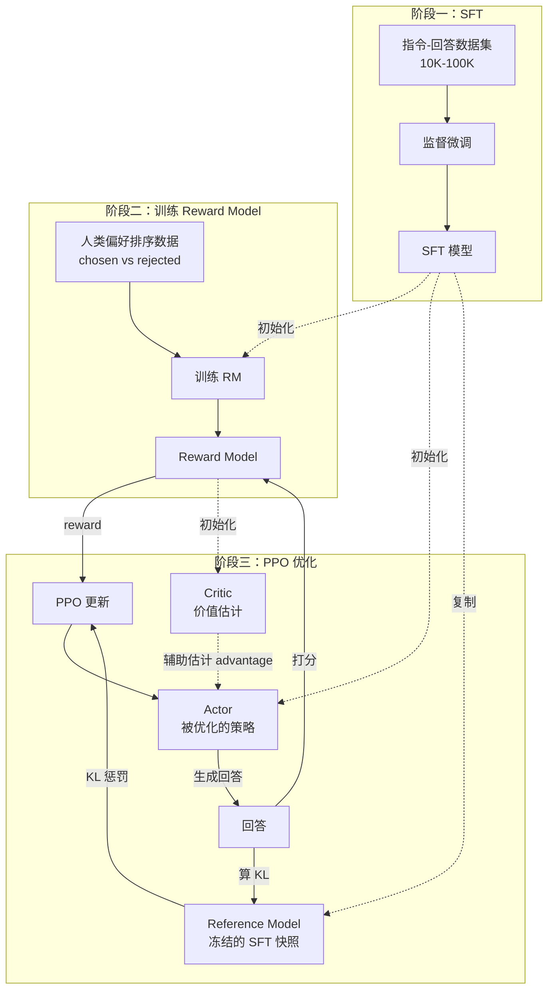

# 第 10 章 RLHF 与对齐

> **本章代码示例只在 Linux GPU 服务器执行。** DPO 单卡 24GB 显存（QLoRA + DPO）就够上手，PPO 至少需要多卡 A100 才能稳定跑通。Mac 本地可以阅读所有概念部分。

上一章我们让模型学会了领域知识（微调），但这还不够。一个微调过的模型可能回答正确率很高，却经常给出冗长、格式混乱、甚至有害的回答。

这就是"对齐"（Alignment）要解决的问题：让模型不仅"回答正确"，而且"回答得好"——有用、无害、诚实。

> **术语速读**
>
> - **RL（Reinforcement Learning，强化学习）**：让 agent 在环境里"试错"——做出动作、拿到奖励、调整策略，让长期奖励最大化。类比前端 A/B 实验：发版 → 看转化 → 调整下次发版，只不过 RL 是按 token 级别快速循环
> - **policy（策略）**：在 LLM 语境下就是模型本身——给定 prompt 输出 token 概率分布的那个函数。"训练 policy"="更新模型权重"
> - **reward（奖励）**：一个标量分数，告诉模型"这次回答有多好"。可以来自人类标注，也可以来自一个打分模型（RM）

## 10.1 SFT → RM → PPO

### RLHF 的三阶段

OpenAI 在 InstructGPT 论文（[arxiv 2203.02155](https://arxiv.org/abs/2203.02155)）中提出的 RLHF（Reinforcement Learning from Human Feedback，基于人类反馈的强化学习；第 1 章简单提过，本章详细讲）分三步走：先用监督学习教模型基本对话能力，再训练一个能模拟人类偏好的打分器，最后用强化学习把模型往"人类喜欢的方向"推。

**阶段一：SFT（Supervised Fine-Tuning，监督微调）**

用高质量的指令-回答对做监督微调（第 9 章详细讲过）。目的是让模型学会遵循指令的基本能力。

数据样例：
```json
{"prompt": "写一首关于春天的诗", "response": "春风拂面暖阳照..."}
```

数据量：通常 10K-100K 条。

**阶段二：RM（Reward Model，奖励模型）训练**

收集人类偏好数据（preference data，即同一个 prompt 下"哪个回答更好"的人工标注）：对同一个 prompt，让 SFT 模型生成多个回答，然后让人类标注员做 pairwise comparison（两两比较）或排序（ranking）。用这些排序数据训练一个奖励模型——本质上是一个把 (prompt, response) 映射成"得分"的神经网络。

> **Bradley-Terry 模型**：把"A 比 B 好"这种比较关系建模成 $P(A \succ B) = \sigma(r_A - r_B)$ 的统计模型，是 RM 训练损失的数学基础。直觉上：分差越大，A 赢的概率越高。常见的公开偏好数据集有 Anthropic HH（Helpful & Harmless）、UltraFeedback 等。

数据样例：
```json
{
  "prompt": "解释量子力学",
  "chosen": "量子力学是物理学的一个分支，研究微观粒子...[详细、准确、易懂的回答]",
  "rejected": "量子力学就是说猫可以又死又活...[不准确、过于简化的回答]"
}
```

RM 本质上是一个分类/回归模型，输入 (prompt, response)，输出一个标量分数。数据量通常需要 100K+ 条偏好对。

**阶段三：PPO（Proximal Policy Optimization，近端策略优化）**

PPO 是 OpenAI 2017 年提出的强化学习算法，"近端"指每次更新策略时通过 clip 操作限制新旧策略的差距，避免一步走太远把模型搞坏。在 RLHF 里，它用 RM 作为奖励信号，通过强化学习优化 SFT 模型。PPO 的循环是：

1. 模型生成回答（这一步叫 rollout，即"从当前策略采样一条完整轨迹 trajectory"）
2. RM 给回答打分
3. 用 PPO 算法更新模型，让它生成更高分的回答
4. 同时用 KL divergence（KL 散度）约束，防止模型偏离 SFT 模型太远

> **什么是 KL 散度？** KL 散度（Kullback-Leibler divergence）是衡量两个概率分布"有多不同"的标量指标。在 RLHF 里，我们让模型对每个 token 输出一个概率分布，然后比较新模型和原始 SFT 模型在同一个 prompt 下产生的概率分布。KL 散度越大，说明新模型偏离原始模型越远。把它当作训练损失的一部分，就能限制新模型"别跑太远"。
>
> **什么是 reference model（参考模型）？** 参考模型是训练开始前的 SFT 模型快照，训练过程中参数完全冻结。它的作用是充当"对照组"——每一步 PPO 更新时，我们都拿当前 actor 模型和 reference model 算 KL 散度，KL 越大惩罚越重。没有 reference model，模型可能在追求高 reward 的路上一去不复返，丢掉所有原本学到的语言能力（也就是后面要讲的"奖励 hacking"）。

流程图里会出现几个 PPO 特有的角色，先解释一下：

- **actor**：被训练的策略模型本身，就是最终我们要部署的模型
- **critic（价值网络）**：和 actor 配套的另一个网络，输入一段 (prompt, partial response)，输出"从这一步往后预期还能拿到多少 reward"——也就是 RL 里说的 value function（价值函数）
- **advantage（优势）**：实际拿到的 reward 减去 critic 估的预期 reward，告诉模型"这一步比平均水平好/差多少"，是 PPO 真正用来更新 actor 的信号。这种用 critic 给 actor 提供 advantage 估计的架构叫 actor-critic

下面是三阶段的整体流程：



### PPO 的直觉解释

不需要深入数学，PPO 的核心思想可以这样理解：

想象你在训练一只狗。SFT 阶段是教它基本的"坐下"、"握手"指令。PPO 阶段则是：狗做了个动作 → 你给奖励或惩罚 → 狗调整行为。RM 就是那个自动判断"做得好不好"的打分器。

PPO 加了一个关键约束：每次更新不能太大（proximal = 近端）。这就像你不希望狗为了拿到零食而学会一些奇怪的技巧——你希望它在保持正常行为的基础上变得更好。

### 为什么 RLHF 有效

关键洞察：**SFT 教模型"说什么"，RLHF 教模型"怎么说"。**

一个 SFT 模型可能知道正确答案，但它不知道：
- 用户更喜欢分步骤的回答还是直接给结论
- 什么时候该说"我不确定"
- 怎么拒绝有害请求同时保持有用
- 回答的最佳长度是多少

这些"偏好"很难通过监督学习捕捉，但人类标注员可以很容易地判断"A 比 B 好"。RLHF 正是利用了这种比较信号。

### PPO 的实际挑战

但 PPO 训练非常难搞：

1. **训练不稳定**：需要同时维护四个模型。显存压力巨大：
   - **actor**：被优化的策略模型，从 SFT 模型初始化，每一步都会更新
   - **critic**：估计某个状态下的"期望未来奖励"（value function），从 reward model 初始化，会一起被训练
   - **reference**：冻结的 SFT 模型快照，用来算 KL 惩罚，参数不动
   - **reward model**：从人类偏好数据训练出来的打分器，对 (prompt, response) 输出一个标量，参数不动
2. **超参数敏感**：KL coefficient（KL 惩罚强度）、clip ratio（PPO 限制新旧策略比值的截断阈值）、value function coefficient（critic 损失的权重）... 调参空间很大
3. **奖励 hacking（奖励黑客）**：模型学会钻 RM 的漏洞拿高分，而不是真正变好。比如 RM 偏好长回答，模型就一直输出长但空洞的回答；类比 SEO 时代专门为搜索引擎堆关键词的网页
4. **成本高**：需要在线生成 + 打分 + 训练，整个 pipeline 复杂度很高

这些挑战催生了更简单的对齐方案。

## 10.2 DPO：更简单的对齐方案

### DPO 的核心思想

2023 年，Stanford 的 Rafailov 等人提出了 DPO（Direct Preference Optimization，直接偏好优化，[arxiv 2305.18290](https://arxiv.org/abs/2305.18290)；第 1 章简单提过，本章详细讲），核心洞察是：

> 你不需要先训练一个 Reward Model，再用 RL 优化。可以直接从偏好数据优化策略模型。

数学上，DPO 证明了：给定最优的 Reward Model，PPO 的最优策略有一个闭式解（closed-form solution，即可以直接写成公式而不用迭代求解）。这意味着可以把 RL 问题转化为一个简单的分类问题。

DPO 的损失函数：

$$\mathcal{L}_{DPO} = -\log\sigma\left(\beta \left[\log\frac{\pi_\theta(y^+|x)}{\pi_{ref}(y^+|x)} - \log\frac{\pi_\theta(y^-|x)}{\pi_{ref}(y^-|x)}\right]\right)$$

公式里 $\pi_\theta$ 是被训练的策略，$\pi_{ref}$ 是冻结的参考模型，$\sigma$ 是 sigmoid 函数，$\log\pi(y|x)$ 是 log-likelihood（对数似然，即"模型生成这段回答的对数概率"）。

翻译成人话：让模型在 chosen 回答上的概率（相对于参考模型）比在 rejected 回答上的概率更高。就这么简单。

公式里的 $\pi_{ref}$ 就是 10.1 节讲过的 reference model——还是那个冻结的 SFT 快照，DPO 用它充当基准点。

**β 参数**：KL 惩罚的强度系数，控制模型偏离参考模型的幅度。β 越大越保守（更靠近原始 SFT 模型），β 越小越激进（更愿意"按偏好数据走"）。常用范围 0.05-0.5，工程上 **0.1 是一个比较保守、不容易跑飞的起点**；如果发现训练后模型变化太小，可以往下调到 0.05；如果发现模型"走偏"严重，往上调到 0.3-0.5。

### 实际使用

用 TRL（Transformer Reinforcement Learning，HuggingFace 维护的 RL/对齐训练库，第 9 章 SFT 时已经用过）做 DPO 训练，代码简洁到令人发指（库文档：[huggingface.co/docs/trl/dpo_trainer](https://huggingface.co/docs/trl/dpo_trainer)）：

```python
# 适用于 trl >= 0.9.x
from trl import DPOTrainer, DPOConfig
from datasets import load_dataset

# 数据集需要包含 prompt / chosen / rejected 三个字段
dataset = load_dataset("trl-lib/ultrafeedback_binarized", split="train")

trainer = DPOTrainer(
    model="Qwen/Qwen2-7B",
    args=DPOConfig(
        output_dir="./output",
        num_train_epochs=1,
        per_device_train_batch_size=4,
        learning_rate=1e-6,
        beta=0.1,           # KL 惩罚系数，见前文说明
        bf16=True,
        gradient_checkpointing=True,
    ),
    train_dataset=dataset,
)
trainer.train()
```

数据格式也很简单，就是 `prompt`、`chosen`、`rejected` 三个字段。注意 TRL 新版本（0.9+）对数据列名有要求，老版本的 `prompt_input_ids` 等格式已经被废弃。

### DPO vs PPO

| 维度 | PPO | DPO |
|-----|-----|-----|
| 需要 Reward Model | 是 | 否 |
| 需要在线生成 | 是 | 否 |
| 训练稳定性 | 差，需要大量调参 | 好，几乎开箱即用 |
| 显存需求 | 4 个模型 | 2 个模型（policy + reference） |
| 训练速度 | 慢（生成+打分+训练） | 快（直接训练） |
| 数据效率 | 数据量大时更有优势 | 少量数据（几千-几万对）就能见效 |
| 效果上限 | 理论上更高 | 实践中几乎持平 |
| 适用场景 | 大厂、充足资源 | 大多数团队 |

DPO 最大的优势是简单。不需要训练单独的 RM，不需要在线采样，不需要复杂的 RL 训练循环。对于 90% 的对齐需求，DPO 就够了。

### 更新的对齐方法

DPO 之后，社区又提出了很多变体：

**ORPO（Odds Ratio Preference Optimization，赔率比偏好优化，[arxiv 2403.07691](https://arxiv.org/abs/2403.07691)）**：把 SFT 和对齐合并成一步，不需要 reference model。更简单，但效果在某些任务上略差。

**SimPO（Simple Preference Optimization，简化偏好优化，[arxiv 2405.14734](https://arxiv.org/abs/2405.14734)）**：用序列平均对数概率作为隐式奖励，不需要 reference model，训练更高效。

**KTO（Kahneman-Tversky Optimization，卡尼曼-特沃斯基优化，[arxiv 2402.01306](https://arxiv.org/abs/2402.01306)）**：用前景理论替代 Bradley-Terry，不需要成对偏好数据，只需要"好"和"坏"的标签。在数据收集上更灵活。

**IPO（Identity Preference Optimization，恒等偏好优化）**：解决 DPO 可能过拟合偏好数据的问题，加入正则化。

> **顺带提一下**
>
> - **GRPO（Group Relative Policy Optimization，组相对策略优化）**：DeepSeek 提出的 PPO 简化版，不训单独的 critic，用同一个 prompt 多次采样的"组内相对得分"作为 advantage。DeepSeek-R1 推理模型训练的核心算法
> - **RLAIF（RL from AI Feedback）**：把 RLHF 里"人类标注"换成"用一个强力 LLM 来标注偏好"。本质是用 GPT-4 等模型批量造偏好数据，省钱省事
> - **Constitutional AI（CAI，宪法 AI）**：Anthropic 提出的方法，先给模型一份"宪法"（一组原则，比如"无害""诚实"），让模型按宪法自我批评、自我修改回答，再拿这些自生成的偏好对去训练。Claude 系列的核心对齐方法
> - **常见 RL 训练框架**：HuggingFace **trl**（最常用，SFT/DPO/PPO 全都支持）、OpenAI 系研究者维护的 **OpenRLHF**（追大模型 PPO/RLHF，性能优先）、字节开源的 **verl**（vLLM 加速 rollout，把推理和训练做了更紧的协同）

这些方法各有优劣，但 DPO 依然是最成熟、使用最广泛的选择。

## 10.3 对齐税

对齐不是免费的午餐。

### 能力下降

经过 RLHF/DPO 对齐的模型，在某些"原始能力"上会出现下降：

- **数学推理**：对齐后的模型更倾向于给出"安全"的回答，可能不愿意做复杂推理
- **代码生成**：过度对齐会让模型在生成代码时过于保守
- **创造性写作**：对齐后可能变得"太正经"

这被称为"对齐税"（Alignment Tax）。Meta 在 Llama 2 的论文（[arxiv 2307.09288](https://arxiv.org/abs/2307.09288)）中报告，RLHF 后模型在某些 benchmark（基准测试集）上的分数确实下降了 1-3 个百分点。

### 安全与能力的 Tradeoff

这是一个真实的工程决策：

- 对齐太少：模型可能生成有害内容、暴露偏见
- 对齐太多：模型变得"太安全"，拒绝回答正常问题

经典案例：早期的 ChatGPT 会拒绝回答"怎么做炸鸡"（因为"炸"字触发了安全机制）。这就是过度对齐的典型表现。

### 过度对齐的问题

过度对齐（Over-alignment）的表现：

1. **过度拒绝**：对正常问题也回复"我不能帮助你做这件事"
2. **过度免责**：每个回答都加上"请注意，这不构成专业建议..."
3. **过度谨慎**：不愿意给出明确观点，总是说"这取决于..."
4. **套话太多**：开头永远是"好的！这是一个很好的问题"

在实际业务中，对齐的程度需要根据场景调整。一个内部代码助手不需要和面向消费者的聊天机器人一样的安全等级。

## 10.4 Agent 场景的对齐

前面讨论的对齐主要针对"对话"场景——模型生成一段文本，好不好由人来判断。但 Agent 场景完全不同：模型不只是说话，还要**做事**——调用 API、写文件、发邮件、操作数据库。做错了的代价比说错了大得多。

### Agent 对齐的独特挑战

和对话对齐相比，Agent 对齐面临几个额外的难题：

**Tool Calling 准确率**

Tool calling（工具调用）是指 LLM 输出一段结构化指令调用外部函数/API，由宿主程序执行后把结果回传给模型——是 Agent 工作流的基础原语，类比浏览器里 JS 通过 `fetch` 调后端 API。Agent 需要正确选择工具，还要正确构造参数。这不是"大致正确"就行的——你调 `delete_user(user_id=123)` 的时候，user_id 传错了就是生产事故。

Tool calling 的出错模式比文本生成丰富得多：选错工具、参数类型错误、缺少必填参数、参数值超出范围、不该调用时调用了（比如用户只是在问"如果我删掉这个会怎样"，模型真去删了）。

**格式遵从**

Agent 的输出必须严格符合结构化格式（通常是 JSON），否则下游系统解析不了。这和第 8 章讲的约束解码是同一个问题的不同层面：约束解码从推理引擎层面保证格式，对齐训练则从模型权重层面提升格式遵从率。两者互补——对齐训练让模型"想"输出正确格式，约束解码在它"想"错的时候兜底。

**拒绝该拒绝的**

一个对话模型拒绝回答有害问题，最坏的结果是用户不满意。但一个 Agent 如果不该执行时执行了——比如用户开玩笑说"把生产数据库清了"，模型真去跑 `DROP TABLE`——后果就是灾难性的。Agent 的对齐需要更强的"知道什么时候该说不"的能力。

**多步推理的一致性**

Agent 的一次任务可能包含 10+ 步操作。模型需要在整条执行路径上保持一致：不能第 3 步决定用方案 A，第 7 步又切换到方案 B；不能前面说"我来帮你创建文件"，后面又问"你要创建什么文件"。这种长程一致性是单轮对齐训练很难覆盖的。

### Tool Calling 的对齐数据构造

Agent 对齐的核心难度在数据。你需要大量高质量的 tool calling 样本，而且正例和负例都要有。

**正例**：给定用户意图和可用工具列表，模型正确选择工具并构造参数。

```json
{
  "prompt": "帮我查一下北京明天的天气",
  "tools": ["get_weather", "send_email", "search_docs"],
  "chosen": {
    "tool": "get_weather",
    "arguments": {"city": "北京", "date": "2025-03-16"}
  }
}
```

**负例**的类型更多样：

```json
{
  "rejected_examples": [
    {"error": "wrong_tool", "tool": "search_docs", "arguments": {"query": "北京天气"}},
    {"error": "wrong_params", "tool": "get_weather", "arguments": {"city": "北京"}},
    {"error": "unnecessary_call", "context": "用户只是在闲聊提到天气，不需要调用工具"}
  ]
}
```

数据从哪来？三个来源：

1. **人工标注**：最准确但最贵。适合构造高价值的边缘 case（比如"该拒绝"的场景）
2. **API 日志挖掘**：从线上 Agent 的执行日志中，把成功的 trajectory（轨迹，即"一次完整任务里 agent 调了哪些工具、拿到什么结果"的执行序列）作为正例，失败的作为负例。这是最大的数据来源
3. **强模型生成弱模型的训练数据**：用 GPT-4 / Claude 对你的 tool schema 生成大量 tool calling 样本，用来训练自己的 7B/14B 模型。成本可控，质量不错

### Trajectory-level DPO

传统 DPO 是在单轮级别做偏好对比：同一个 prompt，chosen response vs rejected response。但 Agent 的"好坏"往往不是一步决定的，而是整条执行路径（trajectory）的质量。

Trajectory-level DPO 的数据格式：

```json
{
  "task": "帮用户把 CSV 数据导入数据库",
  "chosen_trajectory": [
    {"step": 1, "action": "read_file('data.csv')", "result": "成功读取 1000 行"},
    {"step": 2, "action": "validate_schema(data, table_schema)", "result": "schema 匹配"},
    {"step": 3, "action": "batch_insert(data, 'target_table')", "result": "导入成功"}
  ],
  "rejected_trajectory": [
    {"step": 1, "action": "read_file('data.csv')", "result": "成功读取 1000 行"},
    {"step": 2, "action": "insert_row(data[0], 'target_table')", "result": "逐行插入，太慢"},
    {"step": 3, "action": "insert_row(data[1], 'target_table')", "result": "继续逐行..."}
  ]
}
```

chosen trajectory 做了 schema 验证然后批量导入，rejected trajectory 跳过了验证且用了低效的逐行插入。这种"路径级别"的偏好信号，比单步的 tool calling 偏好更能教会模型做出全局更优的决策。

实现上，需要把整条 trajectory 拼成一个长序列，然后对整个序列做 DPO loss。这对序列长度有要求——10 步的 trajectory 可能有 4000-8000 tokens，训练时要注意 context length（上下文窗口长度）和显存。

### 实际建议

Agent 对齐不是一步到位的事，推荐分阶段来：

**阶段一：Prompt Engineering + Few-shot**

Few-shot（少样本学习）是指在 prompt 里直接塞几条"示例输入-示例输出"，让模型照着模仿，无需训练。先别急着训练。用好的 system prompt 加几个 few-shot 示例，就能把 tool calling 准确率拉到 85-90%。这个阶段的重点是定义清楚 tool schema（工具的 JSON Schema 描述：函数名、参数、类型、用途）——参数的 description 写得越精确，模型犯错越少。

**阶段二：SFT 微调**

在你自己的 tool schema 上做 SFT。收集 1000-5000 条高质量的 tool calling 样本，用 LoRA（Low-Rank Adaptation，第 9 章讲过的轻量级微调方法）微调。目标是让模型熟悉你的工具集，把准确率从 90% 拉到 95%+。

**阶段三：DPO 优化边缘 Case**

SFT 之后，模型在常见场景下已经很好了，但边缘 case 还会出错——比如工具之间有功能重叠时选哪个、参数有歧义时怎么处理。收集这些 hard case 的偏好对，用 DPO 做精细优化。

**评估指标**

Agent 对齐的评估比对话对齐更直接，因为有明确的"对错"标准：

| 指标 | 含义 | 目标 |
|-----|------|------|
| Tool Selection Accuracy | 选对工具的比例 | > 95% |
| Parameter Exact Match | 参数完全正确的比例 | > 90% |
| Unnecessary Call Rate | 不该调用时调用的比例 | < 5% |
| Task Completion Rate | 端到端任务完成率 | > 80% |

其中 Task Completion Rate 是最终指标，但前三个指标能帮你定位问题出在哪个环节。

## 10.5 评估

训练完了怎么知道模型变好了？这是 LLM 领域最难的问题之一。

### 自动评估的局限

传统 NLP（Natural Language Processing，自然语言处理）指标在 LLM 时代基本不够用：

**Perplexity（困惑度，PPL）**：衡量模型对文本的"困惑度"，本质是模型在测试集上每个 token 的平均负对数似然取指数。问题是：perplexity 低不代表回答好。一个总是输出"我不知道"的模型 perplexity 可能很低。

**BLEU/ROUGE**：机器翻译/摘要时代留下来的指标。BLEU（Bilingual Evaluation Understudy）算生成文本和参考文本的 n-gram 精确率，ROUGE（Recall-Oriented Understudy for Gisting Evaluation）算召回率。问题是：好的回答有很多种说法，和参考文本不一样不代表不好。

这些指标可以作为参考，但不能作为唯一标准。

### LLM-as-Judge

LLM-as-Judge（用 LLM 当评委）目前是最流行的自动评估方式，用一个强力 LLM（通常是 GPT-4）来评判：

```python
judge_prompt = """
请评估以下 AI 助手的回答质量，从 1-5 分打分。

评分标准：
- 5 分：准确、完整、格式好、有帮助
- 4 分：基本正确，有小瑕疵
- 3 分：部分正确，有明显遗漏
- 2 分：大部分不正确或不相关
- 1 分：完全错误或有害

用户问题：{question}
AI 回答：{answer}

请给出评分和理由。
"""
```

LLM-as-Judge 的优势：

- 成本低（相比人工评估）
- 速度快
- 可以大规模运行
- 和人类判断的相关性不错（约 80% 一致率）

局限性：

- 对自家模型有偏好（GPT-4 倾向于给 GPT 系列更高分）
- 对格式和长度有偏好（更长的回答通常得分更高）
- 在专业领域可能不可靠

### 人工评估

最可靠但最贵的方式。几个实用建议：

1. **A/B 测试**：给标注员看两个模型的回答（隐藏模型名），让他们选更好的
2. **评分维度**：分多个维度打分（准确性、有用性、安全性、格式），而不是只给总分
3. **标注员一致性**：用 Cohen's Kappa（两人之间的一致性系数）或 Fleiss' Kappa（多人之间的一致性系数，两者都是把"超出随机一致"的部分量化为 0-1 的统计量）衡量标注员之间的一致性，低于 0.4 说明任务定义有问题
4. **样本量**：至少 200-500 条评估数据，覆盖不同难度和类型

### 开源评估工具

**[lm-evaluation-harness](https://github.com/EleutherAI/lm-evaluation-harness)**（EleutherAI 维护，社区里最广泛使用的开源 LLM 评估框架，命令行入口是 `lm_eval`）：

```bash
lm_eval --model hf \
    --model_args pretrained=./my-model \
    --tasks mmlu,hellaswag,arc_challenge \
    --batch_size 8 \
    --output_path ./eval_results
```

它支持几百个评估任务，包括：

- **MMLU（Massive Multitask Language Understanding）**：57 个学科的多选题，衡量知识面
- **HellaSwag**：常识推理（给一段开头，让模型从 4 个选项里选最合理的结尾）
- **ARC（AI2 Reasoning Challenge）**：小学到中学难度的科学问答
- **TruthfulQA**：真实性评估，考察模型是否会胡编看似合理实际错误的答案
- **HumanEval**：OpenAI 出的 164 道 Python 编程题，衡量代码生成
- **GSM8K（Grade School Math 8K）**：8 千道小学数学应用题，衡量数学推理

实际项目中，建议组合使用：

1. 先用 lm-eval 跑几个通用 benchmark，确认模型没有退化
2. 用 LLM-as-Judge 在你的业务场景上评估
3. 最终用人工评估做 sanity check（合理性抽查）

完整代码见 `examples/ch10-alignment/` 目录。

---

## 小结

| 方法 | 复杂度 | 数据需求 | 效果 | 推荐度 |
|-----|-------|---------|------|-------|
| SFT | 低 | 指令-回答对 | 基础 | 必做 |
| DPO | 中 | 偏好对 | 好 | 强烈推荐 |
| PPO | 高 | 偏好对 + RM | 最好（理论上） | 有资源再做 |
| ORPO | 低 | 偏好对 | 不错 | 可以试试 |

对于绝大多数团队，SFT + DPO 就是最佳实践。先用 SFT 教会模型领域知识，再用 DPO 优化回答质量。

下一章我们讲分布式训练——当一张卡不够用时怎么办。


---

> 本章来自《LLM Infra 从入门到实践》开源版 · 作者「递归客」  
> 在线阅读完整书系：[inferloop.dev](https://inferloop.dev)  
> 源码仓库：[github.com/diguike/book-llm-infra](https://github.com/diguike/book-llm-infra)
