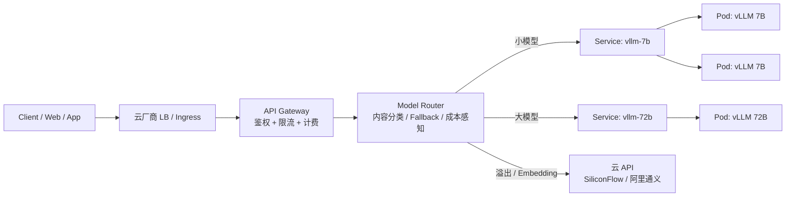

# 第 12 章 LLM 服务的生产化部署

把模型跑起来只是第一步。从 `python -m vllm.entrypoints.openai.api_server`（vLLM 第 1 章已介绍，是当下最主流的高性能推理引擎）到真正承载线上流量，中间隔着容器化、GPU 调度、模型版本管理、API Gateway（API 网关，统一入口负责鉴权/限流/路由，类比 Node 生态里的 Express 或 Fastify 网关层）等一系列工程问题。这一章把这些问题逐个拆解。

## 12.1 容器化部署

### 为什么一定要容器化

LLM 推理服务的依赖链条很长：CUDA driver（GPU 驱动）→ CUDA toolkit（NVIDIA 的并行计算工具包）→ cuDNN（NVIDIA 的深度学习算子库）→ PyTorch → vLLM/TGI（Text Generation Inference，HuggingFace 出品的推理服务，vLLM 的早期竞品）。任何一个版本不匹配都会导致 `CUDA error: no kernel image is available`。容器化（用 Docker 这类容器把进程、依赖、文件系统打包成可移植镜像，前端工程师可以类比 `node_modules` + Dockerfile 的固化产物）不是可选项，是必选项。

### NVIDIA Container Toolkit

在宿主机上安装 NVIDIA driver 之后，需要安装 NVIDIA Container Toolkit（NVIDIA 官方的容器运行时插件，把宿主机的 GPU 设备和驱动透传给容器里的进程），让 Docker（最常用的容器引擎，负责镜像构建和容器生命周期管理）容器能访问 GPU。

```bash
# Ubuntu 22.04
curl -fsSL https://nvidia.github.io/libnvidia-container/gpgkey | \
  sudo gpg --dearmor -o /usr/share/keyrings/nvidia-container-toolkit-keyring.gpg

curl -s -L https://nvidia.github.io/libnvidia-container/stable/deb/nvidia-container-toolkit.list | \
  sed 's#deb https://#deb [signed-by=/usr/share/keyrings/nvidia-container-toolkit-keyring.gpg] https://#g' | \
  sudo tee /etc/apt/sources.list.d/nvidia-container-toolkit.list

sudo apt-get update && sudo apt-get install -y nvidia-container-toolkit
sudo nvidia-ctk runtime configure --runtime=docker
sudo systemctl restart docker
```

验证安装：

```bash
docker run --rm --gpus all nvidia/cuda:12.4.0-base-ubuntu22.04 nvidia-smi
```

如果能看到 GPU 信息，说明配置正确。

### 生产级 Dockerfile

直接用 vLLM 官方镜像是最省事的方式。但实际项目中往往需要定制——加自定义的 tokenizer（分词器，把文本切成模型可理解的 token 序列）、挂载模型权重、配置健康检查（HEALTHCHECK，容器运行时定期探测服务是否存活的机制）等。

```dockerfile
FROM vllm/vllm-openai:v0.6.6.post1

# 安装额外依赖（如果有自定义逻辑）
COPY requirements.txt /app/requirements.txt
RUN pip install --no-cache-dir -r /app/requirements.txt

# 模型权重通常不打进镜像（太大了），通过 volume mount 挂载
# 这里只放配置文件
COPY model_config.json /app/model_config.json

ENV MODEL_NAME="Qwen/Qwen2.5-7B-Instruct"
ENV TENSOR_PARALLEL_SIZE=1
ENV MAX_MODEL_LEN=8192
ENV GPU_MEMORY_UTILIZATION=0.90

HEALTHCHECK --interval=30s --timeout=10s --retries=3 \
  CMD curl -f http://localhost:8000/health || exit 1

EXPOSE 8000

ENTRYPOINT python -m vllm.entrypoints.openai.api_server \
  --model /models/${MODEL_NAME} \
  --tensor-parallel-size ${TENSOR_PARALLEL_SIZE} \
  --max-model-len ${MAX_MODEL_LEN} \
  --gpu-memory-utilization ${GPU_MEMORY_UTILIZATION} \
  --host 0.0.0.0 \
  --port 8000
```

运行方式：

```bash
docker run -d --gpus all \
  -v /data/models:/models \
  -p 8000:8000 \
  --name vllm-server \
  --shm-size=4g \
  my-vllm-server:latest
```

几个关键参数：
- `--gpus all`：分配所有 GPU。生产环境用 `--gpus '"device=0,1"'` 指定具体卡
- `--shm-size=4g`：共享内存（shared memory，Linux 的 `/dev/shm`，多进程共享同一块物理内存的零拷贝通道）。PyTorch DataLoader 和 tensor parallel（张量并行，把单层权重切到多张 GPU 上协同计算，见第 11 章）通信需要用到，默认 64MB 远远不够
- `-v /data/models:/models`：模型权重从宿主机挂载，不打进镜像

### 镜像托管

国内拉 Docker Hub（Docker 官方的公共镜像仓库）和 ghcr.io（GitHub 自家的镜像仓库）的镜像经常超时。生产环境建议把镜像推到云厂商的 Registry（镜像仓库，相当于 Docker 镜像版的 npm registry）：

**阿里云 ACR（Alibaba Cloud Container Registry，阿里云容器镜像服务）：**

```bash
# 登录
docker login --username=<阿里云账号> registry.cn-hangzhou.aliyuncs.com

# 打 tag 并推送
docker tag my-vllm-server:latest \
  registry.cn-hangzhou.aliyuncs.com/<命名空间>/vllm-server:v1.0
docker push registry.cn-hangzhou.aliyuncs.com/<命名空间>/vllm-server:v1.0
```

**腾讯云 TCR（Tencent Container Registry，腾讯云容器镜像服务）：**

```bash
docker login ccr.ccs.tencentyun.com --username=<腾讯云账号ID>

docker tag my-vllm-server:latest \
  ccr.ccs.tencentyun.com/<命名空间>/vllm-server:v1.0
docker push ccr.ccs.tencentyun.com/<命名空间>/vllm-server:v1.0
```

ACR 个人版免费，企业版按实例收费。TCR 个人版免费额度 500 个镜像。

## 12.2 Kubernetes + GPU 调度

单机 Docker 能跑，但扛不住多副本、自动伸缩、滚动更新（rolling update，逐批替换旧版本 Pod，零停机升级）这些需求。生产环境基本都上 K8s（Kubernetes 的缩写，Google 开源的容器编排平台，负责调度、伸缩、自愈，前端工程师可以类比 PM2 的集群版加自动运维）。

### GPU 资源声明

K8s 通过 Extended Resources（K8s 的扩展资源机制，让节点上报非标准资源如 GPU、FPGA）机制管理 GPU。让节点上报 GPU 资源有两条路：手动装 NVIDIA device plugin（NVIDIA 官方的 K8s 设备插件，把 GPU 注册成可调度资源），或者一站式上 NVIDIA GPU Operator（基于 Operator 模式打包了驱动、插件、监控等一整套 GPU 组件）。

**device plugin 还是 GPU Operator？**

NVIDIA device plugin 只是一个 DaemonSet（K8s 工作负载类型，保证每个节点上都跑一个 Pod，类似全局守护进程），前提是 GPU 节点上已经手工装好了 driver、CUDA、container toolkit。GPU Operator 把这些组件（driver、container toolkit、device plugin、DCGM exporter（NVIDIA Data Center GPU Manager 的 Prometheus（CNCF 监控系统，采用 pull 模型抓取指标，第 13 章会专门展开）导出器，用来采集 GPU 监控指标）、MIG manager）打包成一组 Operator（K8s 里把"运维知识"代码化的控制器模式）管理的 CRD（Custom Resource Definition，K8s 自定义资源类型，相当于扩展出新的 YAML 对象），集群里 apply 一次就能拉齐所有 GPU 节点的依赖。

经验法则：

- **自建 K8s 集群**（裸金属、VMware、自建 IaaS（Infrastructure as a Service，基础设施即服务，提供裸机/虚机层面的云服务））：推荐 GPU Operator，省掉手工管理 driver 版本的麻烦
- **托管 K8s**（阿里云 ACK（Alibaba Cloud Container Service for Kubernetes）、腾讯云 TKE（Tencent Kubernetes Engine）、AWS EKS（Amazon Elastic Kubernetes Service））：节点池里勾选 GPU 镜像后，云厂商通常已经预装了 driver + device plugin，不需要再装 GPU Operator
- **混合场景**：如果托管集群里有自建 GPU 节点池，按自建处理

GPU Operator 官方文档：<https://docs.nvidia.com/datacenter/cloud-native/gpu-operator/overview.html>

下面给出最常见的 device plugin 直装方式（托管 K8s 通常已经包含这一步，跳过即可）：

```bash
# 安装 NVIDIA device plugin（DaemonSet 方式）
kubectl apply -f https://raw.githubusercontent.com/NVIDIA/k8s-device-plugin/v0.16.1/deployments/static/nvidia-device-plugin.yml

# 验证 GPU 资源
kubectl describe node <gpu-node> | grep nvidia.com/gpu
# nvidia.com/gpu:  4
# nvidia.com/gpu:  4
```

在 Pod（K8s 里最小的部署单元，一个或多个共享网络/存储的容器组合）spec 中声明 GPU 需求：

```yaml
resources:
  limits:
    nvidia.com/gpu: 1  # 请求 1 张 GPU
  requests:
    nvidia.com/gpu: 1
```

注意：GPU 资源只能整数分配，不像 CPU 可以请求 0.5 核。一个 Pod 要么拿到一整张卡，要么拿不到。

### GPU 共享方案

一张 A100 80GB 跑一个 7B 模型只用 15GB 显存，剩下 65GB 白白浪费。GPU 共享是降本的关键。

**MIG（Multi-Instance GPU，多实例 GPU）：**

NVIDIA A100/A30/H100 支持 MIG，可以把一张物理 GPU 切成最多 7 个独立实例，每个实例有独立的显存和计算资源。

```bash
# 在 GPU 节点上启用 MIG
sudo nvidia-smi -i 0 -mig 1

# 创建 MIG 实例（以 A100 为例，切成 3 个 3g.40gb 实例）
sudo nvidia-smi mig -i 0 -cgi 9,9,9 -C
```

在 K8s 中，MIG 实例以独立 GPU 资源的形式出现：

```yaml
resources:
  limits:
    nvidia.com/mig-3g.40gb: 1
```

**Time-slicing（时间片共享）：**

不需要特殊硬件支持，通过 NVIDIA device plugin 的配置实现 GPU 时间片共享（多个 Pod 轮流使用同一张 GPU 的算力，类似 CPU 调度的时间片）。

```yaml
# ConfigMap for time-slicing
apiVersion: v1
kind: ConfigMap
metadata:
  name: nvidia-device-plugin
  namespace: kube-system
data:
  config: |
    version: v1
    sharing:
      timeSlicing:
        resources:
        - name: nvidia.com/gpu
          replicas: 4  # 每张 GPU 虚拟化为 4 份
```

Time-slicing 的缺点是没有显存隔离——一个 Pod OOM（Out Of Memory，内存耗尽被内核或运行时杀掉的状态）会影响同卡的其他 Pod。适合开发测试环境，生产环境推荐 MIG。

### 阿里云 ACK GPU 节点池

```bash
# 使用 aliyun CLI 创建 GPU 节点池
aliyun cs POST /clusters/<cluster-id>/nodepools --body '{
  "nodepool_info": {
    "name": "gpu-pool-a10"
  },
  "scaling_group": {
    "instance_types": ["ecs.gn7i-c8g1.2xlarge"],  # A10, 1卡24GB
    "system_disk_category": "cloud_essd",
    "system_disk_size": 200,
    "data_disks": [{
      "category": "cloud_essd",
      "size": 500  # 模型权重需要大磁盘
    }],
    "desired_size": 2
  },
  "kubernetes_config": {
    "labels": [
      {"key": "gpu-type", "value": "a10"}
    ],
    "taints": [
      {"key": "nvidia.com/gpu", "value": "present", "effect": "NoSchedule"}
    ]
  }
}'
```

关键配置：
- 数据盘至少 500GB：模型权重大（7B ≈ 14GB，72B ≈ 144GB），加上多版本缓存
- Taint（污点，节点上的"排斥标记"，只有显式声明 Toleration 的 Pod 才能调度上去）：防止非 GPU 工作负载调度到昂贵的 GPU 节点
- Label（标签，K8s 对象上的键值对元数据）：用于 nodeSelector（节点选择器，按 label 把 Pod 调度到指定节点）精确调度

### 完整 Deployment 示例

（Deployment 是 K8s 里管理无状态副本集的工作负载类型，声明"期望状态"后由控制器持续 reconcile，类似 PM2 的 `instances` 但能力强很多。）

```yaml
apiVersion: apps/v1
kind: Deployment
metadata:
  name: vllm-qwen-7b
  labels:
    app: vllm-qwen-7b
spec:
  replicas: 2
  selector:
    matchLabels:
      app: vllm-qwen-7b
  template:
    metadata:
      labels:
        app: vllm-qwen-7b
    spec:
      tolerations:
      - key: "nvidia.com/gpu"
        operator: "Exists"
        effect: "NoSchedule"
      nodeSelector:
        gpu-type: a10
      containers:
      - name: vllm
        image: registry.cn-hangzhou.aliyuncs.com/my-ns/vllm-server:v1.0
        ports:
        - containerPort: 8000
        env:
        - name: MODEL_NAME
          value: "Qwen/Qwen2.5-7B-Instruct"
        - name: TENSOR_PARALLEL_SIZE
          value: "1"
        - name: MAX_MODEL_LEN
          value: "8192"
        resources:
          limits:
            nvidia.com/gpu: 1
            memory: "32Gi"
            cpu: "8"
          requests:
            nvidia.com/gpu: 1
            memory: "24Gi"
            cpu: "4"
        volumeMounts:
        - name: model-cache
          mountPath: /models
        - name: shm
          mountPath: /dev/shm
        livenessProbe:
          httpGet:
            path: /health
            port: 8000
          initialDelaySeconds: 120  # 模型加载需要时间
          periodSeconds: 30
        readinessProbe:
          httpGet:
            path: /health
            port: 8000
          initialDelaySeconds: 120
          periodSeconds: 10
        lifecycle:
          preStop:
            exec:
              # 收到 SIGTERM 后先停止接流量，sleep 5s 让 Service 把这个 Pod 摘出来
              command: ["/bin/sh", "-c", "sleep 5"]
      terminationGracePeriodSeconds: 120  # 留足时间给 streaming 请求收尾
      volumes:
      - name: model-cache
        hostPath:
          path: /data/models
          type: DirectoryOrCreate
      - name: shm
        emptyDir:
          medium: Memory
          sizeLimit: "4Gi"
```

以下几个细节容易踩坑：

1. **livenessProbe vs readinessProbe**（存活探针 vs 就绪探针，K8s 用来判断容器是否需要重启/是否能接流量的两类健康检查）：两个 probe 的语义不一样。readinessProbe 失败时 K8s 把 Pod 从 Service（K8s 里给一组 Pod 提供稳定虚拟 IP 和负载均衡的抽象）的 endpoints（端点列表，Service 背后实际可路由到的 Pod IP 集合）里摘掉（不再分配流量），但 Pod 本身不重启；livenessProbe 失败时 Pod 会被直接重启。LLM 服务的模型加载期间还不能接流量，但进程是健康的，所以两者都需要 `initialDelaySeconds: 120` 让模型加载完。periodSeconds 上 readiness 可以短一些（10s），更快感知"模型加载完了，可以接流量了"；liveness 可以长一些（30s），避免误杀正在做长推理的 Pod。Probe 详细配置见 K8s 官方文档：<https://kubernetes.io/docs/tasks/configure-pod-container/configure-liveness-readiness-startup-probes/>
2. **initialDelaySeconds: 120**：7B 模型加载到 GPU 大概需要 30-60 秒，72B 可能要 3-5 分钟。设太短会导致 Pod 被反复杀死
3. **preStop + terminationGracePeriodSeconds**：滚动更新或缩容时，K8s 先发 SIGTERM（Unix 标准的"优雅终止"信号，进程收到后应自行清理并退出）。LLM 的 streaming（流式响应，边生成边推送给客户端，第 4 章已介绍 SSE）连接可能持续 30-60 秒，比普通 HTTP 请求长一个数量级。preStop 里 sleep 5 秒，给 Service 的 endpoints controller（K8s 内置控制器，根据 Pod 状态维护 Service 的 endpoints 列表）留时间把这个 Pod 摘出来再开始关闭进程；`terminationGracePeriodSeconds: 120` 让正在生成的 token 流有时间走完。少了这两个配置，滚动更新时用户会看到响应突然中断
4. **shm volume**：用 emptyDir（K8s 临时卷，Pod 生命周期内可用，删除时自动清空）+ Memory medium 来提供共享内存，替代 Docker 的 `--shm-size`
5. **模型缓存用 hostPath 仅限示意**：hostPath（K8s 卷类型之一，把宿主机本地路径直接挂进 Pod）把模型目录绑死在节点本地磁盘上。一旦节点故障被驱逐，K8s 把 Pod 调度到另一台机器时，新节点上没有模型文件，Pod 会卡在 init 阶段或者反复重启。多副本之间也无法共享同一份缓存。生产环境应该用 PVC（PersistentVolumeClaim，K8s 的持久卷申领，按需绑定后端存储）+ NAS（Network Attached Storage，网络附加存储）/NFS（Network File System，Unix 经典的网络文件共享协议）（多 Pod 共享、节点无关），或者下一节 12.3 的 initContainer（初始化容器，在主容器启动前按顺序跑完的一次性容器，常用来下载资源或做迁移）+ OSS（Object Storage Service，阿里云对象存储服务，类似 AWS S3）方案（每个节点本地缓存一份，第一次启动时下载）

### 把服务暴露出去：Service 和 Ingress

Deployment 只管 Pod 的生命周期，Pod 的 IP 会随重启变化，外部根本没法稳定访问。把流量送进 Pod 需要 Service 这一层。最小配置就一个 ClusterIP Service（集群内部 IP 类型 Service，只在集群内部可访问）：

```yaml
apiVersion: v1
kind: Service
metadata:
  name: vllm-qwen-7b
spec:
  selector:
    app: vllm-qwen-7b  # 匹配 Deployment 的 Pod label
  ports:
  - name: http
    port: 8000         # Service 端口
    targetPort: 8000   # Pod 内的容器端口
  type: ClusterIP      # 集群内访问，默认值
```

Service 有三种暴露方式，覆盖不同场景：

- **ClusterIP**（默认）：只在集群内部可达，适合给同集群的 API Gateway 或其他后端调用
- **NodePort**：在每个 Node 上开一个端口（30000-32767 范围），外部通过 `NodeIP:NodePort` 访问。适合测试，生产很少用——端口管理麻烦，没有 TLS（Transport Layer Security，HTTPS 底层的加密传输协议）终结
- **LoadBalancer**：云厂商会自动创建一个外部 LB（Load Balancer，负载均衡器，把流量分发到多个后端实例）（阿里云 SLB（Server Load Balancer）/ 腾讯云 CLB（Cloud Load Balancer）），把流量打到集群里。生产对外服务的典型方式，但每个 Service 一个 LB，成本和数量都不划算

实际生产环境里推荐的模式是 **ClusterIP + Ingress**（Ingress 是 K8s 里基于 HTTP 主机名/路径的入口路由规则，类似 Nginx 反代的配置抽象）：内部用 ClusterIP，集群入口统一通过一个 Ingress Controller（实际执行 Ingress 规则的组件，常见实现有 NGINX/Traefik）（NGINX（高性能开源 HTTP 服务器和反向代理）、Traefik（Go 写的云原生反向代理，原生支持 K8s）或云厂商的 ALB Ingress（Application Load Balancer Ingress，云厂商应用层负载均衡的 Ingress 实现））路由，一个 LB 服务所有对外接口，还能在 Ingress 层统一做 TLS、限流、路径重写。

Service 详细文档：<https://kubernetes.io/docs/concepts/services-networking/service/>；Ingress 概念：<https://kubernetes.io/docs/concepts/services-networking/ingress/>。

### 用 Helm 管理 K8s 资源

到这一节为止 Deployment + Service 已经分散在两段 YAML 里，再加上后面要讲的 HPA（Horizontal Pod Autoscaler，水平 Pod 自动伸缩器，按 CPU/自定义指标自动增减副本数）、ConfigMap（K8s 用来注入配置文件/环境变量的资源对象）、ServiceAccount（K8s 内部身份，Pod 用它调用 API Server 时的"账号"）、Ingress，一套完整的部署文件加起来很容易上千行。生产项目几乎都用 Helm Chart（Helm 是 K8s 的包管理器，类似 npm；Chart 是它的"包"格式，把一组 YAML 模板加变量打包发布）把这些资源参数化管理：环境变量、副本数、镜像 tag、资源 limit 都抽到 `values.yaml`，部署不同环境时只换 values 文件。

vLLM 社区维护了官方 Helm Chart：<https://github.com/vllm-project/vllm/tree/main/examples/online_serving/chart-helm>；Helm 入门：<https://helm.sh/docs/intro/quickstart/>。本章为了让每个 YAML 字段清晰可见用手写 manifests（清单文件，K8s 里描述资源期望状态的 YAML 文档），实际项目里建议直接基于这份 Chart 改。

## 12.3 模型注册与版本管理

### 模型文件存储

模型权重文件动辄几十 GB，不适合放在容器镜像里。常见方案：

| 方案 | 优点 | 缺点 |
|------|------|------|
| 阿里云 OSS / 腾讯云 COS（Cloud Object Storage，腾讯云对象存储） | 便宜、可靠 | 每次启动要下载，慢 |
| NAS 共享存储 | 多节点共享、无需下载 | 贵（约 OSS 5-10 倍） |
| 本地缓存 + OSS 回源 | 兼顾速度和成本 | 需要管理缓存 |

推荐方案是「OSS + 本地缓存」：

```bash
#!/bin/bash
# init-model.sh - Pod 的 initContainer 脚本
MODEL_PATH="/models/${MODEL_NAME}"
OSS_PATH="oss://my-models/${MODEL_NAME}"

if [ -d "$MODEL_PATH" ] && [ -f "$MODEL_PATH/config.json" ]; then
    echo "Model already cached locally, skipping download"
else
    echo "Downloading model from OSS..."
    # ossutil 是阿里云 OSS 的官方命令行工具，支持并发上传/下载
    ossutil cp -r "$OSS_PATH" "$MODEL_PATH" --parallel 10
fi
```

在 Deployment 中用 initContainer 执行：

```yaml
initContainers:
- name: model-downloader
  image: registry.cn-hangzhou.aliyuncs.com/my-ns/ossutil:latest
  command: ["/bin/bash", "/scripts/init-model.sh"]
  env:
  - name: MODEL_NAME
    value: "Qwen2.5-7B-Instruct"
  volumeMounts:
  - name: model-cache
    mountPath: /models
  - name: scripts
    mountPath: /scripts
```

### 模型版本管理

不要用 `latest` 这种模糊标签。推荐用语义化版本 + 日期的命名规范：

```
models/
├── Qwen2.5-7B-Instruct/
│   ├── v1.0_20250101/    # 基础版本
│   ├── v1.1_20250115/    # 微调版本
│   └── current -> v1.1_20250115  # 软链接指向当前版本
```

配合配置中心（Apollo（携程开源的分布式配置中心） / Nacos（阿里开源的配置中心 + 服务发现组件，Java 生态常见））管理当前生效的版本号，切换版本只需改配置 + 滚动重启。

### 灰度发布（Canary）

（Canary 即金丝雀发布，新版本先放一小部分流量观察，没问题再逐步放量，名字来自矿工带金丝雀进矿井探毒气。和 blue-green（蓝绿发布，新旧版本各跑一套环境，切一刀完成切换）相对。）

新模型上线不能一把梭。最简单的金丝雀发布是基于副本数的近似流量切分——两个 Deployment 都打上同一个公共 label，让 Service 同时选中它们，依靠 kube-proxy（K8s 在每个节点上的网络代理组件，负责把 Service 流量转发到后端 Pod）的随机负载均衡按副本数比例分流：

```yaml
# v1 版本 - 9 个副本
apiVersion: apps/v1
kind: Deployment
metadata:
  name: vllm-qwen-v1
spec:
  replicas: 9
  selector:
    matchLabels:
      app: vllm-qwen
      version: v1
  template:
    metadata:
      labels:
        app: vllm-qwen   # 公共 label,供 Service 选中
        version: v1      # 区分版本的 label
    # ...

---
# v2 版本 - 1 个副本
apiVersion: apps/v1
kind: Deployment
metadata:
  name: vllm-qwen-v2
spec:
  replicas: 1
  selector:
    matchLabels:
      app: vllm-qwen
      version: v2
  template:
    metadata:
      labels:
        app: vllm-qwen
        version: v2
    # ...

---
# 共享同一个 Service,selector 只匹配 app,两个版本的 Pod 都会被选中
apiVersion: v1
kind: Service
metadata:
  name: vllm-qwen
spec:
  selector:
    app: vllm-qwen
  ports:
  - port: 8000
```

两个版本的 Pod template 必须打不同的 label（这里用 `version: v1` / `v2`），否则 Deployment 的 selector 没法区分自己管的是哪些 Pod，会出现互相争抢 Pod 的情况。Service 只看公共 label `app: vllm-qwen`，两个版本都会被加进 endpoints。

这种方式有几个坑要先说清楚，否则容易被坑：

- **不是精确比例，只是近似**：kube-proxy 默认用随机/轮询选 endpoint，9:1 的副本比对应的也是 9:1 的请求概率，但同一 Pod 处理时长不同（长上下文请求会占住一个 Pod 好几秒），实际流量分布会偏离副本比
- **没有会话黏性**（session affinity / sticky session，同一会话的请求始终被路由到同一后端实例）：同一个用户的多次请求可能被打到不同版本，无法做严格的 A/B 测试（A/B Test，把用户随机分流到两个版本对比关键指标的实验方法）（统计同一用户的转化）
- **缩到 0 不能直接缩 replicas**：把 v1 的 replicas 缩到 0 不会马上停掉流量，要先把 v2 加上去并等 readiness 通过

需要精确流量切分（比如 95% / 5%）或者会话黏性，用 Istio（最主流的开源服务网格，把流量管理、可观测、安全策略下沉到 sidecar 代理里）的 VirtualService（Istio 自定义资源，按主机/路径/权重定义流量路由规则）weight 路由，或者用云厂商的应用网关：

- Istio Traffic Shifting：<https://istio.io/latest/docs/tasks/traffic-management/traffic-shifting/>
- 阿里云 ASM（Alibaba Service Mesh，阿里云托管的 Istio 服务）流量管理：<https://help.aliyun.com/zh/asm/user-guide/traffic-management>

如果不引入 service mesh（服务网格，通过透明代理为微服务提供流量、安全、观测能力的基础设施层），另一个轻量方案是在 12.4 节的 API Gateway 里写流量切分逻辑——根据 user_id 哈希分桶（保证会话黏性）或者随机数（精确比例）选择上游 Service。

## 12.4 API Gateway 设计

LLM 服务不能裸露给客户端。API Gateway 需要处理：鉴权、限流、负载均衡、超时。

API Gateway 跟具体语言无关，下面的代码用 Python（FastAPI（第 4 章已介绍的 Python 异步 Web 框架） + redis-py（Redis 的 Python 官方客户端）；Redis 是内存型 KV 数据库，常用作缓存和限流计数器）举例，是因为它跟 vLLM 的生态贴得最近。如果主语言是 Node.js，用 Fastify（Node.js 生态的高性能 Web 框架） + ioredis（Node.js 上流行的 Redis 客户端）实现完全等价的逻辑就行，对应的限流可以用 `fastify-rate-limit` 之类的现成插件。不想自己写的话，社区也有几个现成的 LLM 网关可以直接部署：

- one-api（开源，多模型聚合）：<https://github.com/songquanpeng/one-api>
- LiteLLM Proxy（开源 LLM 代理网关，统一多家模型 API；支持 100+ 模型）：<https://docs.litellm.ai/docs/simple_proxy>
- Higress AI Gateway（阿里云开源，基于 Envoy（CNCF 顶级项目，云原生 L4/L7 代理，Istio 的默认数据面））：<https://github.com/alibaba/higress>

### 限流策略

LLM 的限流（rate limiting，按规则限制单位时间内的请求量，保护后端不被打挂）比传统 API 复杂。一个请求可能消耗 10 个 token，也可能消耗 10000 个。

两层限流：

```
第一层：请求级限流（简单快速）
  - 每个 API Key 每分钟最多 60 个请求（RPM, Requests Per Minute）

第二层：Token 级限流（精确但有延迟）
  - 每个 API Key 每分钟最多 100K tokens（TPM, Tokens Per Minute）
  - 需要在请求完成后扣减，不能预扣（因为不知道 completion 会生成多少 token）
```

实现上用 Redis 的滑动窗口（sliding window，按"过去 N 秒"的连续时间窗口统计请求数的限流算法，比固定窗口更平滑）：

```python
import redis
import time

r = redis.Redis()

def check_rate_limit(api_key: str, rpm_limit: int = 60) -> bool:
    """滑动窗口限流"""
    now = time.time()
    window_start = now - 60
    key = f"rate_limit:{api_key}"

    pipe = r.pipeline()
    pipe.zremrangebyscore(key, 0, window_start)  # 清理过期记录
    pipe.zcard(key)                               # 当前窗口请求数
    pipe.zadd(key, {str(now): now})               # 添加当前请求
    pipe.expire(key, 120)                         # 设置过期时间
    _, count, _, _ = pipe.execute()

    if count >= rpm_limit:
        r.zrem(key, str(now))  # 超限，移除刚添加的
        return False
    return True
```

### 负载均衡

传统的 Round Robin（轮询，按顺序把请求依次分给每个后端实例的负载均衡算法）对 LLM 服务不友好。一个长上下文请求可能占用一个实例好几秒，而同时来的短请求被路由到已经很忙的实例上。

更好的策略是 **Least Pending Requests**（最少排队请求优先，类似 Least Connections，但针对的是"正在处理中"的请求数）——把请求路由到当前排队最少的实例：

```python
class LeastPendingRouter:
    def __init__(self, backends: list[str]):
        self.backends = backends
        self.pending = {b: 0 for b in backends}
        # 仅做演示。生产环境多协程并发读写 self.pending 有竞态:
        # 两个请求几乎同时调 route(),可能拿到同一个 backend,导致计数偏移。
        # 真实部署建议用以下任一方式:
        #   1) asyncio.Lock 保护 route/release(单进程内)
        #   2) Redis INCR/DECR(跨进程、跨实例)
        #   3) 直接读 vLLM 的 /metrics 里的 num_requests_running 做决策

    async def route(self) -> str:
        backend = min(self.pending, key=self.pending.get)
        self.pending[backend] += 1
        return backend

    async def release(self, backend: str):
        self.pending[backend] = max(0, self.pending[backend] - 1)
```

vLLM 自身的 `/metrics` 端点（Prometheus 格式的指标暴露接口，监控系统拉取后用于告警和绘图）会暴露当前 pending requests 数量，可以用这个做更精确的路由。

### Streaming 超时

LLM 的 streaming 响应可能持续几十秒。不能简单设一个 30 秒超时把连接断掉。

```python
# 错误做法
timeout = aiohttp.ClientTimeout(total=30)  # 30 秒后整个请求超时

# 正确做法：分段超时
timeout = aiohttp.ClientTimeout(
    connect=5,        # 连接超时 5 秒
    sock_read=30,     # 单次读取超时 30 秒（两个 chunk 之间的间隔）
    total=300,        # 总超时 5 分钟
)
```

`sock_read` 超时是关键：它控制的是两个 SSE（Server-Sent Events，服务器主动推送的 HTTP 流，第 4 章已介绍）chunk 之间的最大间隔，而不是整个响应的时长。正常情况下 vLLM 每 10-50ms 就会发一个 token chunk，如果 30 秒都没收到下一个 chunk，说明后端出问题了。

## 12.5 多模型路由

到这一节为止，从容器到 K8s 到 Gateway 已经讲完了。先用一张图把整条请求路径串起来，再看多模型路由怎么嵌进去：



Gateway 负责通用的横切关注点（鉴权、限流、日志），Router 负责模型选型。两者可以是同一个进程里的两个模块，也可以拆开部署。下面看 Router 的几种典型策略。

生产环境通常不只跑一个模型。典型配置：

| 模型 | 用途 | 成本 |
|------|------|------|
| Qwen2.5-72B-Instruct | 复杂推理、代码生成 | 高 |
| Qwen2.5-7B-Instruct | 日常对话、简单任务 | 低 |
| BGE-M3 | Embedding（嵌入向量，把文本/图片转成稠密向量供检索或语义计算用） | 极低 |

### 基于内容的路由

根据用户请求的内容特征选择模型：

```python
def classify_request(messages: list[dict]) -> str:
    """简单的请求分类"""
    last_msg = messages[-1]["content"].lower()
    total_tokens = sum(len(m["content"]) for m in messages) // 4  # 粗估 token 数

    # 长上下文或复杂任务 -> 大模型
    if total_tokens > 2000:
        return "qwen-72b"
    if any(kw in last_msg for kw in ["代码", "code", "分析", "推理", "debug"]):
        return "qwen-72b"

    # 简单任务 -> 小模型
    return "qwen-7b"
```

更精确的做法是用一个小的 classifier（分类器，把输入归类到预定义类别的小模型，通常推理成本远低于主模型）模型来分类，但这会增加延迟。实际项目中，基于简单规则 + 用户手动选择已经够用了。

### Fallback 策略

（Fallback 即回退/降级，主路径失败时自动切换到备用路径的可靠性策略，类似 circuit breaker（熔断器，连续失败时直接短路调用以保护下游）的搭档。）

主模型不可用时自动降级：

```python
class ModelRouter:
    def __init__(self):
        self.routes = {
            "qwen-72b": {
                "primary": "http://vllm-72b:8000",
                "fallback": ["http://vllm-7b:8000"],  # 降级到小模型
            },
            "qwen-7b": {
                "primary": "http://vllm-7b:8000",
                "fallback": ["https://api.siliconflow.cn/v1"],  # 降级到云 API
            },
        }

    async def call(self, model: str, request: dict) -> dict:
        route = self.routes[model]

        # 先尝试主模型
        try:
            return await self._call_backend(route["primary"], request)
        except Exception as e:
            logger.warning(f"Primary backend failed: {e}")

        # 依次尝试 fallback
        for fallback in route["fallback"]:
            try:
                return await self._call_backend(fallback, request)
            except Exception:
                continue

        raise Exception("All backends failed")
```

### 成本感知路由

如果自建的 GPU 实例已经满载，新请求可以溢出到云 API：

```python
async def cost_aware_route(self, request: dict) -> str:
    """优先用自建实例，满载时溢出到云 API"""
    self_hosted_pending = await self.get_pending_count("self-hosted")
    threshold = 50  # 队列深度阈值

    if self_hosted_pending < threshold:
        return "self-hosted"
    else:
        logger.info(f"Self-hosted queue depth {self_hosted_pending}, "
                    f"routing to cloud API")
        return "cloud-api"
```

这种混合架构的好处是：自建实例扛基线流量（成本低），峰值流量溢出到云 API（弹性好）。详细的成本计算见下一章。

## 本章小结

这一章覆盖了 LLM 服务从容器化到 K8s 部署的完整链路：

1. **容器化**是基础，NVIDIA Container Toolkit + vLLM 官方镜像能快速起步
2. **K8s GPU 调度**通过 device plugin + resource limits 管理 GPU，MIG 和 time-slicing 提升利用率
3. **模型版本管理**用 OSS + 本地缓存 + 语义化版本号
4. **API Gateway** 的核心是 Token 级限流和 Least Pending 路由
5. **多模型路由**实现成本和质量的平衡

下一章讲这套系统跑起来之后，怎么监控它、怎么降成本。


---

> 本章来自《LLM Infra 从入门到实践》开源版 · 作者「递归客」  
> 在线阅读完整书系：[inferloop.dev](https://inferloop.dev)
