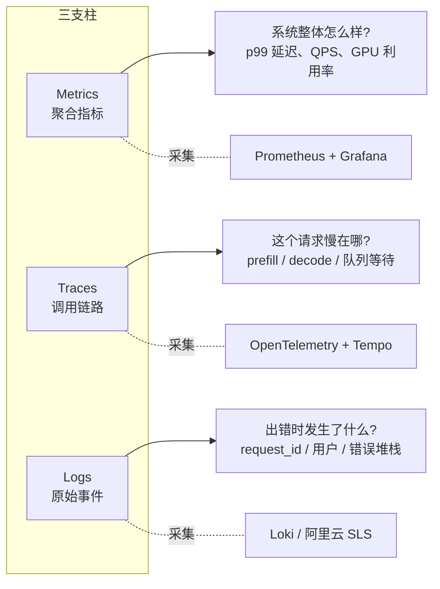

# 第 13 章 可观测性与成本优化

LLM 服务跑起来之后，两个问题会接踵而至：「它到底跑得怎么样」和「太贵了怎么降本」。这两个问题互为因果——你得先看清楚资源花在哪了，才能有的放矢地优化。

可观测性（Observability，从系统外部观察输出来推断内部状态的能力）圈子里有个约定俗成的「三支柱」分类：Metrics（指标，可数值聚合的时序数据，如 QPS、延迟）、Traces（链路追踪，单个请求在多个服务/组件间流转的完整路径）、Logs（日志，离散的事件记录），三者解决不同的问题，工具也各有侧重。前端类比：Metrics 像 Web Vitals 看板，Traces 像 Chrome DevTools 的 Performance 火焰图，Logs 像 console.log。本章 13.1-13.3 节按这个框架展开，13.4 节开始讲成本和伸缩：



涉及到的工具名字一次性交代清楚：

- **Prometheus**：CNCF 毕业的开源时序数据库 + 监控系统，主动从目标端点拉取（pull）指标，ch12 已介绍过
- **Grafana**：开源可视化前端，把 Prometheus / Loki / Tempo 等多种数据源画成 Dashboard
- **OpenTelemetry（OTel）**：CNCF 的可观测性标准协议和 SDK 集合，统一了 traces/metrics/logs 的采集格式，可以理解为「可观测性界的 HTTP」
- **Tempo**：Grafana 出的分布式追踪后端，专门存 trace 数据，存储用对象存储（S3/OSS）成本低
- **Loki**：Grafana 出的日志聚合系统，理念类似「日志版 Prometheus」，按 label 索引而不是全文索引
- **阿里云 SLS（Simple Log Service，日志服务）**：阿里云的托管日志平台，国内项目常用

三者不是非此即彼——成熟的可观测平台同时跑三套数据，靠 `trace_id`（一条调用链路的全局唯一 ID）/ `request_id`（应用层定义的请求 ID，通常等同于 trace_id）把它们关联起来：从 Grafana Dashboard 上看到一个 p99（99 分位延迟，下面 13.1 会展开）飙高的时间段（Metrics），点进去查这个时间段最慢的几条 trace（Traces），再用 trace 上记录的 request_id 拉对应的结构化日志（Logs）看出错原因。

## 13.1 关键指标

LLM 推理服务的指标体系跟传统 Web 服务有本质区别。传统服务关注 QPS（Queries Per Second，每秒请求数，ch01 已介绍）和 P99 延迟，LLM 服务需要更细粒度的指标。

### TTFT — Time to First Token

用户体感延迟的核心指标（ch04 已介绍）。从发出请求到收到第一个 token（模型处理的最小语义单元，可以是一个汉字、半个英文单词或一个标点）的时间。

TTFT 主要由 prefill（预填充阶段，把整个 prompt 一次性塞进模型做并行前向计算，对应 ch04 讲的推理两阶段中的第一阶段）决定：模型需要先处理完所有 input tokens（输入 token 数，即 prompt 的 token 数量），才能开始生成。所以 TTFT 跟输入长度正相关：

| 输入长度 | A10 (7B) TTFT | A100 (72B) TTFT |
|----------|---------------|-----------------|
| 100 tokens | ~80ms | ~200ms |
| 1K tokens | ~200ms | ~500ms |
| 8K tokens | ~800ms | ~2s |
| 32K tokens | ~3s | ~8s |

用户能接受的 TTFT 一般在 1-2 秒以内。超过 3 秒就会明显感到「卡顿」。

### TPS — Tokens Per Second

单个请求的 token 生成速度（ch04 已介绍）。人的阅读速度大约 5-8 tokens/s（中文 3-5 字/秒），所以 TPS 只要超过 15 tokens/s，用户体验就不会有明显瓶颈。

实际数据参考：

| 模型 | GPU | TPS (单请求) | TPS (并发 10) |
|------|-----|-------------|--------------|
| Qwen2.5-7B | A10 24GB | ~45 | ~25 |
| Qwen2.5-72B | A100 80GB x2 | ~20 | ~12 |

并发时 TPS 下降是正常的——GPU 的计算资源被多个请求共享。

### TPOT — Time Per Output Token

TPOT（每个输出 token 的平均生成耗时）是 TPS 的"硬币另一面"：`TPOT = 1000 / TPS`（单位毫秒），衡量两个连续 token 之间的间隔。TPS 站在系统视角说「每秒能出几个 token」，TPOT 站在用户视角说「下一个字要等多久」。Streaming UI（流式输出界面，类似 ChatGPT 那种边生成边显示的交互）设计的判断阈值用 TPOT 更直观：

- TPOT ≤ 66 ms（TPS ≥ 15）：用户感知流畅，跟阅读速度匹配
- TPOT ≤ 100 ms（TPS ≥ 10）：可接受，偶尔感到「卡了一下」
- TPOT > 200 ms（TPS < 5）：明显卡顿，前端最好加「思考中」动画掩盖

vLLM（ch01/ch05 已介绍的工业级推理引擎）的 `vllm:time_per_output_token_seconds` Histogram（直方图，Prometheus 的一种 metric 类型，把观测值分桶统计，便于后续算分位数）暴露的就是这个分布。

### Throughput — 系统级吞吐

跟 TPS 不同，throughput（吞吐量，单位时间内系统处理的总工作量）衡量的是整个系统每秒处理的总 token 数。vLLM 的 continuous batching（连续批处理，把多个请求在每个 decode step 动态拼成一个 batch 一起跑，ch05 详细讲过）会把多个请求打包在一起处理，所以系统 throughput 远高于单请求 TPS。

```
系统 throughput = 并发请求数 × 单请求 TPS
```

一个 A100 跑 7B 模型，并发 64 时系统 throughput 可以到 3000+ tokens/s。

### GPU 利用率的陷阱

`nvidia-smi`（NVIDIA System Management Interface，NVIDIA 自带的命令行 GPU 状态查询工具）里的 GPU Utilization 显示的是 GPU 有多少时间在执行 kernel（在 GPU 上跑的一段计算函数），不是「算力用了多少」。一个简单的 memory copy kernel 也会让利用率显示 100%，但实际计算单元可能只用了 10%。

更有意义的指标：
- **SM Occupancy（流多处理器占用率）**：Streaming Multiprocessor（SM，GPU 上的并行计算单元，类比 CPU 的核心）的占用率
- **显存利用率**：`memory.used / memory.total`
- **实际 FLOPs（Floating Point Operations，浮点运算次数）**：通过 profiling 工具（性能剖析工具，如 Nsight Systems / PyTorch Profiler）测量

衡量算力榨干程度的两个进阶指标在 ch03 出现过，这里简单复述：

- **MFU（Model FLOPs Utilization，模型算力利用率）**：实际执行的有效 FLOPs ÷ GPU 理论 FLOPs。LLM 推理常见 5%-30%
- **MBU（Memory Bandwidth Utilization，显存带宽利用率）**：实际显存带宽消耗 ÷ HBM 理论带宽。decode 阶段是 memory-bound 的，MBU 比 MFU 更值得盯

但在日常运维中，我们更关心一个实用指标：**pending requests（排队中的请求）数量**。如果持续有请求在排队（pending > 0），说明 GPU 资源不够了。

```bash
# 从 vLLM 的 metrics 端点获取
curl http://vllm-server:8000/metrics | grep vllm_num_requests
# vllm:num_requests_running 8
# vllm:num_requests_waiting 3  <-- 有 3 个在排队
```

### 指标采集

用 Prometheus 采集 vLLM 暴露的 metrics。最简单的 scrape config（抓取配置，告诉 Prometheus 去哪里、按什么频率拉指标）（开发/单机场景）：

```yaml
# Prometheus scrape config — 单机静态配置
scrape_configs:
  - job_name: 'vllm'
    metrics_path: '/metrics'
    scrape_interval: 15s
    static_configs:
      - targets: ['vllm-server:8000']
```

K8s（Kubernetes，容器编排平台，ch12 已介绍）环境里这种 `static_configs` 不能用：Pod（K8s 中最小的部署单元，包含一个或多个容器）IP 随重启变化，Pod 数量也会随 HPA（Horizontal Pod Autoscaler，水平 Pod 自动伸缩器，本章 13.5 会详细讲）变化。两种正确做法：

**1）Prometheus 自带的 Kubernetes 服务发现**

直接让 Prometheus 用 K8s API 发现需要抓取的 Pod，给 Pod 打 annotation（K8s 资源上的键值对元数据，用来携带非标识性的额外信息）来标记是否需要抓取：

```yaml
scrape_configs:
  - job_name: 'vllm-k8s'
    kubernetes_sd_configs:
      - role: pod
    relabel_configs:
      # 只抓打了 prometheus.io/scrape=true annotation 的 Pod
      - source_labels: [__meta_kubernetes_pod_annotation_prometheus_io_scrape]
        action: keep
        regex: true
      # annotation 里指定端口
      - source_labels: [__address__, __meta_kubernetes_pod_annotation_prometheus_io_port]
        action: replace
        regex: ([^:]+)(?::\d+)?;(\d+)
        replacement: $1:$2
        target_label: __address__
```

对应的 Pod 模板里加 annotation：

```yaml
metadata:
  annotations:
    prometheus.io/scrape: "true"
    prometheus.io/port: "8000"
    prometheus.io/path: "/metrics"
```

**2）Prometheus Operator + ServiceMonitor**

生产推荐方案。Operator 是 K8s 上一种「特定领域的 controller」模式，把某个软件（这里是 Prometheus）的运维知识写成代码，自动管理它的生命周期。安装 kube-prometheus-stack（包含 Operator、Prometheus、Grafana、AlertManager 告警管理器 一整套）后，用 ServiceMonitor CRD（Custom Resource Definition，K8s 自定义资源类型，相当于扩展 K8s API 的「新增 schema」）声明式地配置抓取规则：

```yaml
apiVersion: monitoring.coreos.com/v1
kind: ServiceMonitor
metadata:
  name: vllm
spec:
  selector:
    matchLabels:
      app: vllm-qwen-7b
  endpoints:
  - port: http
    interval: 15s
    path: /metrics
```

Operator 会自动把 ServiceMonitor 翻译成 Prometheus 配置，无需手工改 prometheus.yaml。详细文档：<https://prometheus-operator.dev/docs/getting-started/installation/>。

vLLM 暴露的核心 metrics（Prometheus 有四种基础 metric 类型：**Counter** 只增不减的累计计数器、**Gauge** 可上可下的瞬时值、**Histogram** 直方图分桶统计、**Summary** 客户端预先算分位数）：

| Metric | 类型 | 含义 |
|--------|------|------|
| `vllm:num_requests_running` | Gauge | 正在处理的请求数 |
| `vllm:num_requests_waiting` | Gauge | 排队中的请求数 |
| `vllm:gpu_cache_usage_perc` | Gauge | KV Cache（键值缓存，把已经算过的 attention 中间结果存下来避免重复计算，ch01/ch05 介绍过）使用率 |
| `vllm:avg_prompt_throughput_toks_per_s` | Gauge | Prefill 吞吐 |
| `vllm:avg_generation_throughput_toks_per_s` | Gauge | Decode（解码阶段，一次生成一个 output token 的串行过程，对应 ch04 推理两阶段的第二阶段）吞吐 |
| `vllm:e2e_request_latency_seconds` | Histogram | 端到端（end-to-end，从请求进入到响应完整返回的全过程）延迟分布 |
| `vllm:time_to_first_token_seconds` | Histogram | TTFT 分布 |
| `vllm:time_per_output_token_seconds` | Histogram | TPOT 分布 |

### 读懂 Histogram：p50/p95/p99 分位值

表格里几个 Histogram 类型的 metric 不能像 Gauge 那样直接展示，需要做分位（percentile，把样本按数值排序后取某个百分比位置的值）计算才有意义。所谓 p99 延迟，是指「99% 的请求都比这个时间快、只有 1% 的请求比它慢」。常用的几个分位含义：

- **p50（中位数）**：一半请求比这快，一半比这慢。反映「典型用户」的体验
- **p95**：偏长尾的代表，反映「大多数情况」。LLM 服务通常拿 p95 TTFT ≤ 2s 作为 SLA（Service Level Agreement，服务等级协议，运营方对外承诺的服务质量指标，比如「p95 TTFT ≤ 2s 否则赔偿」；与之相关的还有 SLI 实际衡量值、SLO 内部目标值）基准
- **p99**：长尾，反映「最差的 1% 请求多差」。p99 大幅高于 p95 说明系统有偶发抖动（队列堆积、GC（Garbage Collection，垃圾回收，运行时回收无用内存的过程，Python 和 JVM 都有自己的 GC，会导致毫秒级到秒级的停顿）、网络抖动）

Prometheus 的 `histogram_quantile` 函数从 `_bucket`（直方图每个分桶累计计数的时间序列）系列计算分位值，查询语言用 PromQL（Prometheus Query Language，Prometheus 自家的查询 DSL）：

```promql
# p99 端到端延迟（5 分钟窗口）
histogram_quantile(0.99,
  sum by (le) (rate(vllm:e2e_request_latency_seconds_bucket[5m])))

# p95 TTFT，按 model label 分组
histogram_quantile(0.95,
  sum by (model, le) (rate(vllm:time_to_first_token_seconds_bucket[5m])))
```

只看平均值是常见的坑——平均 200ms 听起来很好，但 p99 可能是 5s，这部分用户体验完全崩了。监控时盯 p50 + p99 一对指标，远比看 avg 有用。

## 13.2 全链路追踪

Metrics 告诉你「系统整体怎么样」，Tracing（链路追踪）告诉你「一个请求具体慢在哪」。

### OpenTelemetry 集成

OpenTelemetry（OTel）是现在的事实标准。LLM 服务的 trace（一条完整的调用链路，由多个 span 组成的树状结构）需要覆盖以下 span（跨度，trace 中的最小单元，表示一段有起止时间的工作，比如一次函数调用或一次 HTTP 请求）：

```
[API Gateway]
  └── [Auth + Rate Limit Check]       ~2ms
  └── [Model Router]                   ~1ms
  └── [Backend Request]
       └── [Queue Wait]               可能几秒
       └── [Prefill]                   跟输入长度正相关
       └── [Decode]                    跟输出长度正相关
  └── [Response Streaming]             持续时间 = output_tokens / TPS
```

在 FastAPI（ch04 介绍过的 Python 异步 Web 框架，类比 Node 的 Express/Fastify）Gateway（网关，应用前面用来做路由/鉴权/限流的统一入口）中添加 OTel：

```python
from opentelemetry import trace
from opentelemetry.instrumentation.fastapi import FastAPIInstrumentor
from opentelemetry.sdk.trace import TracerProvider
from opentelemetry.sdk.trace.export import BatchSpanProcessor
from opentelemetry.exporter.otlp.proto.grpc.trace_exporter import OTLPSpanExporter

# 初始化
provider = TracerProvider()
provider.add_span_processor(
    BatchSpanProcessor(OTLPSpanExporter(endpoint="http://otel-collector:4317"))
)
trace.set_tracer_provider(provider)
tracer = trace.get_tracer(__name__)

# 自动注入 FastAPI
FastAPIInstrumentor.instrument_app(app)

# 手动添加 LLM 特有的 span 属性
@app.post("/v1/chat/completions")
async def chat_completions(request: ChatRequest):
    with tracer.start_as_current_span("llm_request") as span:
        span.set_attribute("llm.model", request.model)
        span.set_attribute("llm.input_tokens", count_tokens(request.messages))

        with tracer.start_as_current_span("model_routing"):
            backend = router.select(request)

        with tracer.start_as_current_span("backend_call") as backend_span:
            backend_span.set_attribute("backend.url", backend)
            response = await call_backend(backend, request)

        span.set_attribute("llm.output_tokens", response.usage.completion_tokens)
        span.set_attribute("llm.total_tokens", response.usage.total_tokens)
        return response
```

### OTel Collector 在中间做什么

前面代码里 `OTLPSpanExporter(endpoint="http://otel-collector:4317")` 把 span 发到了一个叫 otel-collector 的服务，这是 OpenTelemetry 推荐的标准链路：应用 → OTel Collector → 后端（Tempo / Jaeger（Uber 开源的老牌分布式追踪系统）/ 商用 APM（Application Performance Monitoring，应用性能监控，泛指 Datadog / New Relic / 阿里云 ARMS 这类商用一体化平台））。

Collector 单独存在的理由：

- **协议转换**：应用统一发 OTLP（OpenTelemetry Protocol，OTel 官方的二进制传输协议，支持 gRPC 和 HTTP），Collector 转换成 Tempo/Jaeger/Zipkin（Twitter 开源的另一个分布式追踪系统）各种后端协议
- **采样和过滤**：在 Collector 层做尾采样（tail sampling，等整条 trace 收完再决定要不要保留，对应「头采样」是在 trace 一开始就随机决定要不要采）（基于整条 trace 的耗时/错误码决定保留哪些），比在应用里做更准
- **缓冲和重试**：Collector 攒一批再发后端，可以削平后端的写入压力

简单场景可以省掉 Collector，让应用直接发到 Tempo 的 OTLP 端口（Tempo 同样监听 4317/4318）；大规模生产建议保留 Collector 这一层。Collector 详细文档：<https://opentelemetry.io/docs/collector/>。

下面的 docker-compose 演示「应用 → Tempo（直连）」的最小链路，省掉 Collector：

### Grafana + Tempo + Prometheus 部署

Tempo 是 Grafana 出的分布式追踪后端，相比 Jaeger 更轻量，存储用 S3（AWS Simple Storage Service，事实标准的对象存储 API）/OSS（阿里云 Object Storage Service，对象存储服务）对象存储。

```yaml
# docker-compose.yaml — 最小可观测栈
services:
  prometheus:
    image: prom/prometheus:v3.0.1
    volumes:
      - ./prometheus.yml:/etc/prometheus/prometheus.yml
    ports:
      - "9090:9090"

  tempo:
    image: grafana/tempo:2.6.1
    command: ["-config.file=/etc/tempo.yaml"]
    volumes:
      - ./tempo.yaml:/etc/tempo.yaml
      - tempo-data:/var/tempo
    ports:
      - "4317:4317"   # OTLP gRPC（Google 开源的高性能 RPC 框架，基于 HTTP/2 + Protobuf），应用直接发到这里
      - "3200:3200"   # Tempo API

  grafana:
    image: grafana/grafana:11.4.0
    ports:
      - "3000:3000"
    environment:
      - GF_AUTH_ANONYMOUS_ENABLED=true
    volumes:
      - ./grafana-datasources.yaml:/etc/grafana/provisioning/datasources/datasources.yaml
```

数据源用 Grafana 的 provisioning（启动时通过配置文件预置资源的机制，相当于 IaC（Infrastructure as Code，基础设施即代码））自动注册，省去 UI 点击：

```yaml
# grafana-datasources.yaml
apiVersion: 1
datasources:
  - name: Prometheus
    type: prometheus
    access: proxy
    url: http://prometheus:9090
    isDefault: true
  - name: Tempo
    type: tempo
    access: proxy
    url: http://tempo:3200
    jsonData:
      # 让 Tempo 上点击 trace 关联到 Prometheus,实现 trace-to-metrics 跳转
      tracesToMetrics:
        datasourceUid: prometheus
```

启动后访问 `http://localhost:3000`，两个数据源已经就位。Dashboard 不用从零搭——Grafana 社区有现成的 vLLM Dashboard 可以一键导入：

- vLLM 官方 Grafana Dashboard：<https://github.com/vllm-project/vllm/tree/main/examples/online_serving/prometheus_grafana>
- Grafana Dashboards 市场搜索：<https://grafana.com/grafana/dashboards/?search=vllm>

### 用现成 SaaS 还是自建？

OTel + Tempo + Grafana 这套自建方案，第一次跑通至少要花 1-2 天。如果团队规模小、流量不大，先用现成的 LLM 可观测平台（俗称 LLMOps 平台，专门给 LLM 应用做监控、prompt 管理、效果评测的一类工具）更划算，它们除了 trace 还内建了 prompt（送给模型的输入文本，包含 system message、历史对话、用户输入等）管理、token 计费、Eval（Evaluation，效果评测，对模型输出做自动或人工打分）等 LLM 专属功能。

- **Langfuse**（推荐自部署）：开源，支持 self-host（自托管，部署到自家服务器而非用厂商的云服务），覆盖 trace + prompt 管理 + Eval。<https://langfuse.com>，GitHub：<https://github.com/langfuse/langfuse>
- **Helicone**（推荐 SaaS（Software as a Service，软件即服务，厂商托管你不用运维））：Proxy（代理）模式接入，应用代码改一个 base_url 就能用。开源版可自部署。<https://helicone.ai>，GitHub：<https://github.com/Helicone/helicone>
- **Phoenix by Arize**：偏 Eval 和模型评测。Arize 是一家专注 ML/LLM 可观测的公司，Phoenix 是它家的开源产品。<https://phoenix.arize.com>

业内其他常见的同类工具还有 LangSmith（LangChain 官方平台，跟 LangChain 生态集成最紧）、Datadog LLM Observability（老牌 APM 厂商出的 LLM 模块）等，挑选时按团队已有技术栈靠拢。

经验法则：

| 规模 | 推荐方案 |
|------|---------|
| 初创 / 个人项目 | Langfuse Cloud（免费额度）或 Helicone SaaS |
| 中型团队，关注 prompt 工程 | Langfuse self-host |
| 大规模生产，已有 Grafana 栈 | OTel + Tempo + Grafana（本节方案） |
| 强合规要求（金融/医疗） | OTel + Tempo + Grafana（自建可控） |

## 13.3 结构化日志

Metrics 和 Traces 解决「系统怎么样」「请求慢在哪」，但还有一个问题它们答不了：**这次具体的请求到底用了多少 token，是哪个用户、哪个模型、扣多少钱**。这是 Logs 的活。

LLM 服务的日志至少要覆盖三类用途：

1. **计费和成本归因**：每个请求消耗的 input/output token 数、用哪个模型
2. **故障排查**：错误码、堆栈、关联的 trace_id
3. **用户行为分析**：哪些场景跑大模型、哪些跑小模型，平均长度多少

结构化日志（Structured Logging）的核心思路是把日志写成机器可解析的 JSON 等格式，而不是 `printf` 风格的纯文本字符串，这样后端可以按字段索引、过滤、聚合。

### 推荐字段

每条 LLM 请求日志至少包含：

| 字段 | 类型 | 用途 |
|------|------|------|
| `timestamp` | ISO 8601 字符串（国际标准的日期时间格式，如 `2026-05-21T10:23:01.234Z`） | 时间排序 |
| `request_id` | string | 唯一标识，跟 trace_id 关联 |
| `user_id` | string | 用户归因（计费 / 限流 / 违规分析） |
| `model` | string | 模型名 |
| `input_tokens` | int | prompt token 数 |
| `output_tokens` | int | completion（补全输出，模型对应 prompt 生成的文本）token 数 |
| `latency_ms` | int | 端到端延迟（latency，单个请求从开始到结束的耗时） |
| `ttft_ms` | int | 首 token 时间 |
| `status` | string | success / timeout / error |
| `error_code` | string | 失败时填，如 `rate_limit`（触发限流） / `context_too_long`（context 即模型一次能看到的上下文窗口长度，超出就要截断或报错） |

### Python 结构化日志示例

`structlog` 是 Python 生态里写结构化日志的标准库，比内置 `logging` 用着舒服（前端类比：Node 生态里类似定位的是 `pino` 或 `winston`）：

```python
import time
import uuid
import structlog

# 配置:输出 JSON,自动注入 timestamp
structlog.configure(
    processors=[
        structlog.processors.TimeStamper(fmt="iso"),
        structlog.processors.add_log_level,
        structlog.processors.JSONRenderer(),
    ]
)
log = structlog.get_logger()

@app.post("/v1/chat/completions")
async def chat_completions(request: ChatRequest):
    request_id = str(uuid.uuid4())
    started = time.perf_counter()
    input_tokens = count_tokens(request.messages)

    try:
        response, ttft_ms = await call_backend_with_ttft(request)
        latency_ms = int((time.perf_counter() - started) * 1000)
        log.info(
            "llm_request",
            request_id=request_id,
            user_id=request.user_id,
            model=request.model,
            input_tokens=input_tokens,
            output_tokens=response.usage.completion_tokens,
            latency_ms=latency_ms,
            ttft_ms=ttft_ms,
            status="success",
        )
        return response
    except RateLimitError as e:
        log.warning(
            "llm_request",
            request_id=request_id,
            user_id=request.user_id,
            model=request.model,
            input_tokens=input_tokens,
            status="error",
            error_code="rate_limit",
        )
        raise
```

输出长这样（每行一个 JSON）：

```json
{"timestamp":"2026-05-21T10:23:01.234Z","level":"info","event":"llm_request","request_id":"a3f1...","user_id":"u_8821","model":"qwen-7b","input_tokens":342,"output_tokens":128,"latency_ms":1840,"ttft_ms":280,"status":"success"}
```

Node.js 侧等价方案是 `pino`，输出格式相同。

### 日志聚合

日志写到 stdout（标准输出，进程默认的输出流），让容器运行时（container runtime，运行容器的底层引擎，如 containerd、Docker）收集，再统一发到日志后端。两个主流选择：

- **Grafana Loki**：跟 Prometheus 是一家，存储用对象存储成本低，跟 Tempo / Grafana 集成顺。<https://grafana.com/oss/loki/>
- **阿里云 SLS（日志服务）**：托管，国内服务首选。带 SQL 查询和告警，按写入量计费

Loki 部署最小化示例（接到上一节的 docker-compose 里）：

```yaml
  loki:
    image: grafana/loki:3.3.1
    ports:
      - "3100:3100"
    command: -config.file=/etc/loki/local-config.yaml
```

容器侧用 `promtail`（Grafana 的日志采集 agent，给 Loki 用）或 Fluent Bit（CNCF 项目，轻量级的日志/指标采集器）把 stdout 推过去，Grafana 里把 Loki 加成第三个数据源就能用 LogQL（Loki 的查询语言，语法借鉴 PromQL）查日志。从一条 trace 的 `request_id` 直接跳到对应的日志记录，是排障的核心动作。

## 13.4 成本模型

这是老板最关心的话题：自建推理服务到底划不划算？

### 自建成本

以阿里云为例，跑一个 Qwen2.5-7B-Instruct 的月度成本：

> 以下价格数据截至 2026 年初，仅供数量级参考，请以云厂商/API 官网最新定价为准。

| 项目 | 规格 | 月费用 |
|------|------|--------|
| GPU 实例 | ecs.gn7i-c8g1.2xlarge (A10 × 1) | ¥5,800 |
| 系统盘 | ESSD（阿里云 Enhanced SSD，增强型 SSD 云盘，性能比普通 SSD 高一档） 200GB | ¥140 |
| 数据盘 | ESSD 500GB | ¥350 |
| 公网带宽 | 按量付费，50GB/月 | ¥400 |
| **合计** | | **约 ¥6,700/月** |

上表是按量付费价格。如果 GPU 实例长期在线（>30 天/月）、负载稳定，包年包月通常比按量便宜 30-40%，包三年可以低到按量的一半。预留实例（RI，Reserved Instance，预先承诺一段时间用量来换取折扣的购买方式）的承诺期越长、折扣越多。如果基线流量稳定可预测，把基线部分换成包年包月、峰值溢出到按量或云 API（直接调云厂商的 LLM 推理 API，按 token 计费），是最划算的组合。

一张 A10 跑 7B 模型，系统 throughput 约 1500 tokens/s（并发 32），按照 70% 利用率算，每月可处理：

```
1500 × 0.7 × 3600 × 24 × 30 ≈ 27 亿 tokens/月
```

每百万 token 成本：¥6,700 / 2700 ≈ **¥2.5/百万 tokens**（cost per token / tokens per dollar 是 LLM 成本核算的两个等价指标，前者「每个/每百万 token 多少钱」、后者「一块钱能买多少 token」，方向相反但表达同一件事）

### 云 API 成本

国内主流云 API 定价（2026 年初）：

| 服务 | 模型 | Input（输入价格） | Output（输出价格） |
|------|------|-------|--------|
| 阿里通义 | qwen-plus | ¥0.8/百万 | ¥2/百万 |
| 阿里通义 | qwen-max | ¥2/百万 | ¥6/百万 |
| SiliconFlow（硅基流动，国内的低价 LLM 推理聚合平台） | Qwen2.5-7B | ¥0.35/百万 | ¥0.35/百万 |
| DeepSeek（深度求索，国产开源大模型团队） | deepseek-chat | ¥1/百万 | ¥2/百万 |

假设 input:output = 3:1 的典型比例，用 SiliconFlow Qwen2.5-7B：
- 混合单价：(0.35 × 3 + 0.35 × 1) / 4 = ¥0.35/百万 tokens

**Output 为什么比 Input 贵**

主流云 API 几乎都把 output token 定价做成 input 的 2-5 倍，这不是定价策略问题，是计算成本的真实反映。回到第 4 章讲的推理两阶段：

- **prefill（处理 input）**：所有 input token 一次性塞进 transformer（ch02 详细讲过的 LLM 主流架构），并行计算，GPU 算力打满，每个 token 摊到的算力很低
- **decode（生成 output）**：每个 output token 都要重新跑一次完整的前向（forward pass，神经网络从输入到输出做一次完整的推理计算），串行生成，前一个 token 不出来下一个开始不了，GPU 大部分时间在等 KV cache 读写

同样 1 个 token，decode 阶段消耗的算力是 prefill 阶段的好几倍。所以工程上有个直觉：**优化 output 长度的性价比远高于优化 input 长度**。具体落地手段：

- 让模型返回结构化 JSON 而不是自由文本，token 数能砍掉 50%
- 设置合理的 `max_tokens`（API 参数，限制本次生成的最大 token 数，到了就强制截断），避免模型生成冗长解释
- 多轮对话场景下，让模型只返回 delta（增量，相对上一版只输出变化的部分，类比 Git diff）而不是重述整段

### 盈亏平衡点

关键数字对比：

```
自建成本：¥2.5/百万 tokens（固定成本，不管用不用都要付）
云 API：  ¥0.35/百万 tokens（SiliconFlow 7B，按量付费）
```

等一下——云 API 更便宜？

对，如果用 SiliconFlow 这种低价推理平台，小模型的云 API 确实比自建便宜。自建的优势体现在：

1. **大模型场景**：72B 模型的云 API 定价通常是 7B 的 10-20 倍，但自建只贵 3-4 倍（多用几张卡）
2. **数据安全**：金融、医疗等行业不允许数据出域（数据不能离开本地/本国合规边界）
3. **定制需求**：微调（fine-tuning，在通用模型基础上用领域数据继续训练，ch09 详细讲）模型、自定义推理参数
4. **延迟敏感**：自建延迟更可控，不受云 API 排队影响

真正的盈亏平衡计算需要考虑这些因素：

```python
def break_even_analysis(
    gpu_monthly_cost: float,      # GPU 月租金
    max_throughput: float,         # 最大吞吐（tokens/s）
    utilization: float,            # 平均利用率
    cloud_price_per_mtok: float,   # 云 API 每百万 token 价格
) -> dict:
    monthly_tokens = max_throughput * utilization * 3600 * 24 * 30
    self_hosted_per_mtok = gpu_monthly_cost / (monthly_tokens / 1_000_000)

    break_even_util = gpu_monthly_cost / (
        cloud_price_per_mtok * max_throughput * 3600 * 24 * 30 / 1_000_000
    )

    return {
        "self_hosted_per_mtok": round(self_hosted_per_mtok, 2),
        "cloud_per_mtok": cloud_price_per_mtok,
        "break_even_utilization": f"{break_even_util:.1%}",
        "recommendation": "self-hosted" if self_hosted_per_mtok < cloud_price_per_mtok else "cloud"
    }
```

当利用率低于盈亏平衡点时用云 API，高于时自建。最佳实践是混合架构。

### 混合方案

```
                    ┌─────────────┐
                    │  API Gateway │
                    └──────┬──────┘
                           │
              ┌────────────┴────────────┐
              │                         │
    ┌─────────▼─────────┐   ┌──────────▼──────────┐
    │  自建 GPU 集群      │   │  云 API (溢出)       │
    │  处理基线流量        │   │  处理峰值流量         │
    │  2 × A10 实例      │   │  SiliconFlow/阿里通义 │
    └───────────────────┘   └─────────────────────┘
```

基线流量用自建（成本固定，利用率高），峰值溢出到云 API（按量付费，不用为峰值常备资源）。

### Spot 实例（竞价实例）

Spot 实例（spot instance，云厂商出售的可被随时回收的闲置算力）是云厂商把闲置 GPU 资源以竞价模式低价售卖的产品形态，价格通常是按量的 30-70%——阿里云竞价实例最低能打到按量的 1-3 折。代价是「随时可能被回收」：库存紧张或者有人出更高价时，系统会提前 5 分钟通知，然后强制释放实例。

什么场景适合用 Spot：

- **离线 Embedding（嵌入向量，把文本/图片映射成定长稠密向量的过程，是 RAG 的底层操作，ch14 详讲）任务**：跑文档库批量向量化，被中断了下次接着跑
- **批量离线推理**：晚上跑用户内容审核、数据标注、摘要生成
- **微调任务**：checkpoint（训练或推理过程中保存的状态快照，便于断点续跑）写到 OSS，被回收后从最近 checkpoint 继续

不适合：在线推理、低延迟 SLA 要求高的请求。

要用 Spot 至少做两件事：

1. **代码侧处理 SIGTERM（POSIX 终止信号，操作系统让进程优雅退出的通用信号）**：收到信号后把当前批次的 checkpoint 写到 OSS，再让进程退出
2. **任务可恢复**：用 OSS 存中间结果 + 任务队列（Redis（开源的内存键值数据库，常用作缓存和消息队列） / RocketMQ（阿里开源的分布式消息中间件））记录进度，被中断的任务能重新入队

阿里云 ECS（Elastic Compute Service，阿里云的弹性计算服务，即云主机产品线）竞价实例文档：<https://help.aliyun.com/zh/ecs/user-guide/preemptible-instances>。

## 13.5 自动伸缩

### HPA 是怎么工作的

K8s HPA（Horizontal Pod Autoscaler，水平 Pod 自动伸缩器，根据指标动态调整 Pod 副本数）是一个独立的 controller（K8s 里的「控制循环」组件，持续比较「期望状态」和「实际状态」并做调和），跑在 kube-controller-manager（K8s 控制面里集中跑各种内置 controller 的进程）里。它的循环每 15 秒（`--horizontal-pod-autoscaler-sync-period`）跑一次，三步动作：

1. **拉指标**：从 Metrics Server（K8s 官方提供的资源指标聚合服务，专门给 HPA/kubectl top 用）（CPU/Memory）或 Custom Metrics API（K8s 标准化的「自定义指标」接口，让 HPA 能消费业务指标）（业务指标）拉当前值
2. **算副本数**：`desired = ceil(current_replicas × (current_metric / target_metric))`。比如当前 4 个 Pod，每个 Pod 平均排队 10，目标值是 5，则 desired = ceil(4 × 10/5) = 8
3. **调 Deployment**：把 Deployment（K8s 中无状态应用的部署对象，管一组 Pod 的副本数和滚动更新）的 replicas（副本数，决定起几个 Pod 副本）改成 desired，触发 Pod 增减

CPU 和 Memory 是 K8s 内置的资源指标，开箱即用。GPU 不在内置范围内，需要 Prometheus Adapter（一个适配器组件，把 Prometheus 的指标转换成 K8s Custom Metrics API 让 HPA 能用）把 Prometheus 里采到的 `vllm:num_requests_waiting` 之类的指标暴露成 Custom Metrics API（`/apis/custom.metrics.k8s.io`），HPA 才能识别。

HPA 详细文档：<https://kubernetes.io/docs/tasks/run-application/horizontal-pod-autoscale/>；Prometheus Adapter：<https://github.com/kubernetes-sigs/prometheus-adapter>。

### 基于 GPU 的 HPA

Prometheus Adapter 把 vLLM 的指标转成 Custom Metric：

```yaml
# Prometheus Adapter 配置
rules:
  - seriesQuery: 'vllm:num_requests_waiting{namespace!="",pod!=""}'
    resources:
      overrides:
        namespace: {resource: "namespace"}
        pod: {resource: "pod"}
    name:
      matches: "vllm:num_requests_waiting"
      as: "vllm_pending_requests"
    metricsQuery: 'avg(vllm:num_requests_waiting{<<.LabelMatchers>>})'
```

HPA 配置：

```yaml
apiVersion: autoscaling/v2
kind: HorizontalPodAutoscaler
metadata:
  name: vllm-hpa
spec:
  scaleTargetRef:
    apiVersion: apps/v1
    kind: Deployment
    name: vllm-qwen-7b
  minReplicas: 2
  maxReplicas: 8
  metrics:
  - type: Pods
    pods:
      metric:
        name: vllm_pending_requests
      target:
        type: AverageValue
        averageValue: "5"  # 每个 Pod 平均排队 5 个请求时扩容
  behavior:
    scaleUp:
      stabilizationWindowSeconds: 60   # 1 分钟窗口，避免抖动
      policies:
      - type: Pods
        value: 2
        periodSeconds: 60              # 每次最多加 2 个 Pod
    scaleDown:
      stabilizationWindowSeconds: 300  # 5 分钟窗口，缩容要谨慎
      policies:
      - type: Pods
        value: 1
        periodSeconds: 120             # 每 2 分钟最多缩 1 个
```

### KEDA

KEDA（Kubernetes Event Driven Autoscaling，K8s 事件驱动自动伸缩，CNCF 项目）比原生 HPA 更灵活，直接支持 Prometheus 作为 scaler（伸缩触发器，决定何时扩缩容的数据源）来源，不需要再装 Prometheus Adapter。

KEDA 是一个独立的 Operator，要先安装才能用 ScaledObject 这个 CRD：

```bash
# 用 Helm（K8s 的「包管理器」，类比 Node 生态的 npm）安装 KEDA
helm repo add kedacore https://kedacore.github.io/charts
helm repo update
helm install keda kedacore/keda --namespace keda --create-namespace
```

安装文档：<https://keda.sh/docs/latest/deploy/>。装完之后定义 ScaledObject：

```yaml
apiVersion: keda.sh/v1alpha1
kind: ScaledObject
metadata:
  name: vllm-scaledobject
spec:
  scaleTargetRef:
    name: vllm-qwen-7b
  minReplicaCount: 2
  maxReplicaCount: 8
  triggers:
  - type: prometheus
    metadata:
      serverAddress: http://prometheus:9090
      metricName: vllm_pending_requests
      query: |
        avg(vllm:num_requests_waiting{deployment="vllm-qwen-7b"})
      threshold: "5"
  advanced:
    horizontalPodAutoscalerConfig:
      behavior:
        scaleDown:
          stabilizationWindowSeconds: 300
```

### 缩容的坑

GPU 实例的启动很慢：

1. **K8s 节点扩容**：云厂商创建 GPU 实例需要 3-5 分钟
2. **镜像拉取**：vLLM 镜像 ~10GB，拉取需要 2-5 分钟
3. **模型加载**：7B 模型加载 ~1 分钟，72B ~5 分钟

加起来，从 HPA 触发到新 Pod 就绪可能需要 **10-15 分钟**。

应对策略：
- **预热节点**：保持 1-2 个空闲 GPU 节点，避免等待云厂商创建实例
- **模型预缓存**：用 DaemonSet（K8s 工作负载类型之一，保证集群里每个节点上各跑一个 Pod，适合做节点级别的初始化）在每个 GPU 节点上预下载常用模型
- **保守缩容**：缩容窗口设长一些（5-10 分钟），避免频繁缩容后又要扩容

## 13.6 Prompt Caching 的成本节省

### 云 API 的 Prompt Caching

Prompt Caching（提示缓存，把重复出现的 prompt 前缀的中间计算结果存下来复用，降低延迟和费用）这两年成了云 API 的标配。Anthropic（Claude 系列模型的厂商）和 OpenAI 都支持 Prompt Caching——如果多个请求的 prompt 前缀（前面相同的那一段，对应 cache hit，命中缓存；不同的部分叫 cache miss，未命中）相同，后续请求只需为缓存命中部分支付更低的费用。

> 以下价格数据截至 2026 年初，仅供数量级参考，请以官网最新定价为准。

| 服务 | 缓存命中价格 | 正常价格 | 折扣 |
|------|------------|---------|------|
| Anthropic Claude | $0.30/MTok（每百万 token 美元价） | $3/MTok (Sonnet) | 90% off |
| OpenAI GPT-4o | $1.25/MTok | $2.5/MTok | 50% off |

典型适用场景：
- System prompt（系统提示，给模型的角色设定/规则约束，通常放在对话开头） 很长（> 1000 tokens）且多个请求共享
- RAG（Retrieval-Augmented Generation，检索增强生成，先从知识库检索相关片段再丢给模型生成答案，ch14 详讲） 场景下，相同的检索结果被多次引用
- 多轮对话中，历史消息作为 prefix（前缀，prompt 序列开头的一段） 重复发送

### 自建场景的 Prefix Caching

vLLM 内置了 Automatic Prefix Caching（APC，自动前缀缓存，自动识别并复用相同前缀的 KV Cache） 功能：

```bash
# 启动时开启
python -m vllm.entrypoints.openai.api_server \
  --model Qwen/Qwen2.5-7B-Instruct \
  --enable-prefix-caching
```

原理：vLLM 会缓存已计算过的 KV Cache block（块，vLLM 把 KV Cache 切成固定大小的 block 来做分页管理，ch05 PagedAttention 一节讲过）。如果新请求的 prompt 前缀与之前某个请求相同，直接复用缓存的 KV Cache，跳过 prefill 计算。

效果取决于 prompt 前缀的重复率：

| 场景 | 前缀重复率 | TTFT 节省 |
|------|-----------|----------|
| 固定 System Prompt | ~高 | 30-50% |
| RAG（相同知识库） | ~中 | 20-30% |
| 完全随机请求 | ~低 | < 5% |

开启 APC 几乎没有副作用（会多占一些显存用于缓存），建议默认开启。

### 实际节省计算

假设一个客服场景：
- System prompt：1500 tokens（固定）
- 检索上下文：500 tokens（部分重复）
- 用户消息：200 tokens（每次不同）

不开 prefix caching：每次 prefill 2200 tokens
开启后：大部分请求只需 prefill 200-700 tokens

TTFT 从 ~400ms 降到 ~150ms，用户体感提升明显。

## 本章小结

1. **可观测三支柱**：Metrics 看趋势（Prometheus + Grafana），Traces 看单请求链路（OTel + Tempo），Logs 看原始事件（structlog + Loki）。三者用 trace_id / request_id 串起来
2. **TTFT、TPOT、pending requests** 是 LLM 服务最核心的三个指标；只看 avg 容易踩坑，盯 p50 + p99 一对
3. **成本优化的核心是利用率**——GPU 闲着就是在烧钱，混合架构（自建基线 + 云 API 溢出 + Spot 跑离线）让利用率保持在最优区间
4. **HPA 工作原理是 controller 定期拉指标算副本数**，GPU 指标要经 Prometheus Adapter；KEDA 是更轻量的替代
5. **自动伸缩要考虑 GPU 启动延迟**（10-15 分钟），不能照搬传统服务的伸缩策略
6. **Prefix Caching 是低垂果实**，几乎零成本就能显著降低延迟和计算开销


---

> 本章来自《LLM Infra 从入门到实践》开源版 · 作者「递归客」  
> 在线阅读完整书系：[inferloop.dev](https://inferloop.dev)
