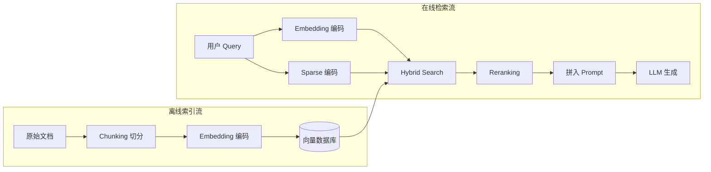

# 第 14 章 RAG 系统的基础设施

RAG（Retrieval-Augmented Generation，检索增强生成）是当前 LLM 应用最主流的架构模式——给 LLM 配一个外挂知识库，回答前先去检索相关文档，把检索结果拼进 prompt 再让模型生成，从而避免模型瞎编、能引用最新数据。但「用 LangChain（一个把 LLM、检索、工具串成链路的 Python/JS 框架）写一个 RAG demo」和「跑一个生产级 RAG 系统」之间，差的是 embedding（把文本压缩成一组浮点数向量，让相似的文本在向量空间里靠得近，类比 JS 工程师熟悉的"特征向量"或文本指纹）部署、向量数据库选型、检索策略优化这些基础设施工作。

一个完整的 RAG 系统其实是两条独立的流水线——离线建库和在线检索：



图里几个名词先做个最短解释，后面章节会逐一展开：

- **Chunking**：把长文档切成 chunk（"块"）的过程，因为 embedding 模型有最大输入长度限制
- **Sparse 编码 / Dense 编码**：Dense（稠密）向量是 embedding 模型输出的连续浮点数向量；Sparse（稀疏）向量是只在词表里很少数维度上有非零值的向量，本质是给词打权重，BM25 是最经典的例子
- **Hybrid Search（混合检索）**：把 Dense 和 Sparse 两路检索结果融合，兼顾语义和关键词匹配
- **Reranking（重排序）**：第一次检索拿回 Top-K 候选后，用一个更精确（也更慢）的模型重新打分排序

离线流是批处理任务，吞吐优先；在线流是请求/响应，延迟优先。两条流水线的优化目标和系统设计完全不同，下面分别展开。

## 14.1 Embedding 模型部署

### 主流 Embedding 模型

截至 2026 年初，中文场景下常用的 Embedding 模型。下面表格里几个名字先简单交代：

- **BGE**（BAAI General Embedding，[github.com/FlagOpen/FlagEmbedding](https://github.com/FlagOpen/FlagEmbedding)）：智源研究院（BAAI）开源的 embedding 模型系列，中文场景默认首选
- **Jina Embeddings**：德国 Jina AI 公司开源的多语言 embedding 模型系列
- **Nomic Embed**：Nomic AI 开源的 embedding 模型，v2 用 MoE（Mixture of Experts，混合专家，推理时只激活部分参数所以更快）架构
- **E5**（EmbEddings from bidirEctional Encoder rEpresentations）：微软的多语言 embedding 模型系列，`multilingual-e5` 是其中支持中文的版本

| 模型 | 维度 | 参数量 | MTEB 中文 | 特点 |
|------|------|--------|----------|------|
| BAAI/bge-large-zh-v1.5 | 1024 | 326M | 64.5 | 中文专精，稳定 |
| BAAI/bge-m3 | 1024 | 568M | 66.1 | 多语言、支持 sparse + dense |
| jinaai/jina-embeddings-v3 | 1024 | 572M | 65.8 | 多语言，支持 Matryoshka |
| nomic-ai/nomic-embed-text-v2-moe | 768 | 475M | 63.2 | MoE 架构，推理快 |
| intfloat/multilingual-e5-large-instruct | 1024 | 560M | 65.3 | 指令式，效果好 |

> **MTEB 中文**：来自 MTEB 排行榜（[huggingface.co/spaces/mteb/leaderboard](https://huggingface.co/spaces/mteb/leaderboard)）的中文任务平均分，满分约 70，分数越高检索效果越好。MTEB（Massive Text Embedding Benchmark）是 embedding 模型的标准评测基准，覆盖检索、分类、聚类等多种任务。

选型建议：
- 纯中文场景：BGE-large-zh-v1.5 够用，参数量小推理快
- 中英混合 + 需要 Hybrid Search：BGE-M3 一步到位（同时输出 dense 和 sparse 向量）
- 需要灵活维度：Jina v3 支持 Matryoshka embedding，可以按需截断维度

> **Matryoshka embedding**（参考论文 [arxiv.org/abs/2205.13147](https://arxiv.org/abs/2205.13147)）训练时对子向量也施加损失函数，使得截断后的子向量仍保持语义完整性。普通模型直接截断维度会严重损失精度，而 Matryoshka 训练的模型从 1024 维截到 256 维仍能保持大部分检索能力。

### 部署方式

**方案一：sentence-transformers 直接加载**

`sentence-transformers` 是 Python 里最流行的 embedding/句向量库（[sbert.net](https://www.sbert.net/)），在 HuggingFace `transformers` 基础上做了一层封装，主要负责"把模型输出的 token 向量池化成一个句向量并支持余弦相似度计算"。

最简单，适合原型和小规模：

```python
from sentence_transformers import SentenceTransformer

model = SentenceTransformer("BAAI/bge-large-zh-v1.5")
embeddings = model.encode(["你好世界", "Hello world"], normalize_embeddings=True)
# embeddings.shape: (2, 1024)
```

缺点：没有 batching（批处理，把多个请求合并成一个张量送进 GPU）优化，并发上不去。

**方案二：TEI（Text Embeddings Inference）**

HuggingFace（[huggingface.co](https://huggingface.co/)，开源模型/数据集托管平台，相当于"AI 界的 GitHub"）官方的 embedding 推理服务，Rust 实现，性能好：

```bash
docker run -d --gpus all \
  -v /data/models:/data \
  -p 8080:80 \
  ghcr.io/huggingface/text-embeddings-inference:1.5 \
  --model-id BAAI/bge-large-zh-v1.5 \
  --max-batch-tokens 16384 \
  --max-concurrent-requests 128
```

TEI 自带 continuous batching（连续批处理，前一个请求还没结束就把新请求插进同一个 batch，让 GPU 不留空闲，ch05 vLLM 章详细讨论过），并发处理能力远超手动加载。

性能参考（A10 24GB）。QPS（Queries Per Second，每秒处理请求数）是评测吞吐的常用指标：

| 模型 | 方案 | QPS (batch=1) | QPS (batch=32) |
|------|------|-------------|---------------|
| bge-large-zh | sentence-transformers | ~80 | ~200 |
| bge-large-zh | TEI | ~150 | ~800 |

TEI 快 3-4 倍，主要来自 Rust 的异步处理和更好的 GPU 利用。

### 批量 Embedding 优化

建库时需要对大量文档做 embedding，几个优化技巧：

1. **按长度排序后分批**：避免同一个 batch 里混入长短差异大的文本，减少 padding（"填充"，把同一 batch 内短文本补齐到最长文本的长度，凑出规整张量，但补出来的部分是无效计算）浪费

```python
def batch_embed_sorted(texts: list[str], model, batch_size: int = 64):
    """按长度排序后分批 embedding，减少 padding"""
    indexed = sorted(enumerate(texts), key=lambda x: len(x[1]))
    embeddings = [None] * len(texts)

    for i in range(0, len(indexed), batch_size):
        batch = indexed[i:i + batch_size]
        batch_texts = [t for _, t in batch]
        batch_embs = model.encode(batch_texts, normalize_embeddings=True)
        for (orig_idx, _), emb in zip(batch, batch_embs):
            embeddings[orig_idx] = emb

    return embeddings
```

2. **多 GPU 并行**：TEI 原生支持 tensor parallel（张量并行，把同一层模型的权重切分到多张 GPU 上算），也可以启多个 TEI 实例做 data parallel（数据并行，每张卡跑一份完整模型副本，请求分流过去）

3. **结果缓存**：相同文本的 embedding 结果缓存到 Redis（开源的内存键值存储，常用作缓存层），避免重复计算

### 向量维度的 Tradeoff

维度越高 ≠ 效果越好。实测数据。`Top-10 Recall`（前 10 召回率）是信息检索常用指标，表示"标准答案在返回的前 10 条结果中的比例"：

| 维度 | 检索准确率 (Top-10 Recall) | 存储成本 | 检索延迟 |
|------|--------------------------|---------|---------|
| 256 | 91.2% | 1x | 1x |
| 512 | 93.8% | 2x | 1.3x |
| 1024 | 95.1% | 4x | 1.8x |

从 256 到 1024，准确率只提升了 3.9%，但存储和延迟翻了好几倍。

如果用 Jina v3 或 BGE-M3 这种支持 Matryoshka embedding 的模型，可以训练时用 1024 维，线上按需截断到 256 或 512 维。

## 14.2 向量数据库选型

这是 RAG 基础设施中争议最大的话题。先说结论：没有银弹，选型取决于你的规模和团队能力。

### 主流向量数据库对比

向量数据库（Vector Database）是为"近似最近邻搜索"专门设计的数据库——存的不是表格行，而是高维向量；查询时不是"找等于 X 的行"，而是"找和查询向量最近的 K 条记录"。下表四款是开源生态里目前最常被讨论的选项：

- **Milvus**（[milvus.io](https://milvus.io/)）：Zilliz 主导，云原生分布式向量数据库
- **Qdrant**（[qdrant.tech](https://qdrant.tech/)）：Rust 实现的向量数据库，主打单机性能和易用性
- **pgvector**（[github.com/pgvector/pgvector](https://github.com/pgvector/pgvector)）：PostgreSQL（开源关系数据库）的向量扩展，让 PG 直接支持向量列
- **Chroma**（[trychroma.com](https://www.trychroma.com/)）：用 Python 写的轻量向量库，开箱即用、定位本地原型

| | Milvus | Qdrant | pgvector | Chroma |
|---|--------|--------|----------|--------|
| **语言** | Go + C++ | Rust | C (PG 扩展) | Python |
| **架构** | 分布式 | 单机/分布式 | 依赖 PG | 单机 |
| **索引** | HNSW, IVF, DiskANN | HNSW | HNSW, IVFFlat | HNSW |
| **Hybrid Search** | 原生支持 | 原生支持 | 需要手动拼 | 不支持 |
| **百万级 QPS** | ~500 | ~800 | ~200 | ~100 |
| **十亿级支持** | 好 | 中等 | 差 | 不支持 |
| **运维难度** | 高 (依赖 etcd, MinIO) | 低 | 低 (复用 PG) | 极低 |
| **生态** | 丰富 | 好 | 极好 (PG 生态) | 一般 |

表里出现的 etcd（CoreOS 开源的分布式 KV 存储，常用来存集群元数据）和 MinIO（兼容 S3 协议的开源对象存储）是 Milvus 部署时需要外挂的两个组件。

> **没列出的两个**：Pinecone（[pinecone.io](https://www.pinecone.io/)，美国 SaaS 化向量数据库，相当于 AWS RDS 那种"开箱即用云服务"）是托管服务，无需运维，但数据出境合规需确认，国内场景慎用。Weaviate（[weaviate.io](https://weaviate.io/)，另一款开源向量数据库）开源、内置 GraphQL 接口和 BM25（Best Matching 25，基于词频统计的经典文本检索算法，详见 14.4 节），适合需要混合搜索加关系查询的场景，本书不单独评测是因为 Qdrant 在同场景下性价比更优。

### 索引类型速查

表格里出现的 HNSW、IVF、DiskANN 是三类不同的 ANN（Approximate Nearest Neighbor，近似最近邻）索引算法。和 KNN（K Nearest Neighbors，精确 K 近邻，遍历全库算距离）相比，ANN 放弃了"绝对最近"的保证以换取数量级的速度提升。三类索引对检索延迟、精度和资源占用有实质影响：

- **HNSW**（Hierarchical Navigable Small World，分层可导航小世界图，[arxiv.org/abs/1603.09320](https://arxiv.org/abs/1603.09320)）：分层图索引，查询快、精度高，但全量索引需要常驻内存，适合数据量 < 5000 万的场景。这是目前最主流的选择。
- **IVF**（Inverted File Index，倒排文件索引）：量化（把高维浮点向量压缩成几个簇心 ID 的过程）+ 倒排索引（按簇心建索引，类似搜索引擎的"词→文档"反向映射），把向量空间聚类后只在最近的几个簇里搜。内存友好，但需要训练过程，检索精度比 HNSW 略低。常和 PQ（Product Quantization，乘积量化，把向量切成多段分别量化）组合成 IVF-PQ 进一步压缩存储。
- **DiskANN**（[微软研究院](https://github.com/microsoft/DiskANN)）：磁盘友好型图索引，把大部分图结构放在 SSD 上，适合数十亿级向量不全放内存的场景。Milvus 对 DiskANN 的支持是大规模场景的关键能力。

> 还有几个常听到的相关名字：**FAISS**（Facebook AI Similarity Search，[github.com/facebookresearch/faiss](https://github.com/facebookresearch/faiss)）是 Meta 开源的 ANN 算法库，提供 HNSW/IVF/PQ 等多种实现，是很多向量数据库的底层。**ScaNN**（Scalable Nearest Neighbors）是 Google 开源的对应实现。

### 选型建议

```
数据量 < 100 万条 + 已有 PostgreSQL → pgvector
  - 零额外运维成本
  - PG 15+ 性能已经够用
  - 用 pgvector 0.7+ 支持 HNSW 索引

数据量 < 1000 万条 + 需要 Hybrid Search → Qdrant
  - 单机部署简单，Docker 一行搞定
  - Rust 实现，性能好，内存效率高
  - 原生支持 named vectors（同时存 dense 和 sparse）

数据量 > 1000 万条 + 需要分布式 → Milvus
  - 专为大规模设计
  - 支持 DiskANN 索引，十亿级数据不全放内存
  - 运维复杂度高，需要 etcd + MinIO + 多组件

快速原型 / 本地开发 → Chroma
  - pip install chromadb 即用
  - 不适合生产
```

### Qdrant 快速部署

Qdrant 是当前性价比最高的选择，Docker 一行启动：

```bash
docker run -d \
  -p 6333:6333 \
  -p 6334:6334 \
  -v /data/qdrant:/qdrant/storage \
  qdrant/qdrant:v1.12.5
```

基本操作：

```python
from qdrant_client import QdrantClient
from qdrant_client.models import Distance, VectorParams, PointStruct

client = QdrantClient(host="localhost", port=6333)

# 创建 collection（Qdrant 里"集合"的概念，对应关系数据库的一张表，每条记录有一个 vector + 任意 JSON payload）
# distance 选 COSINE（余弦相似度，衡量两个向量的夹角，对向量长度不敏感，是文本 embedding 最常用的距离度量）
# 另外两个常见选项是 DOT（dot product，点积，要求向量已归一化）和 EUCLID（L2 distance，欧氏距离）
client.create_collection(
    collection_name="documents",
    vectors_config=VectorParams(size=1024, distance=Distance.COSINE),
)

# 插入向量
client.upsert(
    collection_name="documents",
    points=[
        PointStruct(
            id=1,
            vector=embedding_vector,  # list[float], 长度 1024
            payload={"text": "原始文本", "source": "doc1.pdf", "page": 3},
        ),
    ],
)

# 检索
results = client.query_points(
    collection_name="documents",
    query=query_vector,
    limit=10,
)
```

## 14.3 Chunking 策略

Embedding 模型的输入长度有限（通常 512-8192 tokens），长文档必须切分。切分策略直接影响检索效果。Chunking（切分）这个动作的核心是"把长文档拆成大小合适、语义完整的片段"，每个片段就是一个 chunk，后续 embedding 和检索都以 chunk 为单位。

### 固定长度切分

最简单粗暴的方式：

```python
def fixed_size_chunk(text: str, chunk_size: int = 500, overlap: int = 100) -> list[str]:
    chunks = []
    start = 0
    while start < len(text):
        end = start + chunk_size
        chunks.append(text[start:end])
        start = end - overlap
    return chunks
```

问题：可能在句子中间截断，导致语义不完整。

### Recursive Character Splitter

Recursive Character Splitter（递归字符切分器）是 LangChain 的经典实现思路——按优先级依次尝试不同的分隔符，先用段落分隔符切，切不开再用句号、逗号，逐级降级，直到 chunk 大小达标。

```python
SEPARATORS = ["\n\n", "\n", "。", "！", "？", "；", "，", " ", ""]

def recursive_split(text: str, chunk_size: int = 500, separators=None) -> list[str]:
    if separators is None:
        separators = SEPARATORS

    if len(text) <= chunk_size:
        return [text] if text.strip() else []

    sep = separators[0]
    remaining_seps = separators[1:]

    parts = text.split(sep)
    chunks = []
    current = ""

    for part in parts:
        candidate = current + sep + part if current else part
        if len(candidate) <= chunk_size:
            current = candidate
        else:
            if current:
                chunks.append(current)
            if len(part) > chunk_size and remaining_seps:
                chunks.extend(recursive_split(part, chunk_size, remaining_seps))
            else:
                current = part

    if current:
        chunks.append(current)
    return chunks
```

### 基于结构的切分

对 Markdown / HTML 文档，按标题结构切分效果更好：

```python
import re

def markdown_chunk(text: str, max_chunk_size: int = 1000) -> list[dict]:
    """按 Markdown 标题分段"""
    sections = re.split(r'(^#{1,3}\s+.+$)', text, flags=re.MULTILINE)
    chunks = []
    current_header = ""
    current_content = ""

    for section in sections:
        if re.match(r'^#{1,3}\s+', section):
            if current_content.strip():
                chunks.append({
                    "header": current_header,
                    "content": current_content.strip(),
                })
            current_header = section.strip()
            current_content = ""
        else:
            current_content += section

    if current_content.strip():
        chunks.append({"header": current_header, "content": current_content.strip()})

    # 对超长段落二次切分
    result = []
    for chunk in chunks:
        if len(chunk["content"]) > max_chunk_size:
            sub_chunks = recursive_split(chunk["content"], max_chunk_size)
            for sc in sub_chunks:
                result.append({"header": chunk["header"], "content": sc})
        else:
            result.append(chunk)
    return result
```

### Chunk 大小的推荐值

没有绝对最优值，但有经验范围：

| 场景 | 推荐 Chunk 大小 | Overlap |
|------|----------------|---------|
| 知识库问答 | 300-500 字 | 50-100 字 |
| 代码检索 | 按函数/类切分 | 0 |
| 法律文档 | 500-1000 字 | 100-200 字 |
| 论文/技术文档 | 按段落/章节 | 0 |

经验法则：chunk 越小检索越精准（precision 高，"返回的结果里相关的比例高"），chunk 越大上下文越完整（recall 高，"相关结果被召回的比例高"）。实际项目中，300-500 字是个不错的起点，然后根据评测结果调整。

> 这里没展开的还有几种工业界常见切分策略：**Semantic Split**（语义切分，用 embedding 相似度找文本里的"语义断点"再切）、**Parent-Child**（父子切分，把小 chunk 用来检索、检索到后回填父级大段落用作 LLM 上下文）、配合 PDF/扫描件还有 **OCR**（Optical Character Recognition，光学字符识别）、**Layout Analysis**（版面分析，识别标题/正文/表格区域）、**Table Extraction**（表格抽取，把表格还原成结构化数据），用 [`unstructured`](https://github.com/Unstructured-IO/unstructured)、[`LlamaParse`](https://www.llamaindex.ai/) 等 parser 库实现。

## 14.4 Hybrid Search

### Dense Retrieval 的局限

Dense Retrieval（稠密检索）就是前面讲的"把文本编码成 dense 向量后按相似度搜索"。它在以下场景表现不佳：

1. **精确关键词匹配**：用户搜「API-KEY-20250101」，向量检索可能返回包含「API key」的泛泛内容
2. **低频专业术语**：embedding 模型对罕见术语的理解不够好
3. **数字和 ID**：向量对数字不敏感

### BM25 的互补优势

BM25（Best Matching 25）是经典的稀疏检索算法，基于词频统计——它给文档里每个词算一个权重，权重由两部分组成：TF（Term Frequency，词频，词在该文档里出现的次数）和 IDF（Inverse Document Frequency，逆文档频率，词在多少文档里出现过的倒数，用来给罕见词加权），合在一起就是 TF-IDF 思路的改进版。词越罕见、在文档里出现越多，权重就越高。它在精确匹配场景下非常强。

在 Python 里有几种方式拿到「稀疏向量」：

1. **经典 BM25**：用 [`rank_bm25`](https://github.com/dorianbrown/rank_bm25) 或 [`bm25s`](https://github.com/xhluca/bm25s) 库直接算词频。输出是 `{term: score}` 字典。
2. **学习型稀疏向量**：用支持稀疏输出的 embedding 模型（如 BGE-M3 的 SPLADE-like 输出。SPLADE 是 SParse Lexical AnD Expansion，让 BERT 类模型直接输出每个 token 的权重而不是 dense 向量），由模型决定每个 token 的权重，能学到「同义词扩展」之类的语义信息。

下面 14.4 节的 Qdrant 示例里用到的 `lexical_weights` 就是 BGE-M3 内置的 sparse encoder 输出。它和经典 BM25 解决的是同一类问题（稀疏词权重），但不等同于经典 BM25——本质是用模型学出来的、带语义的稀疏权重，效果通常比纯统计的 BM25 更好。

### Hybrid Search 融合

结合 Dense 和 Sparse 的结果，通常用 Reciprocal Rank Fusion（RRF，倒数排名融合）——核心思想是不看分数绝对值（两路检索的分数尺度不一样，不能直接相加），只看每条结果在各自列表里的"排名"，把 `1 / (k + rank)` 累加起来作为最终分数：

```python
def reciprocal_rank_fusion(
    results_list: list[list[dict]],
    k: int = 60,
    top_n: int = 10,
) -> list[dict]:
    """
    RRF 融合多个检索结果列表
    results_list: 多个排序结果，每个元素是 [{"id": ..., "score": ...}, ...]
    k: RRF 参数，通常取 60
    """
    scores = {}
    for results in results_list:
        for rank, item in enumerate(results):
            doc_id = item["id"]
            if doc_id not in scores:
                scores[doc_id] = {"id": doc_id, "score": 0, "payload": item.get("payload", {})}
            scores[doc_id]["score"] += 1.0 / (k + rank + 1)

    sorted_results = sorted(scores.values(), key=lambda x: x["score"], reverse=True)
    return sorted_results[:top_n]
```

### 在 Qdrant 中实现 Hybrid Search

Qdrant 原生支持 named vectors（命名向量，同一条记录可以挂多个不同名字、不同类型的向量字段），可以同时存 dense 和 sparse 向量：

```python
from qdrant_client.models import (
    Distance, VectorParams, SparseVectorParams,
    NamedVector, NamedSparseVector, SparseVector,
    SearchRequest, FusionQuery, Fusion,
)

# 创建支持 Hybrid Search 的 collection
client.create_collection(
    collection_name="hybrid_docs",
    vectors_config={
        "dense": VectorParams(size=1024, distance=Distance.COSINE),
    },
    sparse_vectors_config={
        "sparse": SparseVectorParams(),
    },
)

# BGE-M3 的 sparse 输出需要 BAAI 提供的 FlagEmbedding 包（不在 sentence-transformers 里）：
# pip install FlagEmbedding   # https://github.com/FlagOpen/FlagEmbedding
from FlagEmbedding import BGEM3FlagModel
model = BGEM3FlagModel("BAAI/bge-m3", use_fp16=True)
output = model.encode("查询文本", return_dense=True, return_sparse=True)

dense_vector = output["dense_vecs"]
sparse_dict = output["lexical_weights"]  # {token_id: weight}

# Qdrant 的 query 接口直接支持 RRF 融合
results = client.query_points(
    collection_name="hybrid_docs",
    prefetch=[
        SearchRequest(
            query=NamedVector(name="dense", vector=dense_vector),
            limit=20,
        ),
        SearchRequest(
            query=NamedSparseVector(
                name="sparse",
                vector=SparseVector(
                    indices=list(sparse_dict.keys()),
                    values=list(sparse_dict.values()),
                ),
            ),
            limit=20,
        ),
    ],
    query=FusionQuery(fusion=Fusion.RRF),
    limit=10,
)
```

Hybrid Search 相比纯 Dense Search，在实际业务评测中通常能提升 5-15% 的检索准确率。提升幅度在专业领域（法律、医疗、金融）尤为明显。

## 14.5 RAG Pipeline 性能优化

一个完整的 RAG 请求的延迟组成：

```
Embedding 查询文本:  20-50ms
向量检索:           10-30ms
Reranking:          50-200ms
LLM 生成 (TTFT):   200-2000ms
LLM 生成 (Decode):  2-30s
```

LLM 生成占了绝大部分时间。但检索阶段的优化仍然有价值，因为它直接影响 TTFT（Time To First Token，首 token 延迟，从用户发出请求到看到第一个 token 流出来的时间，ch12 详细讨论过）。

### Embedding 缓存

相同的查询文本没必要重复计算 embedding：

```python
import hashlib
import json
import redis

r = redis.Redis()

def cached_embed(text: str, model, ttl: int = 3600) -> list[float]:
    """带 Redis 缓存的 embedding"""
    cache_key = f"emb:{hashlib.md5(text.encode()).hexdigest()}"
    cached = r.get(cache_key)
    if cached:
        return json.loads(cached)

    embedding = model.encode(text, normalize_embeddings=True).tolist()
    r.setex(cache_key, ttl, json.dumps(embedding))
    return embedding
```

对于多轮对话场景，用户的前几轮消息大概率已经 embedding 过了。

### Reranking

向量检索返回的 Top-K 结果往往有噪声。用一个 Cross-Encoder（交叉编码器）模型做 reranking 能显著提升精度。

先解释一下为什么是「Cross-Encoder」而不是再算一次向量相似度：

- **Bi-Encoder**（双编码器，也就是 embedding 模型）：把 query（查询）和 doc（文档）分别编码成两个向量，相似度通过点积或余弦距离计算。两边的编码过程互不影响，所以 doc 的向量可以**预先算好**塞进向量库，查询时只算一次 query embedding。
- **Cross-Encoder**（交叉编码器）：把 `[query, doc]` 拼接后整体输入模型，让 query 和 doc 在每一层 Attention（注意力机制，详见 ch02）里互相 attend，最后输出一个相关性分数。因为每对 (query, doc) 都要跑一次完整的模型推理，**无法预先索引**。

Cross-Encoder 更准是因为它能捕捉 query 和 doc 之间的细粒度交互（比如"用户问 A，但文档讲的是 A 的反面"这种语义反转）。代价就是慢——通常比 Bi-Encoder 慢 1-2 个数量级，所以只用在 Top-K 候选上做精排，而不是替代第一步检索。

> 重排序模型生态里几个常见名字：**BGE Reranker**（智源的 reranker 系列，下面代码用的就是 `bge-reranker-v2-m3`，中文场景默认首选）、**Cohere Rerank**（[cohere.com/rerank](https://cohere.com/rerank)，海外 SaaS 化重排服务，按 API 调用计费）、**ColBERT**（Contextualized Late Interaction over BERT，介于 Bi-Encoder 和 Cross-Encoder 之间的折衷方案，为每个 token 保留单独向量，检索时做"晚交互"，速度比 Cross-Encoder 快但更耗存储）。

```python
from sentence_transformers import CrossEncoder

reranker = CrossEncoder("BAAI/bge-reranker-v2-m3", max_length=1024)

def rerank(query: str, documents: list[str], top_n: int = 5) -> list[tuple[int, float]]:
    """对检索结果重排序"""
    pairs = [(query, doc) for doc in documents]
    scores = reranker.predict(pairs)

    ranked = sorted(enumerate(scores), key=lambda x: x[1], reverse=True)
    return ranked[:top_n]
```

Reranking 的代价是增加 50-200ms 延迟（取决于候选文档数量）。推荐对 Top-20 做 reranking，取 Top-5。

### 异步检索

如果需要从多个知识库检索，用异步并行。

**这里有个常见的工程坑**：`QdrantClient` 是同步客户端，它的 `query_points` 内部是阻塞 I/O。把它直接套在 `async def`（Python 的协程函数定义关键字，对应 JS 的 `async function`）里，再用 `asyncio.gather`（Python 标准库 asyncio 的并发原语，类似 JS 的 `Promise.all`）调度，看起来并行，实际是串行——同步 I/O 会阻塞整个事件循环，每个请求依次执行，延迟反而比直接 for 循环还高。Node.js 工程师对这个陷阱应该不陌生：`async` 关键字本身不带来并发，事件循环里发生阻塞的同步调用就是事故现场。

正确做法有两种：

**方案一：用 `AsyncQdrantClient`（推荐）**

`qdrant-client` 1.x 起内置了原生 async 客户端，API 和同步版完全对齐：

```python
import asyncio
from qdrant_client import AsyncQdrantClient

async def parallel_retrieve(
    query: str,
    collections: list[str],
    client: AsyncQdrantClient,
    top_k: int = 10,
) -> list[dict]:
    """并行检索多个 collection"""
    query_vector = embed(query)

    async def search_one(collection: str):
        return await client.query_points(
            collection_name=collection,
            query=query_vector,
            limit=top_k,
        )

    tasks = [search_one(c) for c in collections]
    all_results = await asyncio.gather(*tasks)

    merged, seen_ids = [], set()
    for results in all_results:
        for r in results.points:
            if r.id not in seen_ids:
                seen_ids.add(r.id)
                merged.append(r)
    return merged


# 调用方
async def main():
    client = AsyncQdrantClient(host="localhost", port=6333)
    results = await parallel_retrieve("查询文本", ["docs_a", "docs_b"], client)
```

**方案二：用线程池包装同步客户端**

如果某个 SDK 没有 async 版本，可以用 `run_in_executor` 把同步调用扔到线程池：

```python
import asyncio
from functools import partial

async def search_one(collection: str, client: QdrantClient, query_vector, top_k: int):
    loop = asyncio.get_event_loop()
    return await loop.run_in_executor(
        None,
        partial(client.query_points, collection_name=collection, query=query_vector, limit=top_k),
    )
```

两种方案都能真正并行；优先选方案一，原生 async 比线程池切换开销低。

### 端到端延迟优化清单

| 优化项 | 预期效果 | 难度 |
|--------|---------|------|
| Embedding 缓存 | -20-40ms | 低 |
| 异步并行检索 | -30-50% 检索延迟 | 低 |
| HNSW 索引参数调优 | -20-30% 检索延迟 | 中 |
| Reranking 限制候选数 | 控制 rerank 延迟 | 低 |
| vLLM Prefix Caching | -30-50% TTFT | 低 |
| Streaming 输出 | 不降总延迟但降体感 | 低 |

最大的杠杆还是在 LLM 端：用 Prefix Caching（前缀缓存，把相同前缀对应的 KV Cache 在多请求间复用，ch05 vLLM 章详细讲过）复用 system prompt（系统提示词，每次请求都拼在最前面的固定指令文本）和检索上下文的 KV Cache（注意力机制里 K/V 矩阵的缓存），直接砍掉 TTFT 的大头。

## 14.6 Agentic RAG

前面讲的 RAG 都是"单次流水线"模式：用户提问 → 检索 → 拼 prompt → 生成。这个流程有一个根本问题：**你怎么知道检索回来的东西是对的？**

如果检索结果不相关，模型要么瞎编（幻觉，hallucination，LLM 一本正经编造不存在的事实），要么给出一个和用户问题不沾边的回答。传统 RAG 没有任何自我纠错能力——它是一个开环系统。

Agentic RAG（带 Agent 能力的 RAG）就是把这个开环变成闭环：让 LLM 自己判断检索质量，不满意就改写查询重新检索，甚至路由到不同的数据源。本质上，检索不再是一个固定步骤，而是 Agent（自主调用工具完成任务的 LLM 系统）的一个工具。

### 核心架构模式

Agentic RAG 有几种常见的架构模式，复杂度逐级递增：

**Query Router（查询路由）**

最简单的 Agentic RAG。根据用户意图，把查询路由到不同的检索源：

- 产品文档问题 → 向量库检索
- 数据统计问题 → SQL 查询
- 实时信息问题 → Web API 调用
- 关系推理问题 → 知识图谱（Knowledge Graph，把实体和实体之间的关系组织成图，节点是实体、边是关系，常存在 Neo4j 等图数据库里）查询

路由本身可以用 LLM 做分类，也可以用简单的关键词规则。分路由的好处在于精准性——产品文档问题命中向量库，数据统计问题走 SQL，各取所长，避免把所有数据塞进一个向量库再用向量检索去凑答案。

**Self-RAG / Corrective RAG（自纠正检索）**

Self-RAG（[arxiv.org/abs/2310.11511](https://arxiv.org/abs/2310.11511)）和 Corrective RAG（CRAG，[arxiv.org/abs/2401.15884](https://arxiv.org/abs/2401.15884)）是两篇相关论文提出的同类思路，工程上常被混用——核心思想都是：检索完之后，让 LLM 评估检索结果和原始问题的相关性。如果不相关，改写查询再来一轮。

这是目前实践中最有价值的模式。很多 RAG 系统的失败不是因为模型差，而是因为第一次检索就跑偏了——用户的表述和文档的表述不匹配。让模型 rewrite 查询，换个角度再检索，往往就能命中。

**Multi-step Reasoning（多步推理）**

面对复杂问题，先拆解成子问题，分步检索再合成。比如用户问"A 公司和 B 公司的营收差异是什么原因"，Agent 会：

1. 先检索 A 公司的营收数据
2. 再检索 B 公司的营收数据
3. 检索行业分析报告
4. 综合三次检索结果生成回答

这种模式对延迟的影响最大，但对复杂问题的回答质量提升也最明显。

### 实现示例：Corrective RAG

一个最小可用的 Corrective RAG 实现：

```python
def agentic_rag(query: str, max_retries: int = 3) -> str:
    """带自纠正能力的 RAG"""
    current_query = query

    for attempt in range(max_retries):
        # 1. 检索
        docs = retrieve(current_query, top_k=10)
        docs = rerank(current_query, docs, top_n=5)

        # 2. LLM 评估检索质量
        relevance = llm_judge_relevance(query, docs)

        if relevance.score > 0.7:
            # 检索结果够好，直接生成
            return llm_generate(query, docs)

        # 3. 检索结果不行，让 LLM 改写查询
        current_query = llm_rewrite_query(
            original_query=query,
            failed_query=current_query,
            feedback=relevance.feedback,  # "检索结果主要在讲 X，但用户问的是 Y"
        )

    # 兜底：用最后一次检索结果硬生成
    return llm_generate(query, docs)


def llm_judge_relevance(query: str, docs: list[str]) -> RelevanceResult:
    """用 LLM 判断检索结果是否和问题相关"""
    prompt = f"""判断以下检索结果是否能回答用户的问题。

用户问题：{query}

检索结果：
{format_docs(docs)}

请给出：
1. 相关性分数（0-1）
2. 如果不相关，说明为什么不相关，以及建议用什么关键词重新检索"""

    return call_llm(prompt, response_format=RelevanceResult)
```

这个实现的关键在于 `llm_judge_relevance`——它不只是打个分，还会给出反馈（"检索结果都是关于 A 的，但用户问的其实是 B"），这个反馈指导下一轮的查询改写。

### Infra 层面的考量

Agentic RAG 比传统 RAG 复杂得多，对基础设施有额外的要求：

**延迟预算**

每多一轮检索循环，大约增加 300-800ms（embedding + 检索 + LLM 评估）。如果最多重试 3 次，最坏情况下总延迟会到 2-3 秒。这在用户等待的场景下是不可接受的。

解法：**必须用 streaming**。第一时间开始流式输出"正在为您查找更精确的信息..."之类的过渡文本，让用户知道系统在工作。或者更好的做法是，先用第一轮结果生成一个初步回答并流式输出，同时后台继续检索优化。

**Query Rewrite 用小模型**

`llm_judge_relevance` 和 `llm_rewrite_query` 不需要用最强的模型。一个 7B 或甚至 1-3B 的模型就能做好"这段文本和问题是否相关"的判断。用小模型做评估和改写，省成本也省延迟。

实测数据：用 Qwen2.5-3B 做相关性判断，准确率能到 85%+，延迟只有 GPT-4 的 1/10。

**检索结果缓存**

如果第一轮查询 "如何配置 nginx" 改写成 "nginx 反向代理配置方法"，这两个查询的检索结果可能有大量重叠。对改写后的查询做 embedding 前，先检查 embedding 缓存，能省掉一次 embedding 计算。

更进一步，可以缓存 (query_embedding, collection) → results 的映射，对相似度超过 0.95 的查询直接返回缓存结果。

**多数据源的并行检索**

在 Query Router 模式下，如果判断需要同时查向量库和 SQL，两个检索应该并行发出，而不是串行。这就是 14.5 节异步检索的直接应用。

### 和 MCP 的关系

Anthropic（Claude 的开发公司）提出的 MCP（Model Context Protocol，模型上下文协议）协议，本质上就是在标准化 Agentic RAG 中的"多数据源接入"问题。可以把它类比为 LSP（Language Server Protocol，编辑器和语言服务器之间的通用协议）：MCP 想做的就是 LLM 应用和外部工具/数据源之间的通用协议。

传统做法是：每接一个新数据源，就在 Agent 代码里加一个 tool 函数，写一套检索逻辑。数据源一多，代码就变成一坨。

MCP 的思路是：每个数据源自己实现一个 MCP Server，暴露统一的接口。Agent 通过 MCP Client 动态发现并调用这些 Server。这样加一个新数据源，不需要改 Agent 代码——只需要部署一个新的 MCP Server。

对于 Agentic RAG 来说，MCP 解决的是工程层面的"可扩展性"问题：当你有 5 个、10 个、50 个数据源时，怎么管理它们的接入和路由。

### 框架支持：什么时候自己写，什么时候用现成的

上面的 Corrective RAG 实现是为了讲清楚机制——生产项目里不一定要从头写。两个主流框架都已经原生支持 Agentic RAG：

- **LlamaIndex**（[llamaindex.ai](https://www.llamaindex.ai/)，专注 RAG 场景的 Python/JS 框架，对接各种数据源和向量库）的 [QueryPipeline](https://docs.llamaindex.ai/) 和 Workflows，提供了 Corrective RAG、Multi-step RAG 的现成模板。
- **LangGraph**（[langchain-ai.github.io/langgraph](https://langchain-ai.github.io/langgraph/)，LangChain 团队推出的有状态图执行框架）用图编排表达 Agent 的循环和分支，社区已有大量 Agentic RAG 模板。

> 同类框架还有 **Haystack**（[haystack.deepset.ai](https://haystack.deepset.ai/)，deepset 公司开源的检索/问答 pipeline 框架）和 **DSPy**（[github.com/stanfordnlp/dspy](https://github.com/stanfordnlp/dspy)，斯坦福开源的"用代码声明 LLM 程序、自动调优 prompt"的框架），各有侧重，按团队偏好选。

对 JS 背景的读者，LangGraph 也有 JS 版本（[langchain-ai.github.io/langgraphjs](https://langchain-ai.github.io/langgraphjs/)），可以直接在 Node.js 项目里用。

实践上的建议：原型阶段从框架起步，跑通后再剥离——遇到性能瓶颈或特定业务逻辑需要精确控制时，把框架替换成自己实现的、更轻量的版本。框架的价值在快速试错，不在生产承载。

## 本章小结

1. **Embedding 部署**首选 TEI，比手动加载 sentence-transformers 快 3-4 倍
2. **向量数据库**没有银弹：小规模用 pgvector，中等规模用 Qdrant，大规模用 Milvus
3. **Chunking 策略**对检索效果影响巨大，优先用结构化切分，300-500 字是合理起点
4. **Hybrid Search** 结合 Dense 和 Sparse 检索，在专业领域提升尤为明显
5. **性能优化**的重点在 LLM 端（Prefix Caching），检索端做好缓存和并行即可
6. **Agentic RAG** 把检索从固定步骤变成 Agent 工具，通过自纠正和多步推理显著提升复杂问题的回答质量

这是本书第五部分的最后一章。到这里，我们已经覆盖了 LLM 基础设施从推理引擎、生产部署、可观测性到 RAG 系统的完整链路。接下来你需要做的是：挑一个实际项目，把这些知识用起来。


---

> 本章来自《LLM Infra 从入门到实践》开源版 · 作者「递归客」  
> 在线阅读完整书系：[inferloop.dev](https://inferloop.dev)  
> 源码仓库：[github.com/diguike/book-llm-infra](https://github.com/diguike/book-llm-infra)
